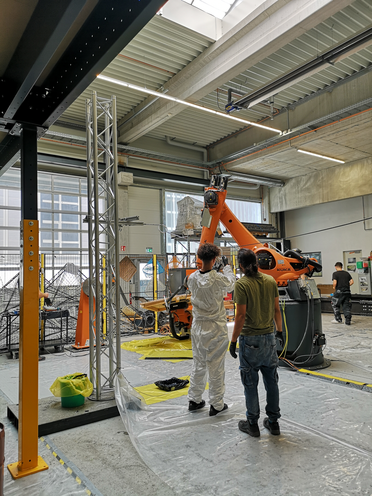
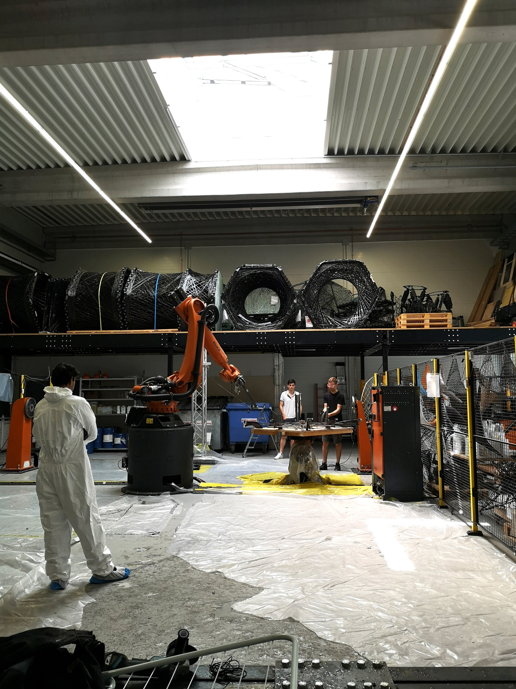

Coreless filament winding is a fabrication technique where a robotic arm winds resin-soaked fibers around a frame to create lightweight, high-performance structural elements without the need for a solid mold. The ICD and ITKE at the University of Stuttgart have been pioneering this technology, producing increasingly ambitious pavilions and demonstrators.

## The challenge

As the robotic arm intertwines the fibers in a kind of three-dimensional weaving, the relationship between these fibers becomes very complex and difficult to predict. At the time, there was no reliable computational tool for accurately simulating how the fibers would interact during the winding process. Christoph Schlopschnat's research aimed to bridge this gap.

## My role

I assisted Christoph in his investigation of computational methods to predict carbon fiber interaction. My responsibilities included:

- **Resin preparation** — mixing and applying the resin that binds the carbon fibers. This required full protective equipment due to the toxicity of the materials.
- **Small-scale physical tests** — running controlled winding experiments to gather data on fiber behavior.
- **Photogrammetry** — capturing the wound specimens from multiple angles to create digital twins for comparison with the computational predictions.

## Learnings

The most memorable aspect of this work was the resin handling. The epoxy resin used in carbon fiber composites is highly toxic, requiring full-body protective suits, gloves, and careful preparation of the workspace with protective sheeting. It was a hands-on introduction to the practical realities of working with advanced composite materials — a world apart from the computational side of the research. And honestly, it the toxicity of the material was a big turn-off for me, which is why I eventually moved away from this line of research. But it was a valuable experience that gave me a deeper appreciation for the complexities of material science in architectural fabrication.

