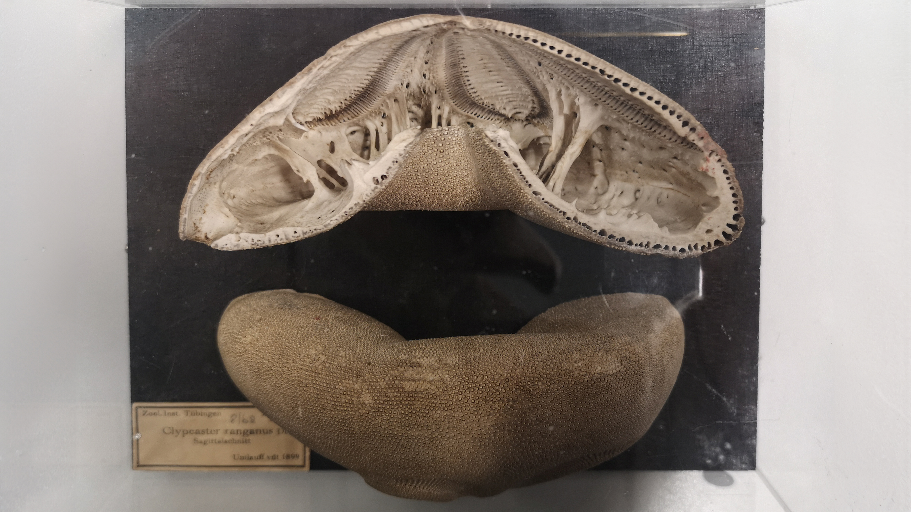
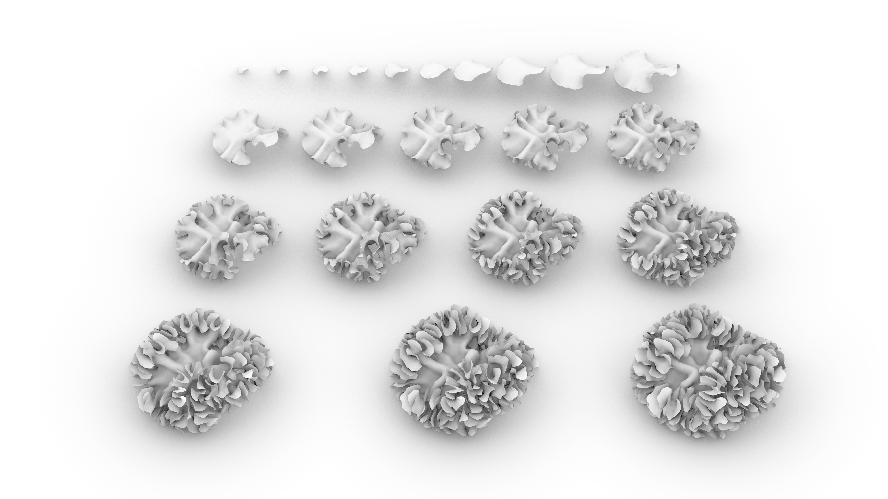
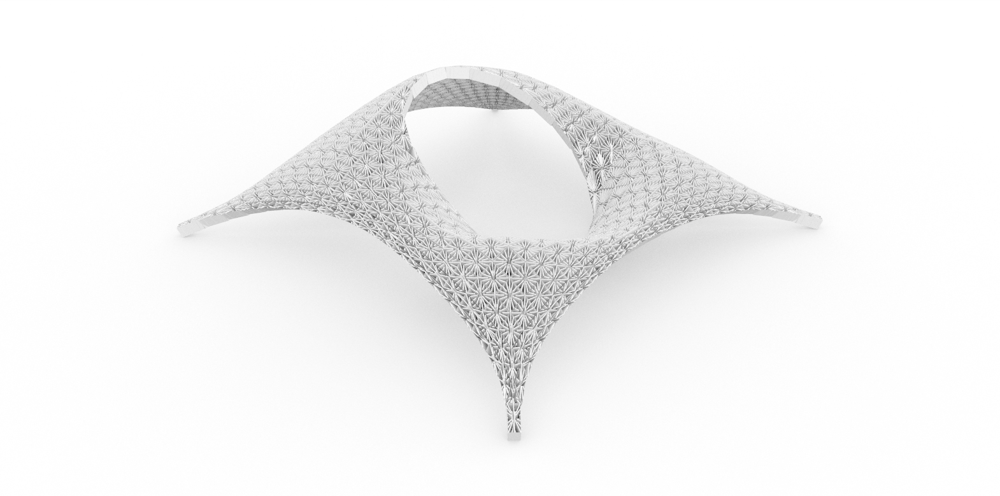

Cada animal tem sua morfologia, anatomia e comportamento únicos. A maioria dessas características é altamente evoluída e cumpre funções com quase perfeição. A biomimética é uma estratégia que investiga as soluções da natureza para nossos problemas.
Esta pesquisa começou explorando estruturas estáticas. Isso inclui qualquer tipo de esqueletos, conchas e outras estruturas mais macias, porém estáticas.
A pesquisa seguinte tratou de princípios gerais encontrados em corais pétreos em uma grande variedade de espécies e também em todas as escalas, desde a estrutura mais simples encontrada em corais, o pólipo, passando pelo próprio coral e, finalmente, os recifes.
Como resultado, este estudo abstraiu a relação entre diferentes pólipos formando um único coral. Essa modularidade é então usada para uma aplicação biomimética arquitetônica, o pavilhão Acropora.

