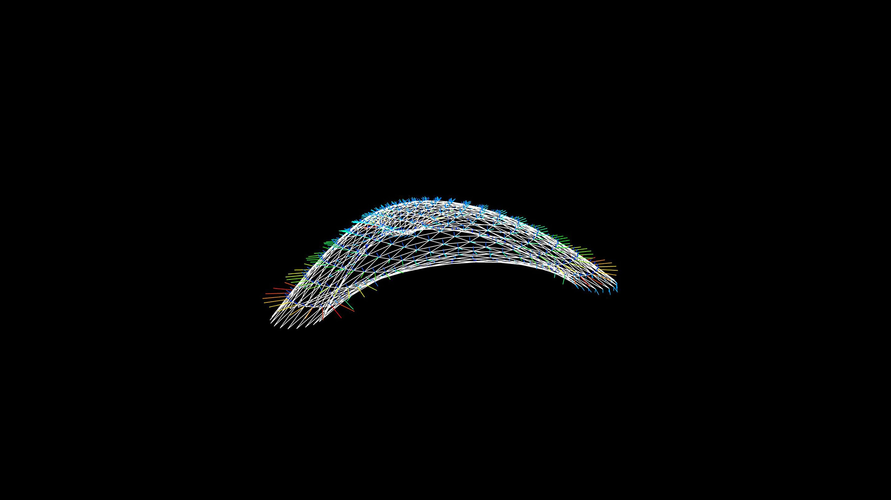

import Video from '@/components/Video.astro'

<Video autoplay src="/media/research/bending-active-bamboo/form-finding.mp4" caption="Form-finding process." />

Este foi o trabalho que eu e Lena Strobel fizemos para o curso Form and Structure do ITECH. Nós fomos inspirados pelo ZCB Bamboo Pavilion, mas desenvolvemos nosso próprio fluxo de trabalho usando Grasshopper, Kangaroo Physics e K2Engineering.

## Busca pela forma

Para o projeto da forma inicial, criamos um layout de vigas bidimensional em uma malha triangular. Em seguida, usamos o Kangaroo como um sistema de partículas-mola com cargas, apoios e vigas como restrições de barras em flexão. A forma surge à medida que as vigas tentam se endireitar.

A ideia inicial era fazer engenharia reversa do pavilhão de bambu usando esse conhecimento para alterar a geometria para uma forma poligonal diferente. No entanto, o desenvolvimento apenas desse estudo exigiu todos os nossos esforços.

O K2Engineering foi crucial para o desenvolvimento deste trabalho. As propriedades do bambu puderam ser usadas como dados de entrada para produzir análises estruturais que foram utilizadas para otimizar os resultados.

Um grande desafio foi o projeto dos arcos que estruturavam a forma geométrica inicial e como eles se ancoravam nos três apoios circulares predeterminados. Além disso, pontos de interseção adicionais tiveram que ser adicionados em uma etapa posterior, pois o resultado inicial não era tão estrutural e esteticamente satisfatório quanto o pretendido. Também foi importante usar o Kangaroo Zombie para tornar a otimização mais rápida.

Confira mais informações sobre o pavilhão original aqui: [ZCB Bamboo Pavilion](https://www.archdaily.com/800173/zcb-bamboo-pavilion-the-chinese-university-of-hong-kong-school-of-architecture)

