## Resumo
**Building Across Scales
Um sistema robótico para colagem de madeira engenheirada no canteiro**
A pesquisa propõe um sistema de construção robótica multiescalar heterogêneo para automatizar ainda mais a construção de madeira no canteiro de obras. Especificamente, ele apresenta o próximo passo na automação da colagem no canteiro de obras por meio da introdução de um dispositivo de prensa robótico para a colagem da madeira
Portanto, no cerne da pesquisa, está o desenvolvimento do dispositivo de prensa. Dispositivo esse que faz parte de uma equipe de construção robótica, incluindo uma dupla de robôs industriais e um guindaste em co-design com o material e o sistema de construção.
A madeira engenheirada abriu novas possibilidades na maneira como as estruturas de madeira modernas são construídas e projetadas. Simplesmente empilhando tábuas de madeira umas sobre as outras e colando-as de forma cruzada, é possível obter uma forte ligação entre as camadas. No entanto, devido a restrições de transporte, essas peças de madeira têm seu tamanho limitado.
Como essas peças apresentam uma conexão fraca, elas consequentemente limitam o sistema a um vão linear o que resulta em uma arquitetura ortogonal.
Esta pesquisa apresenta um sistema de fabricação como uma estratégia para ir além dessas limitações. Por meio da integração de lógicas de construção no material, ele apresenta uma abordagem para atingir alta precisão durante a montagem e automatizar a operação de um guindaste.
Habilitado pelo dispositivo de prensa, esse sistema visa continuar a lógica de fabricação de laminação cruzada de madeira projetada no local para criar uma laje quase monolítica. Isso permite uma laje de madeira apoiada em pontos de dimensões ilimitadas, o que abre para mais flexibilidade de design na planta baixa e estende o espaço de design arquitetônico.
## **Introdução**
> Esta pesquisa tem o objetivo de automatizar a construção em madeira no canteiro de obras através do desenvolvimento de um dispositivo robótico para a prensagem de conexões coladas in loco.
A madeira engenheirada abriu novas possibilidades na forma como as estruturas modernas de madeira são projetadas e construídas [1]. Ao simplesmente empilhar pranchas de madeira e laminá-las de forma cruzada, é possível obter uma união forte entre as camadas individuais criando a CLT — [Madeira laminada cruzada](https://pt.wikipedia.org/wiki/Madeira_laminada_cruzada). No entanto, no canteiro de obras, essa lógica é interrompida, pois os elementos individuais — como vigas, lajes e paredes — são apenas posicionados uns ao lado dos outros. Isso cria juntas fracas entre esses membros, o que limita o sistema a vãos lineares, resultando em uma arquitetura baseada em grelhas.
Em vez disso, esta pesquisa dá continuidade à lógica de fabricação da madeira engenheirada. Ao elevar a escala, o objetivo é criar uma laje quase monolítica que cubra todo o pavimento, permitindo maior liberdade arquitetônica.
Como a escala de um pavimento inteiro é muito superior à de um único painel de CLT, não existe atualmente tecnologia para automatizar essa abordagem. Através do desenvolvimento de um grampo robótico customizado, a intenção é automatizar esse processo.
### Relevância
#### Automação da Construção
Um relatório recente da ONU mostra um aumento constante na população urbana nas próximas décadas. Atualmente, cerca de 55% da população mundial vive em áreas urbanas e, até 2050, espera-se que esse número chegue a 68% [2]. Esta tendência reforça a necessidade de um sistema de construção que seja seguro, acessível, sustentável e automatizado [3].
Embora o setor da construção seja um dos maiores da economia mundial, ele possui um longo histórico de baixa produtividade [4]. Estudos mostram que a produtividade tem diminuído continuamente nas últimas décadas, contrastando com o crescimento constante da produtividade em outras indústrias, como a manufatura [5] (Figura 02).

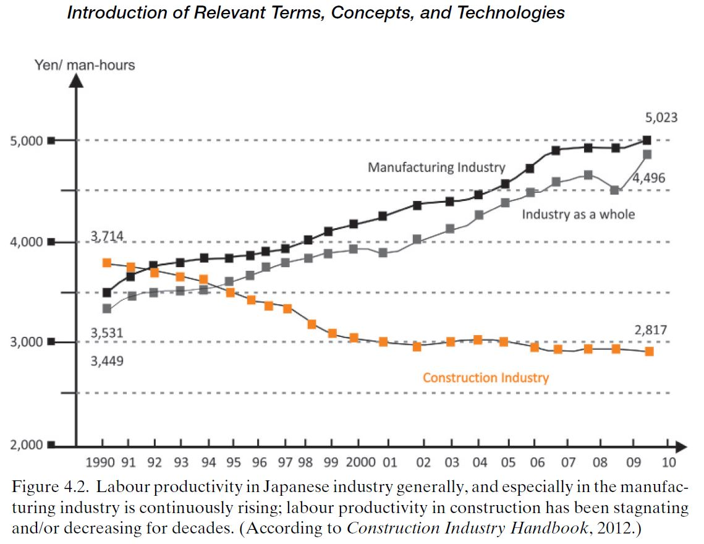

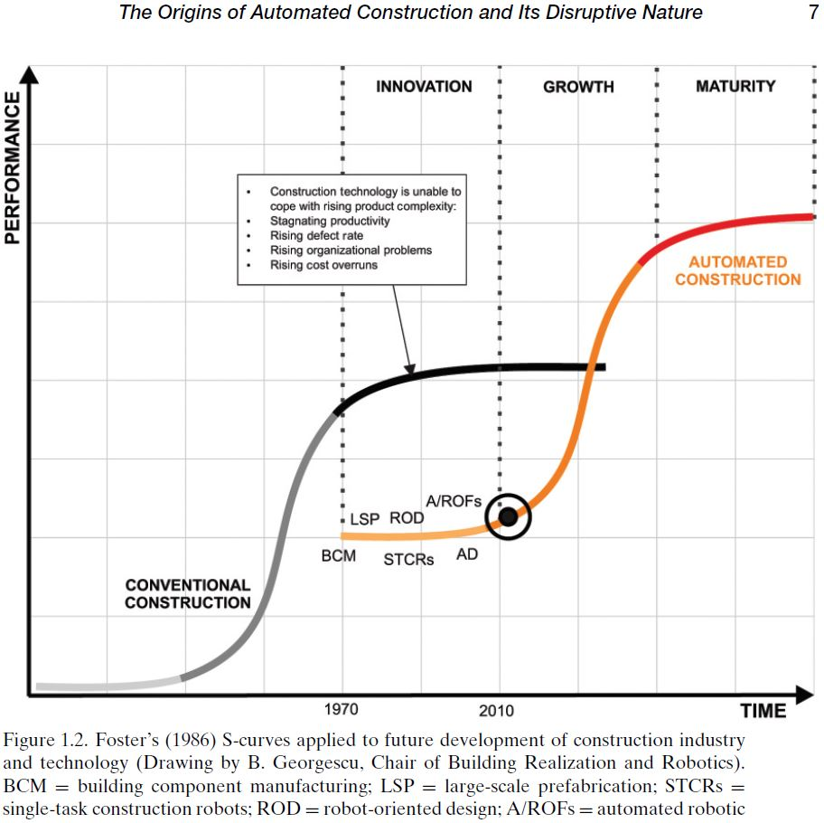
Existem muitos fatores que levam a esse baixo desempenho. A indústria possui uma ampla gama de regulamentações, depende fortemente das demandas do setor público e é altamente fragmentada [4]. No entanto, isso representa uma oportunidade para novos agentes no mercado, e uma solução possível para enfrentar a questão da produtividade é a implementação de automação e robótica [5].
Embora a automação e a robótica tenham começado a ser aplicadas na construção já em 1970, elas ainda não alcançaram o aumento necessário de produtividade para se tornarem uma alternativa economicamente viável. No entanto, isso não deve ser visto como uma falha, mas como um processo natural quando uma mudança tecnológica significativa está em curso [6]. Avanços tecnológicos essenciais, como *big data*, redes de sensores sem fio e a modelagem de informações da construção (BIM), estão promovendo um ambiente favorável para apoiar sistemas eficientes de automação e robótica na construção [7].
De acordo com Thomas Bock (2016), existem dois ciclos tecnológicos significativos ocorrendo na construção. Um engloba os sistemas de construção tradicionais, enquanto o novo refere-se à digitalização, automação e robótica (Figura 03). Os ciclos tecnológicos ocorrem em três fases distintas: inovação, crescimento e maturidade. Neste momento, estamos entrando na segunda fase deste novo ciclo: o crescimento. Ao longo desta fase, ele eventualmente superará os sistemas de construção tradicionais, culminando em sua fase final, a maturidade, levando à adoção em massa em toda a indústria [6].
#### **Estratégias **de Automação
Desde o início da automação na construção, diversas estratégias foram pesquisadas, desenvolvidas e implantadas. Uma delas é o conceito de **pré-fabricação**, no qual uma grande parte do processo de construção se desloca para um ambiente fabril, facilitando a produção em massa de peças de forma mais segura e confiável (Figura 04). Este ambiente estruturado é semelhante às fábricas de diversas outras indústrias, como a automotiva e de manufatura, conhecidas por serem favoráveis à aplicação de robôs industriais convencionais em locais estáticos.
Na indústria da construção, no entanto, as peças ainda precisam ser transportadas para sua localização final. Os módulos de transporte geralmente são muito maiores que a matéria-prima, tornando o custo, a logística e as regulamentações locais fatores limitantes que impactam a flexibilidade do design final [8].

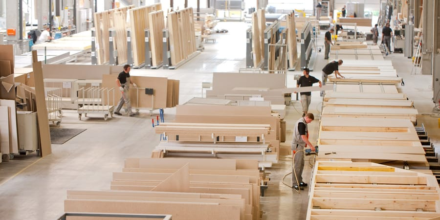

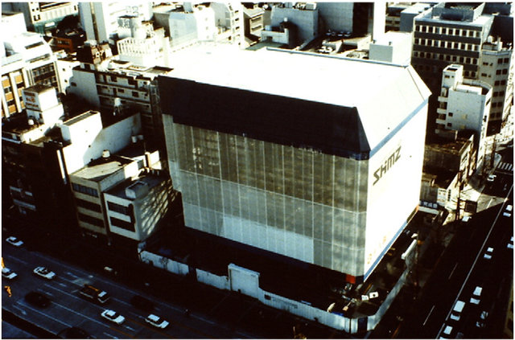
Outra estratégia explorada desde a década de 1970 é a **fábrica no canteiro** (*site factory*). Aqui, em vez de levar a fabricação das peças para um ambiente fabril externo, o próprio canteiro de obras se torna a fábrica. Neste cenário, o canteiro de obras, que de outra forma seria um ambiente não estruturado, passa a ter uma infraestrutura que facilita a navegação dos robôs, acelerando a construção do edifício. Essa estratégia levou, por exemplo, ao desenvolvimento de **fábricas voadoras** para tipologias de torres, nas quais, após a conclusão de cada andar, a fábrica inteira se desloca um nível para cima (Figura 05). Os problemas dessa estratégia são o alto custo, o tempo excessivo de montagem da fábrica antes do início da construção e a viabilidade restrita a tipologias de torres repetitivas, limitando a capacidade do projetista de customizar a forma global [9] [8].
Uma abordagem mais flexível para fábricas no canteiro é a **plataforma robótica transportável para construção em madeira** (Figura 06). Ela consiste em um contêiner equipado com robôs e ferramentas que podem ser entregues diretamente no canteiro de obras. Isso permite a integração da montagem robótica em métodos de construção já existentes. A força do sistema reside no fato de ser independente de localização e reconfigurável. A ampla possibilidade de customização da plataforma permite alta flexibilidade. Portanto, torna-se possível estender, em vez de substituir, o artesanato tradicional, aumentando a qualidade e a produtividade no local [10].

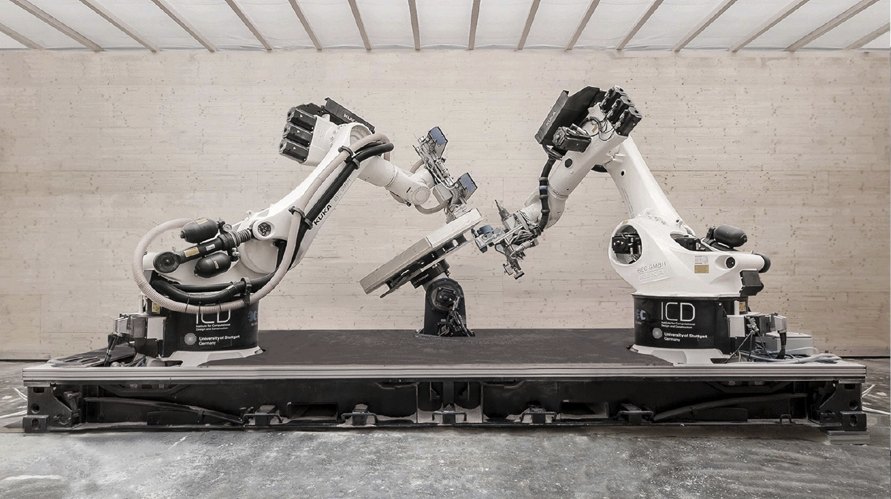

Uma terceira estratégia explorada, especialmente no contexto de pesquisa, é o uso de **robôs móveis** na construção da superestrutura (Figura 07). Esta abordagem é interessante porque explora a ideia de montagem robótica distribuída, levando ao desenvolvimento de algoritmos sofisticados que possuem uma sequência de construção descentralizada e à prova de falhas. Em outras palavras, se algo der errado com um robô, os outros preencheriam a lacuna sem interromper toda a lógica de montagem. Robôs móveis também possuem mais flexibilidade do que fábricas no canteiro ou plataformas transportáveis, alcançando locais que seriam impossíveis para um sistema de pórtico, por exemplo. No entanto, sistemas móveis são muito mais complexos de monitorar e controlar, são menos precisos e suas limitações de baixa capacidade de carga (*payload*) os tornam menos eficientes energeticamente [8].
Até agora, a automação na construção tem se concentrado majoritariamente na criação de sistemas inteiramente novos. No entanto, sua aceitação na indústria da construção atual ainda é limitada. Como mencionado anteriormente, vemos que a indústria da construção não evolui tão rápido quanto outras indústrias. Consequentemente, é essencial integrar a tecnologia de construção já existente ao tentar automatizar processos de montagem.
Devido à natureza não estruturada e complexa da construção, é crítico analisar as diferentes tarefas no canteiro, pois algumas podem ser mais adequadas para um robô grande controlado centralmente, como um guindaste, enquanto outras podem se beneficiar de um coletivo de centenas de robôs menores [8].
Em vez de desenvolver outro sistema inteiramente novo, um **sistema robótico heterogêneo** poderia agregar grande valor na automação de processos in loco. De acordo com Vasey et al. (2020), um sistema heterogêneo de robôs é um "sistema composto por robôs com especificações, ferramentas e lógicas de controle variadas, que podem ser de diferentes fabricantes ou customizados a partir de componentes e controladores comerciais (*off-the-shelf*)" [9].
Analisando pesquisas de ponta, vemos que a combinação de robôs já ocorre em certo grau. O projeto *Sequential Roof* da ETH em Zurique é um exemplo. Ele possuía um processo de pré-fabricação altamente automatizado (Figura 08), enquanto a montagem no canteiro ainda dependia de trabalho manual [11] (Figura 09).

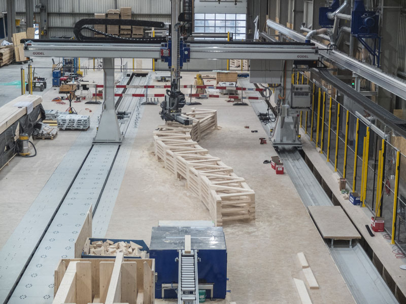

#### **Construção em Madeira**
A madeira é uma escolha adequada para auxiliar os processos de automação in loco, pois é um material de construção consolidado, com uma **alta relação resistência-peso** e facilidade de processamento [12]. Especialmente através da implementação precoce de tecnologias de fabricação de ponta e da facilidade com que o material pode ser usinado, permitiu-se a automação de técnicas de pré-fabricação — como, por exemplo, a **fresagem por controle numérico computadorizado (CNC)** já na década de 1970 [13].
Além dos benefícios técnicos e estruturais, com o aumento da conscientização sobre a construção sustentável, observa-se uma forte pressão política em direção ao uso da madeira. Por exemplo, a *Holzbau Offensive Baden-Württemberg* determina que todo novo edifício público seja construído em madeira (Figura 10) [14]. No entanto, os elementos de madeira são limitados em tamanho devido a restrições de transporte, resultando em peças de construção modulares que precisam ser unidas no canteiro. Isso cria uma junta fraca entre os membros e, consequentemente, produz vãos lineares, derivando em uma arquitetura baseada em grelhas direcionais (Figura 11).

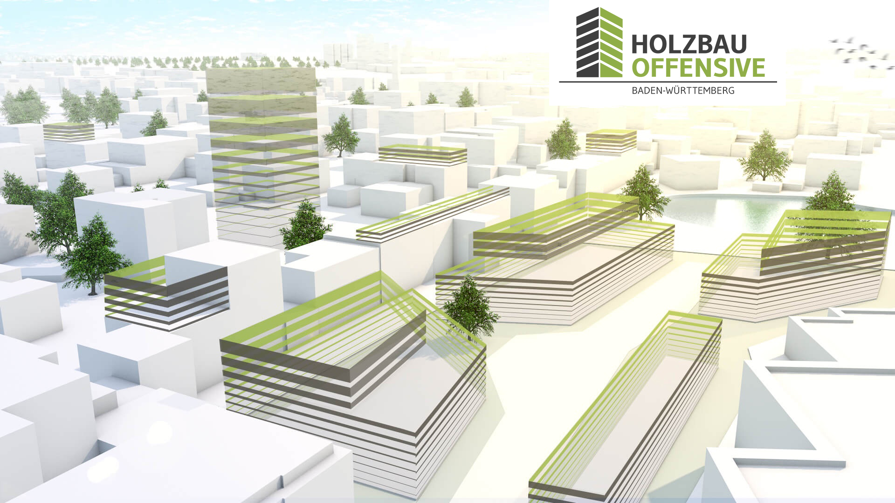

Figura 11 - Tipologias atuais de sistemas de construção em madeira (Kaufmann, 2018).

A colagem in loco tem a possibilidade de superar os desafios que derivam de uma arquitetura modular, pois pode criar uma união forte entre as peças individuais. Visto que, até agora, apenas a cola fornece uma junta suficiente para um gradiente de rigidez contínuo, isso significa que as conexões coladas são muito mais resistentes se comparadas aos métodos tradicionais (Figura 12) [12] e poderiam viabilizar um layout de laje com suporte de carga multiaxial [15].

### Escopo
O escopo da tese é a automação de uma junta colada *in loco* integrada a um sistema construtivo em madeira. Portanto, o aspecto central da pesquisa é o desenvolvimento de um dispositivo robótico customizado, responsável pela prensagem da cola na conexão *in situ*. O co-design entre o grampo robótico e a madeira permitiu a simplificação do projeto robótico e o desenvolvimento de um sistema material que pode tirar proveito total das tecnologias propostas.
Discute-se, adiante, a possibilidade de automatizar toda a cadeia de construção, alcançada através da implementação de uma plataforma ciber-física de fabricação de madeira (TIM), responsável pela pré-fabricação de elementos de madeira no canteiro. Estratégias de sensoriamento embarcado no dispositivo robótico permitem a localização e o monitoramento do processo de montagem em tempo real, possibilitando a comunicação e a coordenação com um guindaste para automatizar o posicionamento *in situ* de elementos pré-fabricados.
O escopo da pesquisa pode ser dividido em duas partes:
- A investigação de um sistema material que utiliza elementos de madeira e a automação de uma junta *in loco*.
- O desenvolvimento de um sistema robótico heterogêneo, incluindo a coordenação entre todos os atores — desde a fabricação no canteiro até a união (*joinery*) *in situ*.
Ambos os sistemas precisam ser projetados em coordenação, de modo que as limitações e os parâmetros informem-se mutuamente de forma contínua (Figura 13).
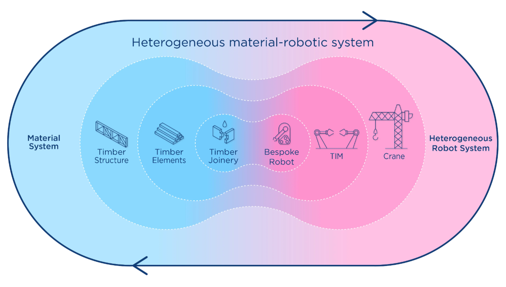
## Pesquisa
### Contexto
#### Colagem no canteiro
Via de regra, juntas coladas devem ser executadas em um ambiente controlado, pois a aplicação depende de parâmetros climáticos como **umidade e temperatura**. No entanto, pesquisas recentes em tecnologia de adesivos para madeira e ciência dos materiais apontam para uma direção promissora [16].
Um exemplo de um procedimento bem-sucedido de colagem *in loco* é a nova tecnologia desenvolvida pela **TS3** (Figura 14), que torna possível unir diferentes elementos de madeira no canteiro para criar painéis com suporte de carga multiaxial [17, p. 3]. O ponto negativo é que o processo de aplicação da cola é inteiramente manual e exige muita mão de obra (Figura 15). Além disso, a fresta entre os elementos de madeira, que por vezes tem alguns milímetros de largura, aumenta drasticamente a quantidade de cola necessária.

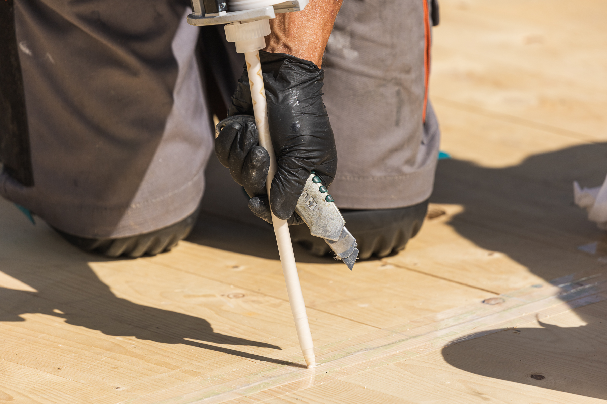

Uma abordagem para reduzir a quantidade de cola é o uso de **parafusos** (Figura 16). Ao pressurizar a cola durante o processo de secagem, é possível obter uma união forte utilizando apenas uma fração da cola inicialmente necessária [18].
Contudo, a desvantagem é que este processo é, novamente, muito laborioso. Além disso, como os parafusos cumprem uma função temporária, eles geralmente são deixados na madeira porque os custos de mão de obra para removê-los são muito superiores ao valor do próprio parafuso.

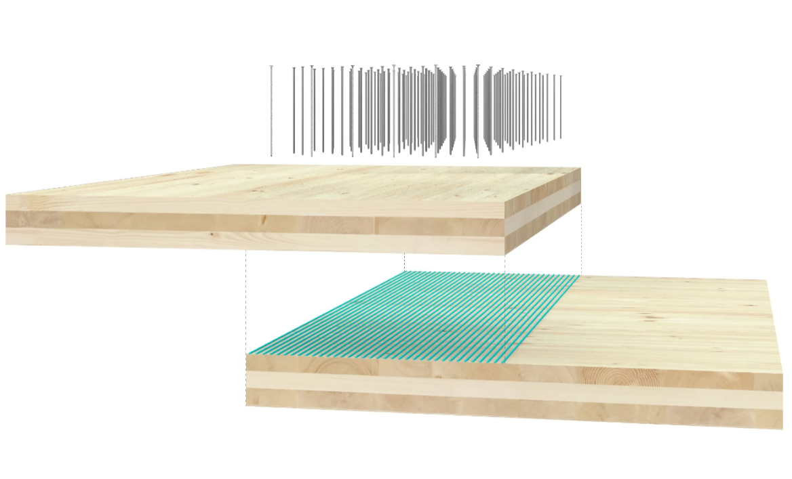

Figura 16 - Sequência mostrando o processo de colagem *in situ* usando parafusos para gerar a pressão necessária.
### Estado da Arte
#### Chicago Horizon [19]
*Chicago Horizon* é um pavilhão público instalado no Grant Park, de frente para o Lago Michigan (Figura 17). Ele exemplifica a beleza modernista em sua composição minimalista: um plano de cobertura plano em madeira é sustentado de forma simples por um campo de colunas de madeira.

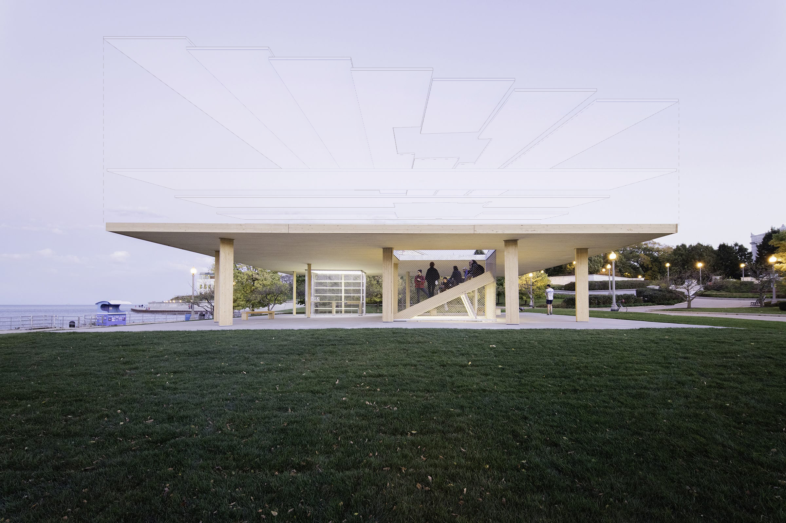
O objetivo é criar uma laje de madeira monolítica através do empilhamento de placas de CLT e do parafusamento entre elas. A solução é ter duas camadas de lajes CLT empilhadas perpendicularmente (Figura 18). As lajes de CLT são anisotrópicas e vencem vãos em apenas uma direção, mas, quando empilhadas perpendicularmente, o sistema adota propriedades bidirecionais.

#### Mass Timber Fastening [20]
Uma tentativa de automatizar o parafusamento é o projeto *Mass Timber Fastening*, que utiliza máquinas de fixação robótica (Figura 19). Elas tornam possível inserir uma multidão de parafusos de uma só vez, mas ainda são operadas manualmente; além disso, a logística de mover essas máquinas e todos os seus cabos de uma área para outra torna este processo apenas ligeiramente mais eficiente se comparado ao parafusamento manual.

Cada camada de CLT é composta por CLT de *Black Spruce* (Picea mariana) de 3 camadas, medindo 2,4 m por 17,0 m em planta (105 mm de espessura). Na primeira camada, as lajes de CLT são parafusadas com pranchas de compensado na costura. A segunda camada de lajes, perpendicular à primeira, é unida pelo mesmo procedimento e, em seguida, fixada à camada inferior com uma matriz de parafusos. Dessa forma, o produto final combina painéis de CLT que são laminados por pregação/parafusamento (NLT - *Nail Laminated Timber*). O resultado é uma estrutura de cobertura de 210 mm de espessura vencendo vãos de até 9 m entre colunas. Embora isso resulte em uma espessura total de laje reduzida e permita até o posicionamento livre das colunas, o sistema é estruturalmente limitado a um único pavimento. Além disso, a necessidade de quase 50 parafusos por metro quadrado carece de escalabilidade.
#### Automatic Assembly of Jointed Timber Structure Using Distributed Robotic Clamps [21]
O projeto da ETH em Zurique adota uma abordagem diferente. Em vez de tentar desenvolver uma grande máquina para automatizar uma tarefa de construção, eles utilizam grampos distribuídos para montar as juntas de uma estrutura complexa de madeira (Figura 20). Através da colaboração com um braço industrial, esses grampos eliminam a necessidade de prover grandes forças de montagem e de corrigir desalinhamentos durante a execução. No entanto, o sistema carece de escalabilidade, pois ainda está limitado ao alcance do robô industrial.

## Desenvolvimento
### Método
Como mencionado anteriormente, nossos métodos podem ser divididos em duas partes: de um lado, a investigação e o desenvolvimento de um sistema material, que utiliza elementos de madeira e uma junta colada *in situ*; de outro, o desenvolvimento de um sistema robótico heterogêneo, incluindo a coordenação entre todos os atores, desde a fabricação no canteiro até a união (*joinery*) *in situ*.

### Desenvolvimento da Pesquisa
A pesquisa iniciou-se investigando agentes acadêmicos e industriais no canteiro de obras e comparando-os sob diferentes aspectos para buscar potenciais combinações para um cenário de construção colaborativa. Demonstra-se que nenhum dos agentes consegue cobrir todas as áreas sozinho, mas, ao combinar vários agentes, as fraquezas de cada sistema podem ser compensadas. Por exemplo, embora robôs distribuídos não consigam atingir as capacidades de carga de um guindaste tradicional, eles se destacam em outras áreas, como a precisão, pois podem ser customizados para uma tarefa específica. Ao combinar ambos os sistemas — o guindaste e os robôs distribuídos — eles poderiam se beneficiar mutuamente, permitindo a execução de tarefas de alta carga e, ao mesmo tempo, alcançando alta precisão. Uma combinação potencial entre o uso de um guindaste, a plataforma TIM e robôs distribuídos guiou os próximos passos desta pesquisa.

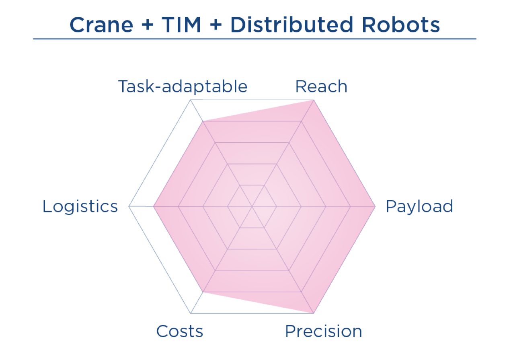
Figura 23 - Comparação de diferentes agentes robóticos no canteiro de obras.

#### Dispositivo Robótico Customizado
Baseando-se na tecnologia de construção disponível, uma nova "espécie robótica" foi proposta para a conexão in situ. O objetivo era alcançar uma união colada entre os diferentes elementos de madeira. Em vez de desenvolver uma máquina de grande porte para parafusar e atingir a pressão necessária — como está sendo desenvolvido no estado da arte "Mass Timber Fastening" (Figura 24) — nossa pesquisa segue uma direção semelhante ao outro projeto de ponta mencionado, "Automatic Assembly of Jointed Timber Structure Using Distributed Robotic Clamps" [21]. Pensamos: por que não criar um dispositivo menor, capaz de aplicar a pressão tão bem quanto um conjunto de parafusos, mas que pudesse ser removido automaticamente depois? (Figura 25).

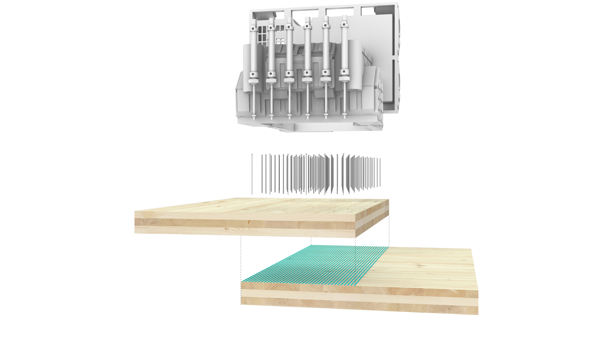

A ideia de funcionamento deste dispositivo baseia-se em furos pré-perfurados na madeira, através dos quais o dispositivo pode ser inserido no canteiro e exercer sua pressão. Para isso, ele precisa realizar duas funções: fixar-se (clamp) na madeira e aplicar a pressão necessária para a secagem da cola. Após o uso, o dispositivo pode aliviar a pressão no furo e cair no chão. Isso permite a automação da conexão in situ.
Além disso, através da reutilização deste dispositivo, é possível não deixar resíduos metálicos na estrutura, abrindo mais possibilidades para o reaproveitamento ao final da vida útil da edificação. De acordo com Jianmei Wu, o gargalo na desmontagem de edifícios de madeira é a remoção das conexões. Por isso, gasta-se mais tempo desmantelando a estrutura do que simplesmente demolindo-a rapidamente [22].
#### Sistema Robótico Heterogêneo
Ao vincular estreitamente todos os diferentes agentes do canteiro, é possível criar um sistema robótico heterogêneo capaz de atuar em diferentes escalas para que se complementem mutuamente. Para tirar o máximo proveito do dispositivo, este sistema consiste em três etapas: uma plataforma robótica industrial móvel para a preparação dos elementos de madeira pré-fabricados, o que inclui a aplicação de cola nos painéis; um guindaste para o transporte; e, por fim, a união dos elementos in situ através do nosso dispositivo. Cada uma dessas etapas é rigorosamente projetada em conjunto para alcançar um fluxo de trabalho colaborativo.

#### Sistema Construtivo
Como as intenções de projeto e as condições do canteiro podem variar, é essencial que o sistema construtivo não seja estático, mas sim uma estrutura adaptativa capaz de reagir a elas. Os dois compartimentos principais são compostos pelo lado material e pelo lado robótico.
Ao ampliarmos a visão, percebemos que muitos subparâmetros influenciam uns aos outros. Através do co-design desses elementos, é possível alcançar um sistema de fabricação sob medida para um design global.
Por exemplo, um dos aspectos críticos da lógica de painéis é o tamanho máximo de painel montável, uma vez que este é definido pelo espaço morfológico da máquina (machinic morphospace) [23] da plataforma robótica móvel. Com a configuração da TIM, seriam permitidos painéis de 3 x 2 m [10]. No entanto, dependendo da configuração (adicionando um eixo linear, por exemplo), essas dimensões poderiam mudar, de modo que o sistema pudesse trabalhar em diferentes resoluções de dimensões de placas. Os capítulos seguintes demonstrarão o fluxo de trabalho computacional do sistema construtivo, respeitando essa restrição.

***Lógica de Paginação (Paneling)***
A lógica de paginação inicia-se a partir do ponto central de cada posição de coluna. Estes pontos podem ser fixos, dependendo de uma intenção de projeto específica. Alternativamente, ao definir um limite específico do terreno, é possível iniciar com um algoritmo de distribuição de colunas para garantir uma dispersão uniforme. Com o auxílio do Karamba3D, calcula-se o momento fletor da laje. Os painéis são então organizados de modo que as juntas de paginação evitem as áreas com alto momento fletor. Isso resulta naturalmente em uma estética de "coluna-cogumelo", já que os momentos fletores máximos são geralmente encontrados no topo da coluna e no meio do vão entre as colunas.
Os painéis são empilhados uns sobre os outros, partindo da coluna para fora, com um painel final cruzando o meio do vão entre colunas vizinhas. Além do aspecto estrutural, a lógica de paginação também é orientada pelo lado da fabricação e, como mencionado anteriormente, por restrições específicas do canteiro, como limitações de transporte e o espaço morfológico da plataforma industrial móvel.

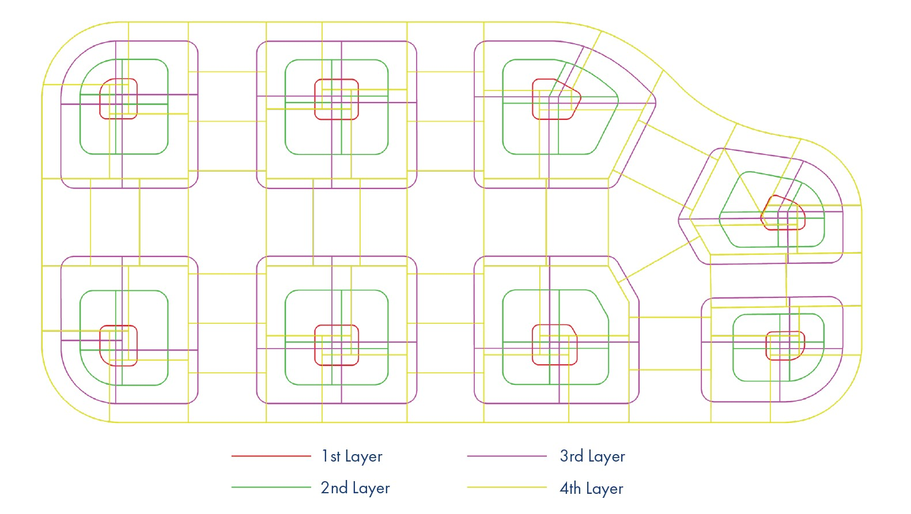

***Lógica de Distribuição da Cola***
Após definir a lógica de paginação, o modelo estrutural é reanalisado para informar a lógica de distribuição de cola, que define, em última instância, o espaçamento dos furos no sistema de madeira para a prensagem da cola in situ. Nesta etapa do desenvolvimento, uma pergunta fundamental foi: como podemos reduzir o consumo de cola e minimizar a quantidade de trabalho no canteiro?
Como a cola é sempre mais forte que a madeira e só pode transferir forças na forma de cisalhamento, o início das falhas do sistema tende a aparecer como o cisalhamento das fibras de madeira adjacentes à interface da cola. Portanto, as tensões transversais que fluem da laje para a coluna são calculadas e divididas pela resistência ao cisalhamento no plano do CLT. Isso resulta em um mapa de calor, que destaca áreas onde mais cola é necessária. Dependendo do dimensionamento do dispositivo robótico customizado, é possível calcular a força correspondente do dispositivo e a área de influência resultante que pode ser pressurizada. Com essa informação, o mapa de calor pode ser preenchido com a quantidade correta de dispositivos robóticos para que o nível de pressão exigido seja atingido em todos os pontos. As linhas de cola são então orientadas para serem aplicadas posteriormente no canteiro, otimizando a trajetória da ferramenta robótica.
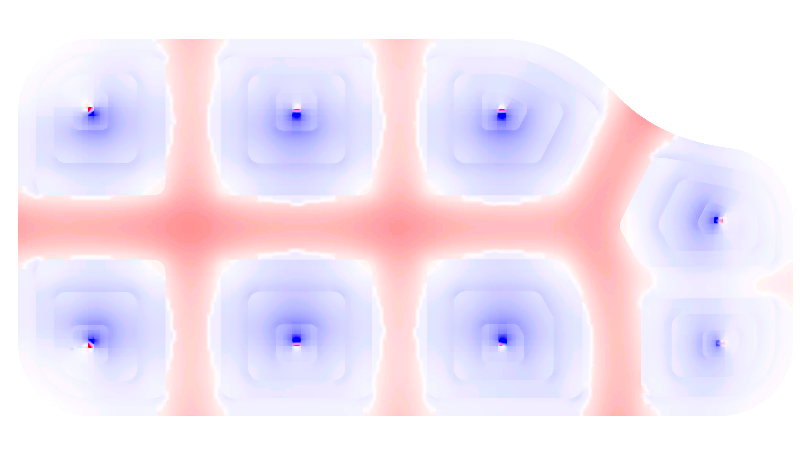

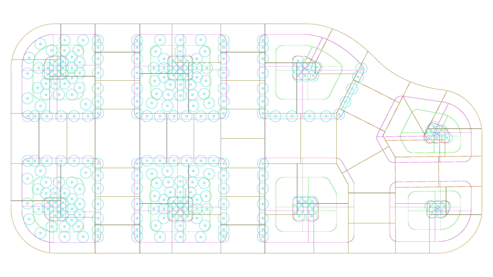
***Canais de Alinhamento***
Para trabalhar com as tolerâncias do guindaste, informações adicionais são incorporadas ao material para tornar o processo de montagem automatizada mais eficiente. Isso é feito através da gravação de canais de alinhamento em um painel e do encaixe de pinos de alinhamento no outro. Este sistema funciona de forma semelhante às peças de LEGO. Este processo é gerado dependendo da lógica de paginação e da ordem de montagem correspondente dos painéis individuais.
A sequência é a seguinte: primeiro, a placa é abaixada até que os pinos atinjam a superfície da placa inferior; em seguida, a placa pode ser arrastada ao longo da superfície até que os pinos de madeira deslizem para dentro dos canais de alinhamento. Assim, minimiza-se o movimento da placa em uma direção; ela pode então ser arrastada através do canal gravado até que os pinos deslizem em seus furos designados.

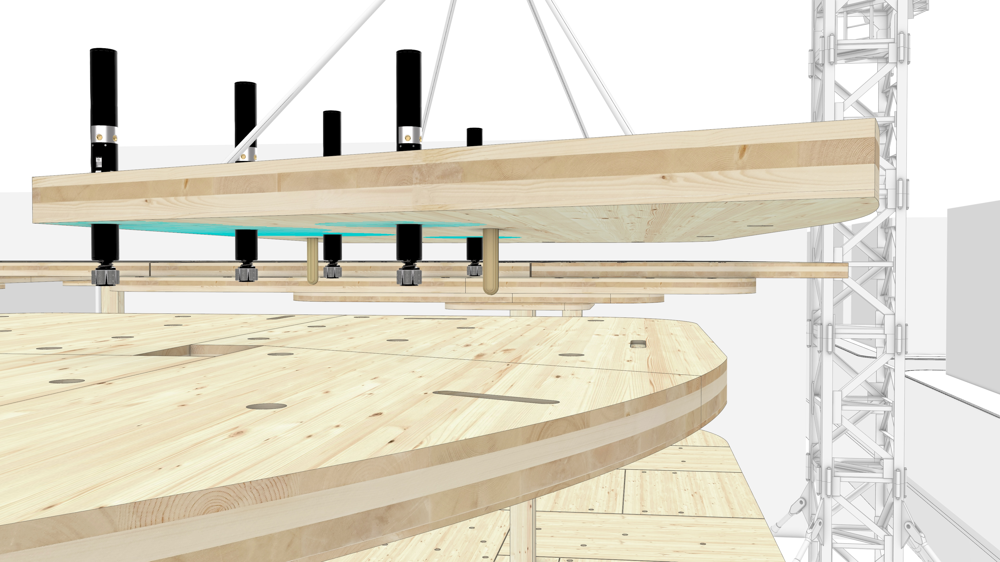

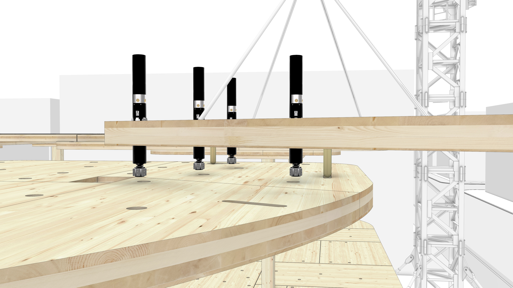

#### Exemplo de Construção
Passando agora para o canteiro de obras, o processo de montagem será demonstrado. Na primeira etapa, os painéis de madeira pré-fabricados serão preparados para a montagem pela plataforma robótica móvel (TIM) antes de serem posicionados *in situ*.

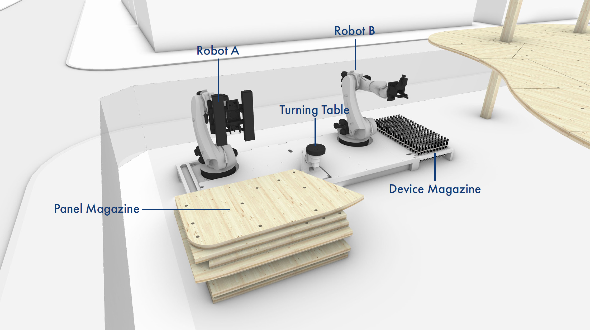

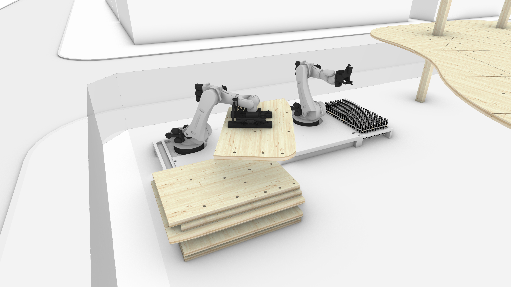

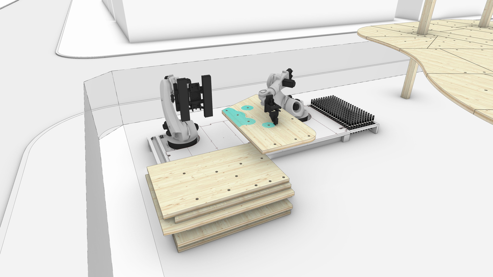

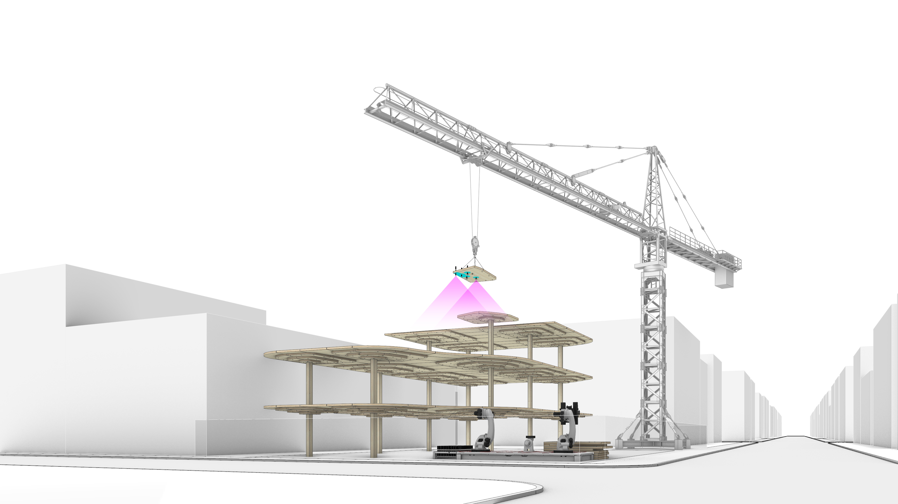

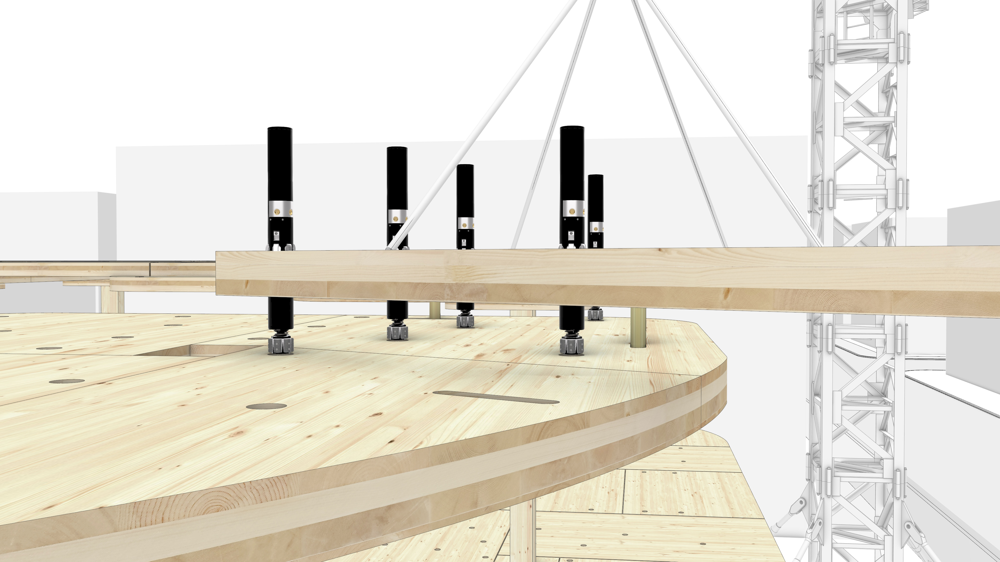

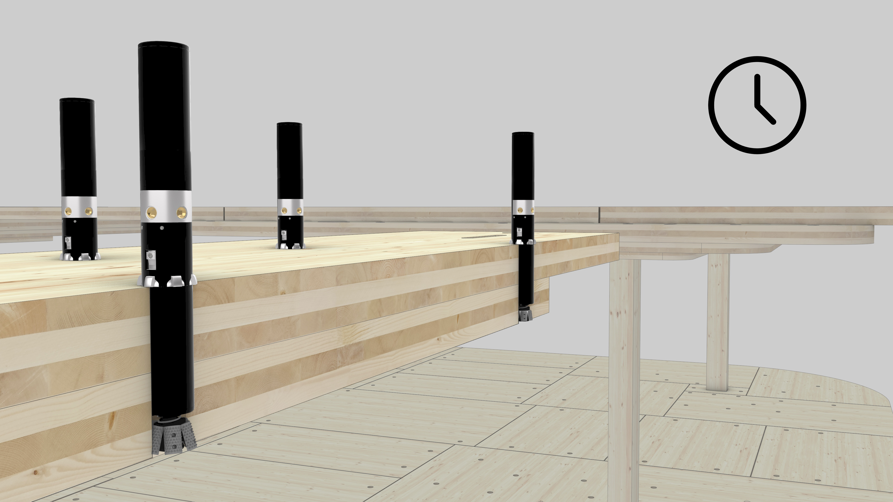

#### **Desenvolvimento do Hardware**
O dispositivo pode ser dividido em quatro componentes: o sistema de controle e uma âncora no topo, o mecanismo de contração no meio e outra âncora na base.
Em geral, o dispositivo precisa realizar duas funções: fixar-se na madeira e aplicar a pressão necessária para a cura da cola. Um dos principais desafios aqui é que o dispositivo precisa ser o menor possível, enquanto aplica a maior pressão possível.

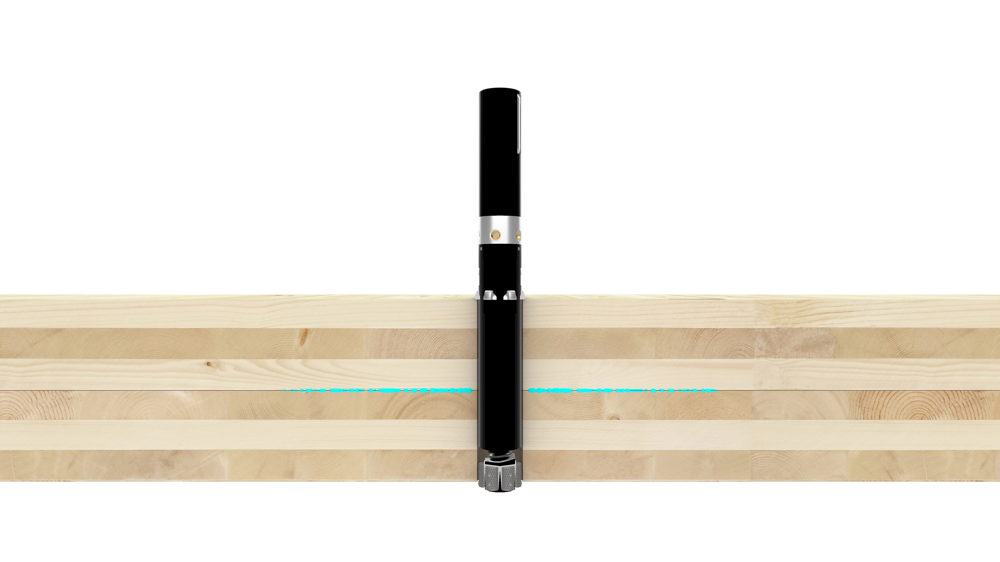

Por conta disso, optamos por uma abordagem pneumática, já que esses sistemas possuem uma excelente relação potência-peso. Eles também exigem baixa manutenção, são baratos e muito robustos, pois são resistentes ao fogo e à água. Para fornecer a pressão necessária dentro do dispositivo, estamos utilizando um cartucho de CO2 recarregável. Aqui, o CO2 é armazenado de forma líquida, o que torna possível inflar todo o dispositivo até uma pressão operacional de 6 bar.
No nosso caso, utilizamos um **músculo pneumático**, que pode ser ativado para realizar um movimento linear de tração. Quando o músculo infla, ele expande radialmente e contrai ao longo dos eixos, produzindo uma força de tração.
Este movimento é então acoplado à âncora inferior. Através de uma mola na base, o movimento inicial do músculo é convertido em um movimento de dobramento da âncora, o que resulta no seu engate na madeira.

Ao posicionar ambas as âncoras na parte externa dos painéis, conseguimos atingir a maior área possível. Dependendo da profundidade dos dois painéis prensados e da força do dispositivo, a possível área de influência pode ser calculada com os métodos explicados anteriormente. O dispositivo em si pode ser controlado via conexão Wi-Fi, para que o tempo e a duração da inflação possam ser ajustados conforme o tempo de abertura e prensagem da cola escolhida.
Após a secagem da cola, o CO2 pode ser liberado do sistema para aliviar a pressão nas âncoras, de modo que o dispositivo possa cair no chão para a próxima operação.
Também investigamos diferentes possibilidades para proteger o dispositivo durante a pressurização da cola. Estas incluíram vaselina, bordas fresadas ao redor do interior do furo e outros tipos de papéis. No final, optamos por uma folha fina de papel enrolada na carcaça do dispositivo, por parecer a solução mais simples. No entanto, dependendo da escolha da cola, não vemos isso como estritamente necessário. Por exemplo, deixar uma folga de 1 cm da borda do furo ao usar uma cola que não expande, como a cola 2K-PUR, não resultou em adesivo sendo empurrado para dentro do furo.

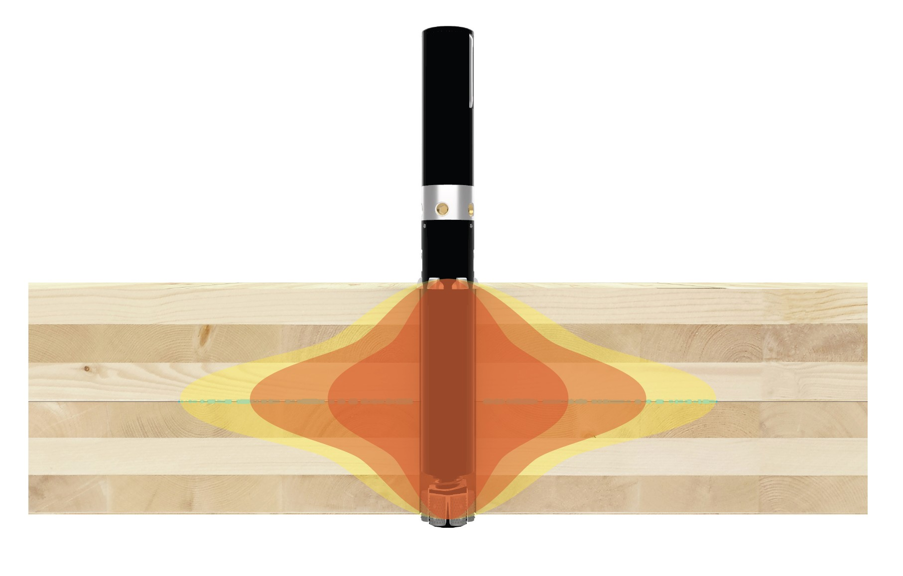

#### **Teste de Resistência**
Para avaliar a resistência do nosso dispositivo, realizamos um teste de tração. Isso foi feito suspendendo o dispositivo entre o teto e o chão e insuflando o músculo com CO2.
O teste de resistência foi repetido com diferentes comprimentos de contração, variando de 5% a 25% da contração total do músculo pneumático. Isso foi realizado ajustando a tensão nas cordas onde o músculo estava pendurado. No estado inflado, com uma contração de 5%, nosso músculo pequeno atingiu cerca de **500N**, enquanto o músculo grande alcançou **2000N**; em ambos os casos, cerca de metade da força estimada que seria teoricamente possível em uma configuração industrial.
O motivo para isso é que nossas peças usinadas em CNC não estavam 100% herméticas, o que impossibilitou a manutenção do nível de pressão máxima para o qual o músculo pneumático foi projetado. No entanto, acreditamos que, com uma nova iteração do design da válvula e uma usinagem de precisão, a força estimada poderia ser atingida.

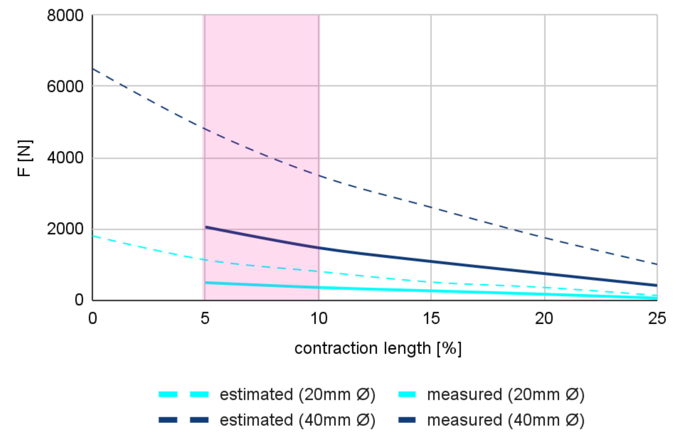

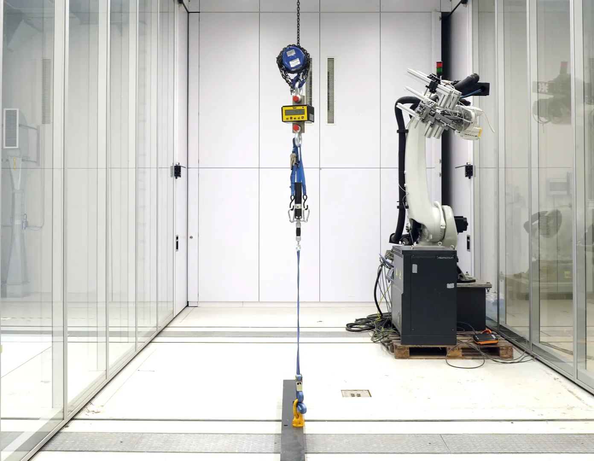
#### **Cálculo do Espaçamento dos Furos**
O cálculo da área de influência para o dispositivo robótico baseia-se na forma como é calculado o espaçamento de parafusos para uma aplicação de pressão de colagem. Tudo foi calculado utilizando uma laje de abeto (*spruce*) de 200 mm de espessura e uma quantidade de adesivo de 300 g/m².
O primeiro estudo baseou-se em uma pressão mínima de **0,1 N/mm²**, conforme a exigência atual da **norma DIN**. Ao aplicar diferentes espaçamentos entre os dispositivos, a área de influência muda e, consequentemente, também a força necessária que deve ser aplicada por cada dispositivo. Essa força relativa necessária dita, então, o dimensionamento e o diâmetro do dispositivo robótico.
O segundo estudo baseia-se em uma pressão mínima de **0,03 N/mm²**, conforme indicado em um artigo da *Helsinki University of Technology* [18], que realizou testes neste nível de pressão e concluiu ser possível obter uma linha de cola cuja resistência ao cisalhamento é tão boa quanto aquelas prensadas a pressões normais. A condição para uma colagem bem-sucedida é que as superfícies coladas estejam adequadamente lisas.
O estudo final utiliza uma pressão mínima de **0,01 N/mm²**, que é mais otimista, mas, como mencionado anteriormente, pesquisas recentes na ciência dos materiais mostram uma direção promissora. Isso já resultaria em uma área de influência de 150.000 mm² para um dispositivo com diâmetro de 40 mm.

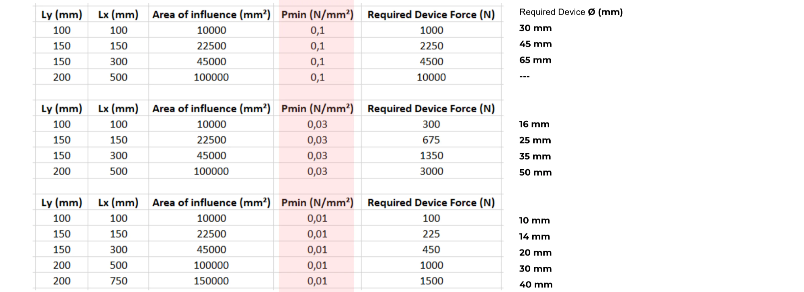

#### **Estratégia de Alinhamento**
Embora nesta etapa do desenvolvimento tenhamos focado principalmente no mecanismo de pressurização, também consideramos uma extensão do dispositivo para auxiliar na união e na montagem dos painéis. Enquanto os canais de alinhamento na madeira ajudam no ajuste dos painéis nos últimos centímetros, um sistema de câmeras poderia auxiliar na navegação do guindaste durante sua operação para entrar no limite de tolerância dos canais. Isso poderia ser feito estendendo o dispositivo robótico com uma câmera embutida na âncora inferior ou projetando um dispositivo adicional com uma câmera de maior poder de processamento. Além disso, pinos mais estáveis poderiam ser usados para auxiliar no alinhamento passivo dos elementos. Alternativamente, estes poderiam ser cavilhas de madeira, que seriam deixadas dentro da estrutura após a montagem.
A ideia é que a placa seja baixada até que as cavilhas atinjam a superfície da estrutura de madeira; a partir daí, a placa pode ser arrastada pela superfície até que as cavilhas deslizem para dentro do canal de alinhamento. Isso minimizaria o movimento da placa em uma direção, permitindo que ela fosse arrastada pelo canal gravado até que as cavilhas deslizassem para seus furos designados.

Os canais de alinhamento foram testados em duas configurações distintas. A primeira consistia em placas de madeira de 80 * 50 * 2 cm com cavilhas de 1,5 cm de espessura, e a segunda em uma placa de CLT de 120 * 80 * 10 cm com cavilhas de 4 cm. Ambos os testes validaram o conceito geométrico do canal, sendo possível montar as placas na posição correta sem ajustes manuais. No entanto, o deslizamento das cavilhas não foi tão simples quanto antecipado, pois o atrito na ponta das cavilhas frequentemente fazia com que elas não deslizassem pelo canal, mas sim criassem um ponto de rotação da placa em torno do eixo da cavilha.
Uma forma de abordar este problema foi não ter as cordas do guindaste presas a um único ponto com rotação livre no topo, mas sim possuir quatro pontos de conexão individuais, espaçados entre si. Futuras iterações no sistema, como adicionar uma terceira cavilha por painel ou chanfrar os canais, seriam necessárias para validar o conceito como eficiente o suficiente para ser operado por um guindaste autônomo.

Através da visão computacional, o dispositivo poderia detectar os furos durante a montagem enquanto é baixado pelo guindaste. A distância entre os furos seria então comparada com o modelo digital para calcular a posição e rotação atuais do painel a ser montado. Todo o procedimento de montagem poderia ser automatizado através de um sistema de feedback conectado ao sistema operacional do guindaste. As cavilhas e os canais de alinhamento serviriam, então, para deslizar o painel até sua posição final.
O painel seria baixado até que as cavilhas atingissem a superfície da estrutura de madeira; a partir daí, a placa poderia ser arrastada pela superfície até que as cavilhas de madeira deslizassem para dentro do canal de alinhamento. Isso minimizaria o movimento da placa em uma direção; ela poderia então ser arrastada através do canal gravado até que as cavilhas deslizassem para seus furos designados.

Figura 62 - Detecção de furos nos elementos de madeira usando visão computacional.

Testes iniciais foram realizados como prova de conceito. O teste consistiu na montagem de uma câmera externa ao painel, fixada ao guindaste (neste caso, uma IntelRealSense D435). Com o auxílio das bibliotecas *realsense2* e *openCV*, foi possível detectar os furos através de uma filtragem progressiva da imagem capturada para extrair sua distância relativa como coordenadas para a câmera. O processo consistiu na conversão da imagem para escala de cinza, seguida de desfoque (*blur*) para reduzir ruído e, finalmente, uma filtragem de limiar (*threshold*) para um determinado valor de cinza. A partir disso, os contornos foram filtrados e suas áreas verificadas para corresponder ao tamanho de pixel esperado dos furos. Este método provou ser muito confiável sob boas condições de iluminação. Contudo, como o canteiro de obras é um ambiente não estruturado, estes métodos precisariam ser refinados para entregar resultados mais consistentes.
#### Demonstrador
Uma seção em escala reduzida do sistema de madeira foi escolhida para ser projetada como um demonstrador, visando validar o processo de montagem e avaliar as tolerâncias do sistema. O protótipo consiste em uma coluna com três camadas de painéis CLT de 10 cm de espessura laminados entre si, atingindo três metros de diâmetro no topo e uma altura total de 2,70 metros.
Os painéis foram usinados em uma máquina CNC de 3 eixos, o que incluiu a furação, a gravação dos canais de alinhamento e o corte dos contornos. Posteriormente, os painéis foram levados ao laboratório do IntCDC em Waiblingen para a demonstração da montagem.

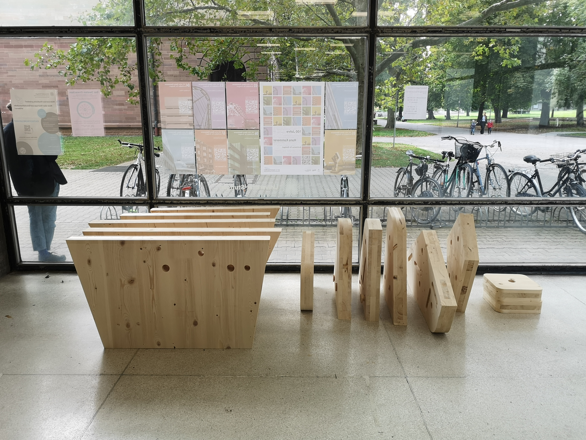
A configuração robótica consistiu na plataforma TIM (uma plataforma robótica móvel customizada para fabricação em madeira), um guindaste aranha e nosso dispositivo customizado. Adicionalmente, um efetuador final foi projetado para auxiliar no posicionamento automatizado dos dispositivos e das cavilhas. Dois processos não puderam ser exibidos na montagem final do dispositivo: a aplicação da cola foi feita manualmente, pois naquele momento a pistola de cola da TIM não estava operacional, e parafusos M20 foram utilizados para aplicar a pressão *in situ*, visto que apenas um protótipo operacional do dispositivo robótico não era suficiente para montar toda a estrutura.

Figura 66 - Coleta da placa de madeira e posicionamento na área de trabalho da plataforma robótica móvel.

Figura 67 - Cavilhas sendo posicionadas pelo efetuador final customizado.

Figura 68 - Robotic device magazine.

Figura 69 - Dispositivo de fixação sendo colocado nos furos.

Figura 70 - Guindaste içando a placa.

Figura 71 - Guindaste posicionando a placa no topo da estrutura.

Figura 72 - Detecção de furos para guiar o guindaste durante a montagem.

Figura 73 - Cavilhas deslizando no canal de alinhamento para auxiliar no posicionamento passivo das placas.

Figura 74 - Dispositivo caindo após a prensagem da cola, pronto para ser coletado.

## Discussão
A montagem do demonstrador final comprovou o potencial do sistema em escala 1:1. Embora o protótipo do dispositivo proposto não tenha atingido a força estimada, vemos um desenvolvimento promissor nessa direção e estamos otimistas de que esses níveis de resistência possam ser alcançados em iterações futuras. Outro ponto de evolução do dispositivo é o mecanismo de queda. Embora o mecanismo funcione, há preocupações quanto à longevidade do dispositivo em um cenário real de construção. Ideias anteriores para resolver este problema incluem o desenvolvimento de um mecanismo de amortecimento na base do dispositivo. Outra abordagem conceitual seria reconsiderar a necessidade de o dispositivo cair no chão.
Graças aos canais de alinhamento, foi possível montar os painéis com altíssima precisão, sem a necessidade de ajustes de posição *in situ*. Um efeito colateral positivo das cavilhas foi permitir que toda a estrutura fosse montada sem qualquer andaime, uma vez que elas travaram as placas em uma posição estável o suficiente para prosseguir com a aplicação de pressão. Isso foi especialmente importante porque o centro de gravidade das "folhas" (painéis) não estava sobre a estrutura principal naquele momento, o que as faria tombar de outra forma. Pontos de preocupação, como o gotejamento da cola durante o transporte do painel pelo guindaste, não ocorreram durante a montagem.
## Perspectivas (Outlook)
O sistema de madeira proposto demonstra o potencial de criar uma laje quasi-monolítica. Isso permite uma laje de madeira apoiada em pontos com dimensões ilimitadas, o que abre maior flexibilidade de design na planta baixa e expande o espaço de projeto arquitetônico. No entanto, para validá-lo totalmente como um sistema construtivo funcional, outros pontos, como segurança acústica e contra incêndio, além da integração de instalações (elétrica/hidráulica), precisam ser considerados.
A pesquisa demonstrou as vantagens de trabalhar em um sistema robótico heterogêneo e mostrou como, através do co-design com o material, é possível automatizar ainda mais a construção em madeira no canteiro. A integração da lógica de construção no próprio material apresenta uma abordagem para atingir alta precisão durante a montagem e automatizar a operação de um guindaste. A aplicação do dispositivo distribuído para prensagem *in situ* de conexões coladas mostra-se promissora para a automação deste processo. Especialmente com o desenvolvimento exponencial de adesivos e a necessidade de as estruturas de madeira serem competitivas com o concreto, vemos um grande potencial para o uso deste dispositivo em uma configuração industrial.
## Adendo
### Agradecimentos
Gostaríamos de agradecer a…
**Samuel Leder e Hans Jakob Wagner**
pelo apoio constante durante nossa tese de mestrado e pelas valiosas percepções, sem as quais esta tese não teria sido possível. E, claro, pela paciência e por responderem aos nossos e-mails tarde da noite.
**Toda a turma do ITECH 2021**
por um tempo incrível ao longo dos últimos dois anos.
**Katja Rinderspacher**
por estar constantemente presente e nos guiar durante nosso tempo na universidade.
**Bernhard Rolle**
por fornecer informações valiosas sobre o conhecimento de ponta em automação e guindastes para montagem no canteiro.
**Anja Lauer**
por nos ensinar tudo sobre a operação de guindastes e por sua confiança em nós para não colidi-los.
**Tzu-Ying Chen**
por seus conselhos de engenharia e por sempre dedicar tempo às nossas questões estruturais.
**Sergej Klassen e Kai Stiefenhofer**
pelo apoio e orientação durante a fabricação do nosso demonstrador.
**Michael Preisack, Michael Schneider e Michael Tondera**
pela ajuda nas oficinas de madeira e metal e pela paciência com nossos pesados painéis de madeira.
**Prof. Achim Menges e Prof. Jan Knippers**
por seus valiosos feedbacks, sabedoria e pela oportunidade de fazer parte deste programa.
**Festo, Müllerblaustein e Henkel**
pelo fornecimento de materiais e equipamentos necessários para dar vida a esta tese.
**IntCDC**
Apoiado parcialmente pela *Deutsche Forschungsgemeinschaft* (DFG, Fundação de Pesquisa Alemã) sob a Estratégia de Excelência da Alemanha – EXC 2120/1 – 390831618.
**Família e Amigos**
por estarem sempre ao nosso lado e nos incentivarem.
### Referências
[1] H. Kaufmann, S. Krötsch, and S. Winter, Manual of multi-storey timber construction. Munich: Detail Business Information, 2018. ISBN 978-3955533946
[2] United Nations, Department of Economic and Social Affairs, and Population Division, World urbanization prospects: the 2018 revision. 2019. [Online]. Available: [https://population.un.org/wup/Publications/Files/WUP2018-Report.pdf](https://population.un.org/wup/Publications/Files/WUP2018-Report.pdf), (accessed Feb. 22, 2021) ISBN 978-92-1-148319-2
[3] K. H. Petersen, N. Napp, R. Stuart-Smith, D. Rus, and M. Kovac, “A review of collective robotic construction,” Sci. Robot., vol. 4, no. 28, p. eaau8479, Mar. 2019, doi: 10.1126/scirobotics.aau8479.
[4] F. Barbosa et al., “Reinventing Construction: A Route to Higher Productivity,” McKinsey & Company. [Online]. Available: [https://www.mckinsey.com/business-functions/operations/our-insights/reinventing-construction-through-a-productivity-revolution](https://www.mckinsey.com/business-functions/operations/our-insights/reinventing-construction-through-a-productivity-revolution), (accessed Feb. 02, 2021).
[5] T. Bock, “The future of construction automation: Technological disruption and the upcoming ubiquity of robotics,” Autom. Constr., vol. 59, pp. 113–121, Nov. 2015, doi: 10.1016/j.autcon.2015.07.022.
[6] T. Bock and T. Linner, Robot-Oriented Design: Design and Management Tools for the Deployment of Automation and Robotics in Construction. New York: Cambridge University Press, 2015. doi: 10.1017/CBO9781139924146.
[7] B. G. de Soto and M. J. Skibniewski, “Future of robotics and automation in construction,” in Construction 4.0, 1st ed., A. Sawhney, M. Riley, and J. Irizarry, Eds. Routledge, 2020, pp. 289–306. doi: 10.1201/9780429398100-15.
[8] N. Melenbrink, J. Werfel, and A. Menges, “On-site autonomous construction robots: Towards unsupervised building,” Autom. Constr., vol. 119, p. 103312, Nov. 2020, doi: 10.1016/j.autcon.2020.103312.
[9] L. Vasey, B. Felbrich, M. Prado, B. Tahanzadeh, and A. Menges, “Physically distributed multi-robot coordination and collaboration in construction: A case study in long span coreless filament winding for fiber composites,” Constr. Robot., vol. 4, no. 1–2, pp. 3–18, Jun. 2020, doi: 10.1007/s41693-020-00031-y.
[10] H. J. Wagner, M. Alvarez, O. Kyjanek, Z. Bhiri, M. Buck, and A. Menges, “Flexible and transportable robotic timber construction platform – TIM,” Autom. Constr., vol. 120, p. 103400, Dec. 2020, doi: 10.1016/j.autcon.2020.103400.
[11] J. Willmann, F. Gramazio, and M. Kohler, “New paradigms of the automatic,” in Advancing Wood Architecture, 1st ed., A. Menges, T. Schwinn, and O. D. Krieg, Eds. New York : Routledge, 2016.: Routledge, 2016, pp. 13–28. doi: 10.4324/9781315678825-2.
[12] M. H. Ramage et al., “The wood from the trees: The use of timber in construction,” Renew. Sustain. Energy Rev., vol. 68, pp. 333–359, Feb. 2017, doi: 10.1016/j.rser.2016.09.107.
[13] A. Menges, “The New Cyber-Physical Making in Architecture: Computational Construction: The New Cyber-Physical Making in Architecture: Computational Construction,” Archit. Des., vol. 85, no. 5, pp. 28–33, Sep. 2015, doi: 10.1002/ad.1950.
[14] “Ziele Handlungsfelder - Holzbau-Offensive BW.” [https://www.holzbauoffensivebw.de/de/p/ziele-der-landesregierung/ziele-handlungsfelder-1075.html](https://www.holzbauoffensivebw.de/de/p/ziele-der-landesregierung/ziele-handlungsfelder-1075.html) (accessed Oct. 19, 2021).
[15] “Design as in reinforced concrete, but build in wood,” Holz-Zentralblatt, p. 13, 2021. [Online]. Available: [https://www.ts3.biz/de/medien/pdf/Holzzentralblatt_01_2021Seite-2.pdf](https://www.ts3.biz/de/medien/pdf/Holzzentralblatt_01_2021Seite-2.pdf), access date: 24/02/2021. 
[16] H. J. Wagner, H. Chai, Zhixian Guo, A. Menges, and P. F. Yuan, “Towards an On-site Fabrication System for Bespoke, Unlimited and Monolithic Timber Slabs,” 2020, doi: 10.13140/RG.2.2.14098.68802/1.
[17] TS3, “Timber Structures 3.0.” [Online]. Available: [https://www.ts3.biz/en/technologien/index.php](https://www.ts3.biz/en/technologien/index.php), (accessed Feb. 24, 2021).
[18] M. Kairi, Schraubenverleimungen erlauben neue Möglichkeiten im Ingenieurholzbau, “Screw gluing gives new possibilities for wood engineering,” 2000. [Online]. Available: [https://www.forum-holzbau.com/pdf/matti_00.pdf](https://www.forum-holzbau.com/pdf/matti_00.pdf), (accessed Feb. 05, 2021).
[19] B. H. Schneider, A. Forrest, Y. Vobis, D. Croteau, and M. Oberholzer, “Development of a Two-way Column-supported Flat Plate in Cross Laminated Timber,” in IABSE Symposium, Vancouver 2017: Engineering the Future, Vancouver, Canada, 2017, pp. 1957–1964. doi: 10.2749/vancouver.2017.1957.
[20] “Innovating to Thrive for the Next 130 Years,” Swinerton, Oct. 19, 2020. [https://swinerton.com/blog/innovating-to-thrive-for-the-next-130-years/](https://swinerton.com/blog/innovating-to-thrive-for-the-next-130-years/) (accessed Jul. 27, 2021).
[21] P. Y. V. Leung, A. A. Apolinarska, D. Tanadini, F. Gramazio, and M. Kohler, “Automatic Assembly of Jointed Timber Structure Using Distributed Robotic Clamps,” p. 10. [https://doi.org/10.3929/ethz-b-000481928](https://doi.org/10.3929/ethz-b-000481928)
[22] J. Wu, L. Liu, and H. Xu, “Evaluation Method For Wooden Buildings Disassemblability and Case Verification,” p. 6, 2017. [https://doi.org/10.3390/su12062220](https://doi.org/10.3390/su12062220)
[23] A. Menges, “Morphospaces of Robotic Fabrication,” in Rob | Arch 2012, S. Brell-Çokcan and J. Braumann, Eds. Vienna: Springer Vienna, 2013, pp. 28–47. doi: 10.1007/978-3-7091-1465-0_3.
### Figura References
Fig. 1 - By authors
Fig. 2 - T. Bock, ‘The future of construction automation: Technological disruption and the upcoming ubiquity of robotics’, Autom. Constr., vol. 59, pp. 113–121, Nov. 2015, doi: 10.1016/j.autcon.2015.07.022.
Fig. 3 -T. Bock, ‘The future of construction automation: Technological disruption and the upcoming ubiquity of robotics’, Autom. Constr., vol. 59, pp. 113–121, Nov. 2015, doi: 10.1016/j.autcon.2015.07.022.
Fig. 4 - Fertighaus – Vorteile und Bauweise. [Online]. Available: [https://www.bau-welt.de/haus-konfigurator/fertighaus.html](https://www.bau-welt.de/haus-konfigurator/fertighaus.html)
Fig. 5 - T. Bock, ‘The future of construction automation: Technological disruption and the upcoming ubiquity of robotics’, Autom. Constr., vol. 59, pp. 113–121, Nov. 2015, doi: 10.1016/j.autcon.2015.07.022.
Fig. 6 - H. J. Wagner, M. Alvarez, O. Kyjanek, Z. Bhiri, M. Buck, and A. Menges, “Flexible and transportable robotic timber construction platform – TIM,” Automation in Construction, vol. 120, p. 103400, Dec. 2020, doi: 10.1016/j.autcon.2020.103400.
Fig. 7- S. Lut, T. Stark, L. Siriwardena, S. Bechert, H. J. Wagner, und M. Maierhofer, „Robot team enabled carbon fibre joining strategies for lightweight wood construction“, 2020
Fig. 8 - Sequential Roof. [Online]. Available: [https://ita.arch.ethz.ch/archteclab/sequential-roof-.html](https://ita.arch.ethz.ch/archteclab/sequential-roof-.html) , (accessed Feb. 24, 2021)
Fig. 9 - Arch_Tec_Lab, ETH Zurich [Online]. Available: [https://www.luechingermeyer.ch/en/project/hib-gebaeude-eth-hoenggerberg-zuerich/](https://www.luechingermeyer.ch/en/project/hib-gebaeude-eth-hoenggerberg-zuerich/)
Fig. 10 - Holzbau Offensive Baden-Württemberg [Online]. Available: [https://www.holzbauoffensivebw.de/de](https://www.holzbauoffensivebw.de/de) (accessed Nov. 01, 2021)
Fig. 11- H. Kaufmann, S. Krötsch, and S. Winter, Manual of multi-storey timber construction. Munich: Detail Business Information, 2018. ISBN 978-3955533946
Fig. 12 - M. H. Ramage et al., ‘The wood from the trees: The use of timber in construction’, Renew. Sustain. Energy Rev., vol. 68, pp. 333–359, Feb. 2017, doi: 10.1016/j.rser.2016.09.107.
Fig. 13 - By authors
Fig. 14 - Geschossdecken. [Online]. Available: [https://www.ts3.biz/de/teaser/Geschossdecken.php](https://www.ts3.biz/de/teaser/Geschossdecken.php) (accessed Nov. 01, 2021)
Fig. 15 - Rethinking Timber Building. [Online]. Available: [https://presse.atp.ag/en/news-detail/490-holzbau-neu-gedacht/1746](https://presse.atp.ag/en/news-detail/490-holzbau-neu-gedacht/1746)
Fig. 16 - By authors
Fig. 17 and Fig. 18 - B. H. Schneider, A. Forrest, Y. Vobis, D. Croteau, and M. Oberholzer, “Development of a Two-way Column-supported Flat Plate in Cross Laminated Timber,” in IABSE Symposium, Vancouver 2017: Engineering the Future, Vancouver, Canada, 2017, pp. 1957–1964. doi: 10.2749/vancouver.2017.1957
Fig. 19 - Mass Timber Fastening by Swinerton’s Innovation, 2021. [Online]. Available: [https://swinerton.com/blog/innovating-to-thrive-for-the-next-130-years/](https://swinerton.com/blog/innovating-to-thrive-for-the-next-130-years/)
Fig. 20 - P. Y. V. Leung, A. A. Apolinarska, D. Tanadini, F. Gramazio, and M. Kohler, “Automatic Assembly of Jointed Timber Structure Using Distributed Robotic Clamps,” p. 10. 
[ttps://doi.org/10.3929/ethz-b-000481928](https://doi.org/10.3929/ethz-b-000481928)
Fig. 21 to Fig. 76 - By authors
## **Apêndice**

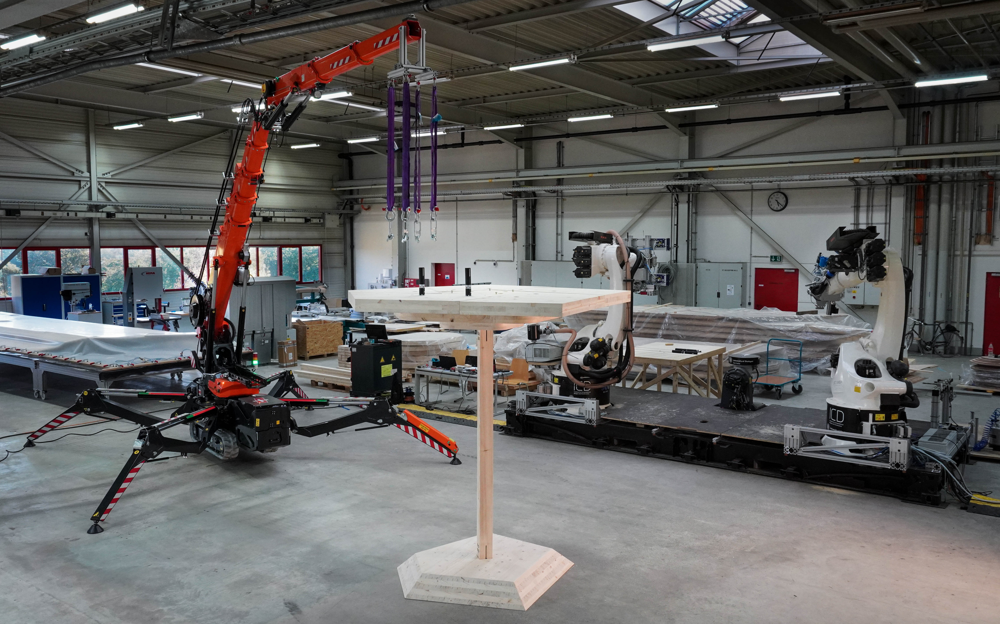

