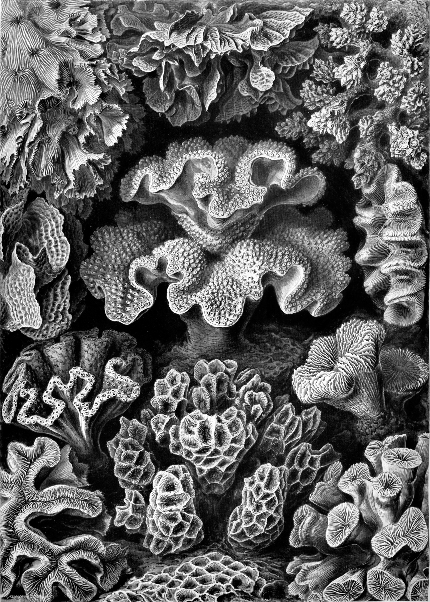
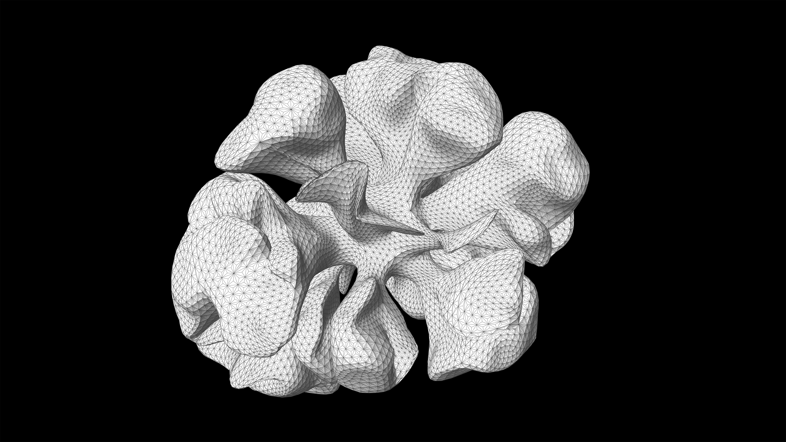
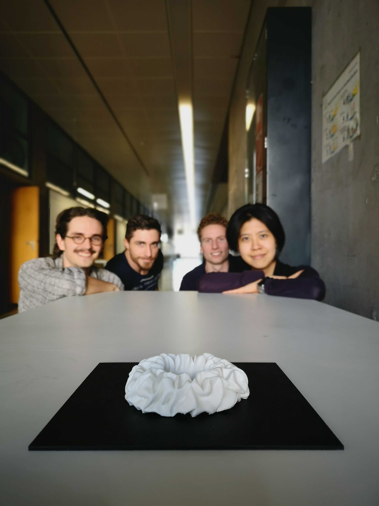

import Video from '@/components/Video.astro'

<Video autoplay src="/media/research/differential-growth-in-corals/differential-growth.mp4" caption="Differential growth in action." />

A natureza é uma designer de pelo menos 3,8 bilhões de anos. De microrganismos a grandes mamíferos, é fascinante como a natureza tira o máximo proveito do material disponível.
Este estudo explorou uma ampla gama de estruturas estáticas na natureza, em geral, as lições são que o material é escasso e a forma é abundante. Em outras palavras, a natureza otimiza as formas para economizar material enquanto, ao mesmo tempo, fortalece a estrutura, fatores extremamente interessantes para a arquitetura.
Investigamos tudo sobre corais, desde pólipos, a unidade única de um coral, até atóis, uma formação de ilha em forma de anel que emerge de muitos corais juntos.

Nós restringimos esta pesquisa a Stony Corals, especificamente sobre como ele cresce por um processo chamado brotamento, onde seus pólipos se duplicam. Esta pesquisa avançou em muitas estratégias de design computacional. O resultado final é um código Python que implementa um sistema baseado em agentes, uma análise de elementos finitos e suporte a aprendizado de máquina.

<Video autoplay src="/media/research/differential-growth-in-corals/morphogenetic_-design-system_720p.mp4" caption="A canopy generated using the complete morphogenetic design system." />

