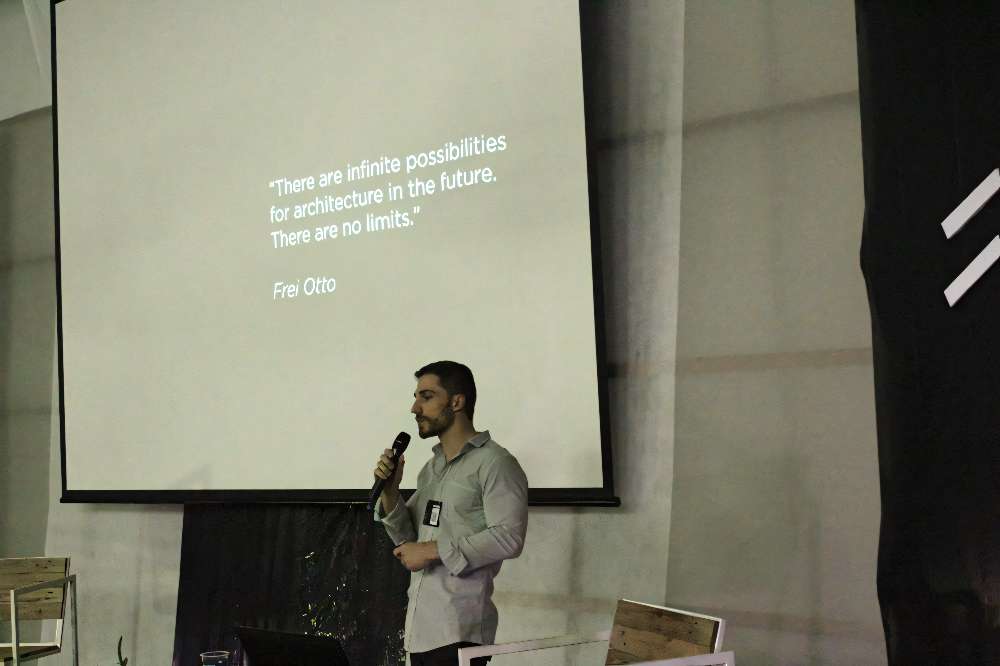

UNEMAT war die erste Universität, an der ich Architektur studierte. Zehn Jahre nach Beginn meines Studiums hielt ich diesen Vortrag über meinen gesamten Werdegang, vom Universitätswechsel zur FAU-USP über meine Arbeit im Atelier Marko Brajovic bis hin zu meinem jüngsten Karrierewechsel, der sich speziell auf Computational Design und Programmierung konzentrierte. Der Vortrag mit dem Titel "Architektur + Biomimetik + Algorithmus" war in drei Teile gegliedert.

## Teil 1: Akademischer Werdegang

Der erste Teil behandelte den akademischen Werdegang nach dem Verlassen der UNEMAT, beginnend mit dem Wechsel an die FAU-USP in São Paulo. Dort reichte die Erfahrung vom ikonischen Gebäude von Vilanova Artigas mit seinen berühmten Undichtigkeiten über das LAME-Labor, inspirierende Professoren und eine starke soziale Ausrichtung in der Architektur, wobei der Technologiebereich begrenzt blieb.

Durch das Stipendienprogramm Ciências sem Fronteiras verbrachte ich anschließend Zeit an der Auburn University in Alabama, wo das Rural-Studio-Programm praktische Erfahrung beim Bauen von Projekten für benachteiligte Gemeinden bot und rigorose Feldarbeit mit realem gesellschaftlichem Einfluss verband. Darauf folgte ein Praktikum an der California State University, Long Beach (CSULB), wo der Arbeitsablauf dynamisch war, die technischen Anforderungen streng und Anpassungen nahezu in Echtzeit stattfanden. Fließendes Englisch zu lernen erwies sich als entscheidender Wendepunkt und langfristige Investition.

## Teil 2: Atelier Marko Brajovic

Der zweite Teil präsentierte die Arbeit im Atelier Marko Brajovic, einem Architekturbüro in São Paulo mit tiefer Verwurzelung in der Biomimetik. Zu den vorgestellten Projekten gehörten der Ekoa Park (mit Ausführungszeichnungen, Schnitten und Besonnungsstudien), der Docol-Stand auf der Exporevestir, der Parada-Coca-Cola-Pavillon, Tensegrity-Strukturen und die Nike-Air-Max-Installation.

## Teil 3: Forschung und Grasshopper

Der letzte Teil widmete sich unabhängiger Forschung und computerbasierten Designexplorationen mit Grasshopper. Dabei wurde eine breite Palette algorithmischer Techniken demonstriert: Attractor, Circle Packing, Delaunay, Differential Growth, Dual Mesh, Exoskeleton, Fractal, Gradient Descent, Hexagon, Inflatable, L-system, Metaball, Minimal Path Networks, Multi-Agent Interactions, Origami, Phyllotaxis, Relaxation, Reciprocal, Relative Neighborhood, Substrate, Tensegrity, Twisted Tower, Voronoi, Zonohedral Dome, Waffle sowie Umweltanalysen mit Honeybee und Ladybug.

