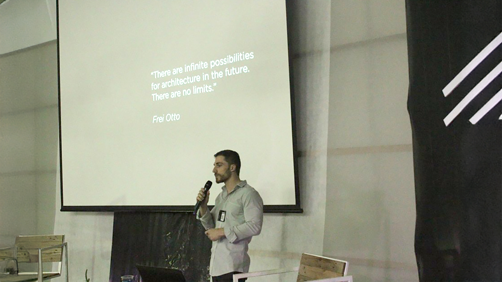
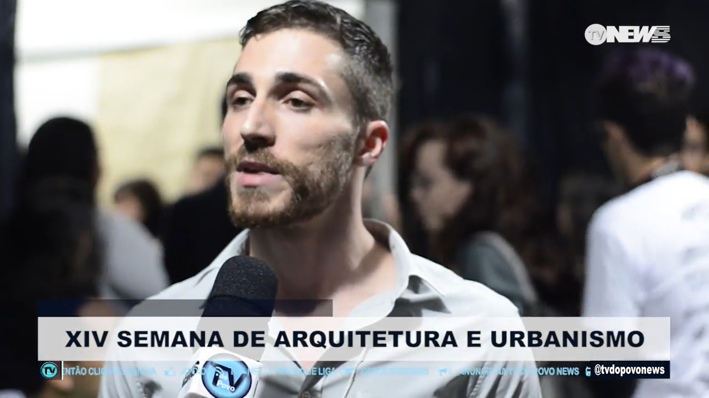

UNEMAT war die erste Universität, an der ich Architektur studierte. Zehn Jahre nach Beginn meines Studiums hielt ich diesen Vortrag über meinen gesamten Werdegang – vom Universitätswechsel zur FAU-USP über meine Arbeit im Atelier Marko Brajovic bis hin zu meinem jüngsten Karrierewechsel, der sich speziell auf Computational Design und Programmierung konzentrierte.

