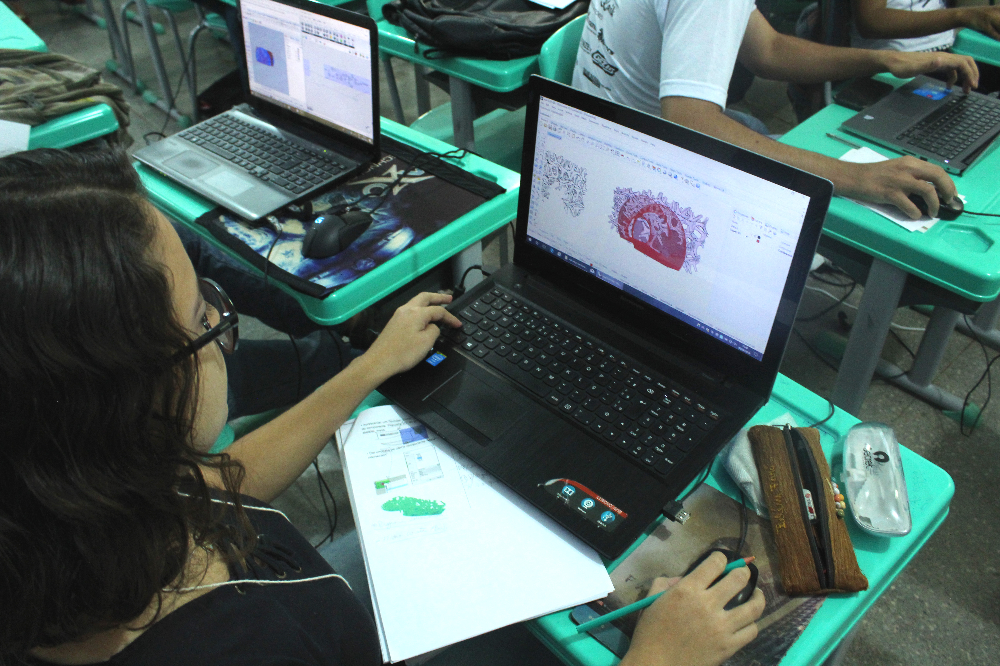

---
{
  "Cover": "/assets/content/teaching/adaptive-grasshopper-workshop/cover-cover.jpg",
  "CoverAlt": "Gruppenfoto mit allen Studierenden und dem Workshop-Ergebnis im Hintergrund.",
  "Description": "Neben dem Erlernen der Grundlagen von Grasshopper für Rhinoceros konnten die Teilnehmer die Richtung des Kurses bestimmen, indem sie aus mehreren bereits gut untersuchten Strategien im Bereich des Computerdesigns auswählten, in welche sie sich vertiefen wollten: In diesem Fall wählten sie „Exoskelett“.",
  "Name": "Adaptiver Grasshopper-Workshop",
  "Slug": "teaching/adaptive-grasshopper-workshop",
  "Tags": [],
  "Authors": [],
  "Category": "Workshop",
  "City": [
    "Barra do Bugres"
  ],
  "DateStart": "2018-06-07",
  "DateEnd": "2018-06-08",
  "Event": "XIV Semana da Arquitetura e Urbanismo",
  "Language": "Portuguese",
  "Link": [],
  "Place": "UNEMAT Barra do Bugres"
}
---

Neben dem Erlernen der Grundlagen von Grasshopper für Rhinoceros konnten die Teilnehmer die Richtung des Kurses mitbestimmen, indem sie aus mehreren bereits gut erforschten Strategien im Bereich des Computational Design auswählten, in welche sie sich vertiefen wollten: In diesem Fall wählten sie „Exoskeleton”.

