Dieser Workshop zielte darauf ab, Computational-Design-Praktiken mit natürlichen Phänomenen zu verbinden und behandelte Themen wie Biomimetik, Modellierung mit der Natur und visuelle Programmiersprachen unter Verwendung von Rhino und Grasshopper.

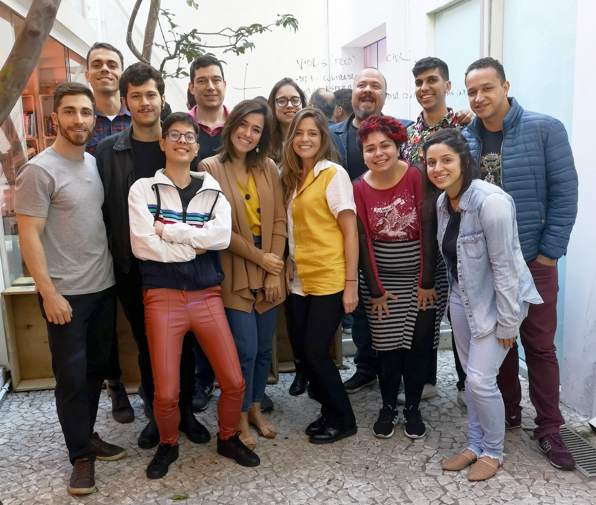

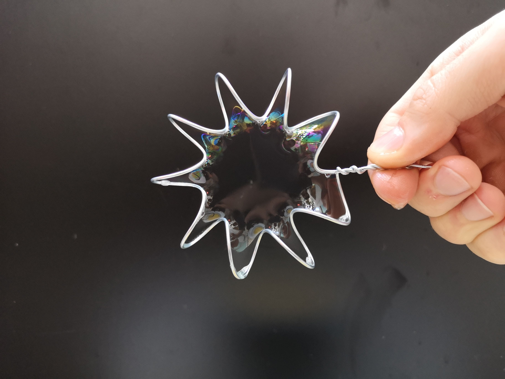

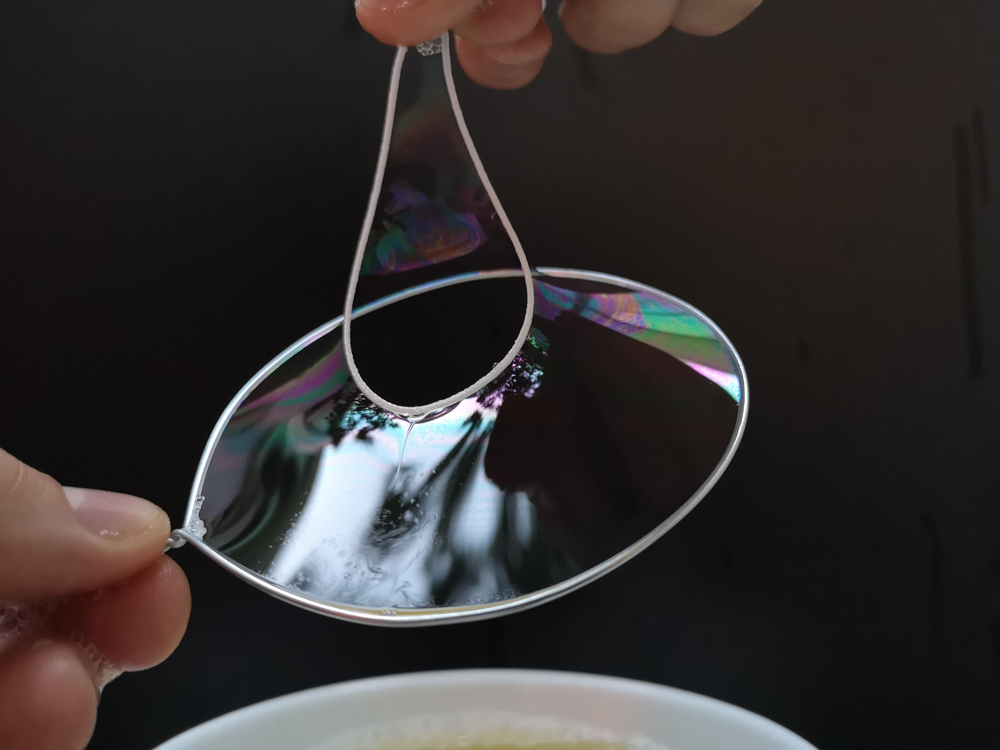

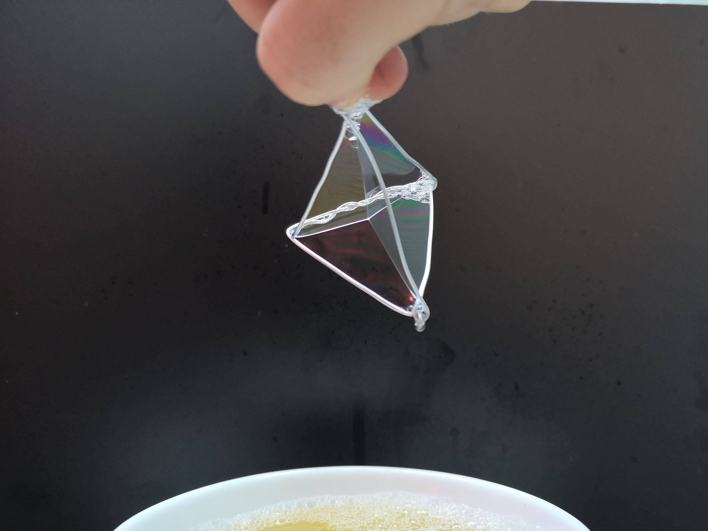

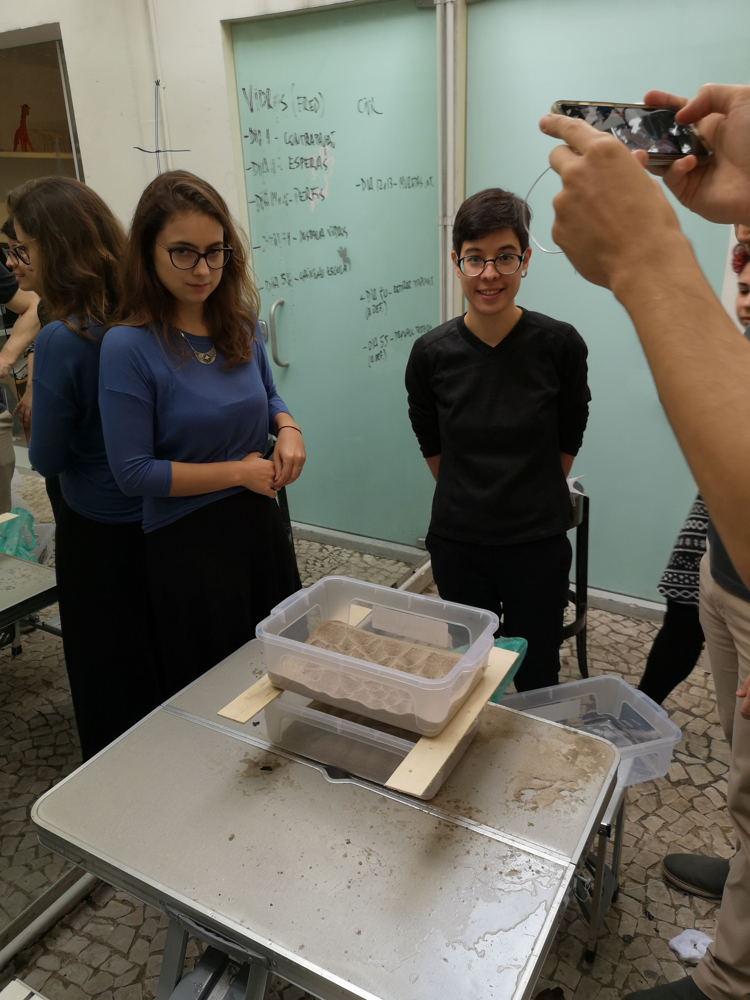

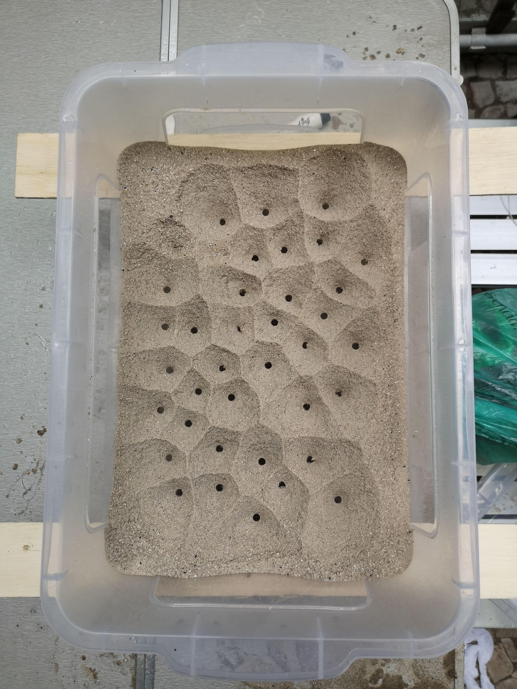

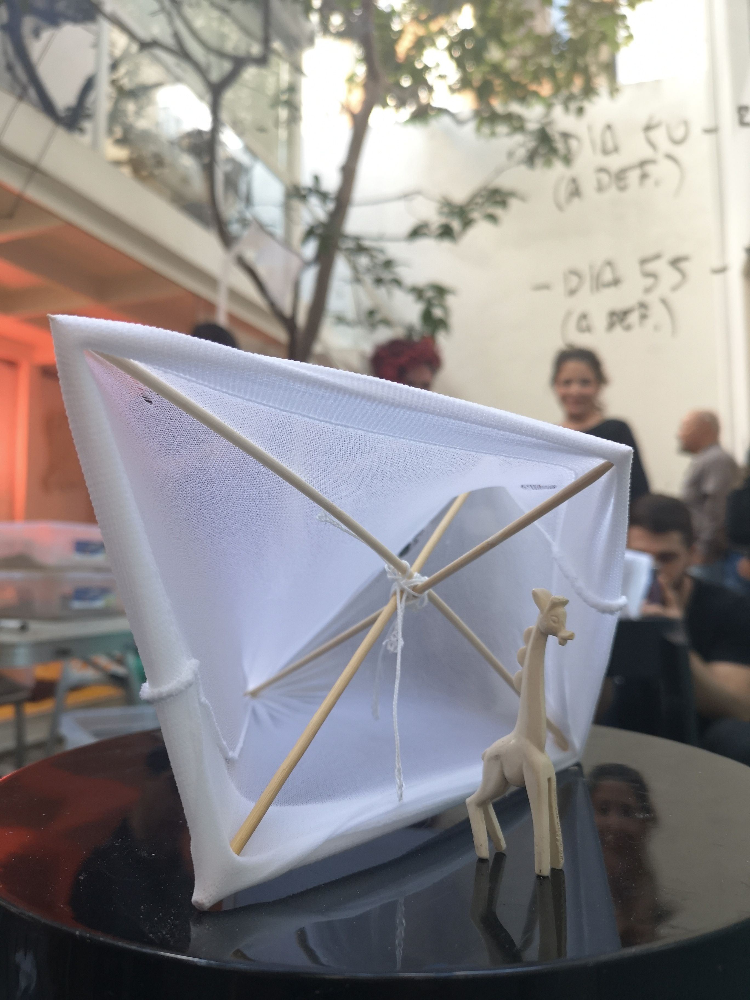

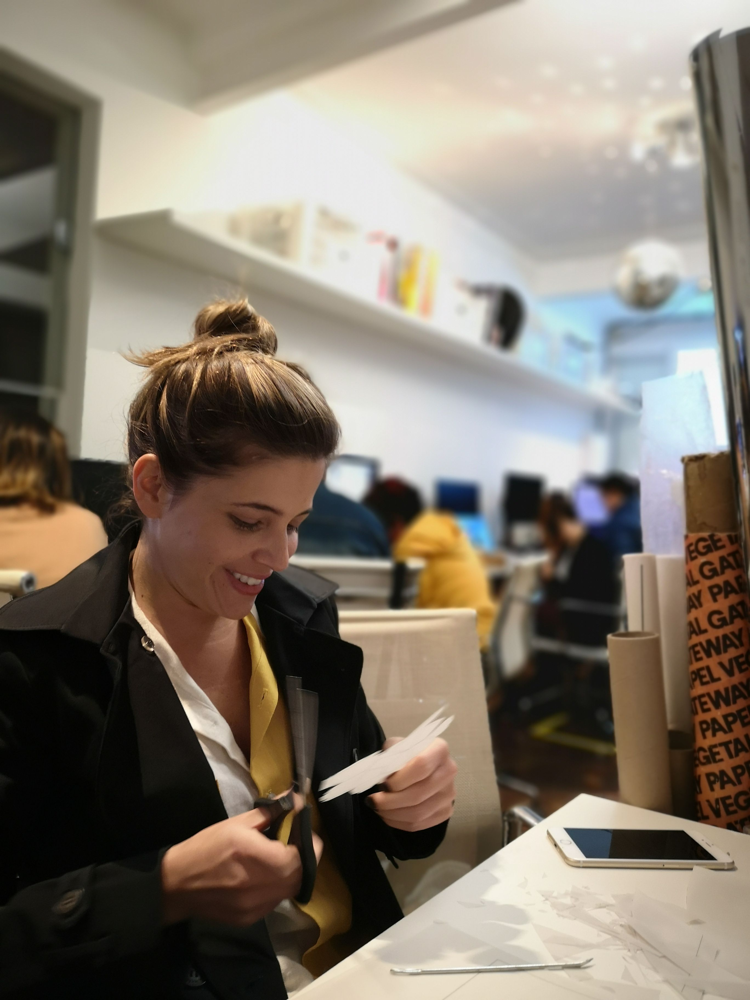

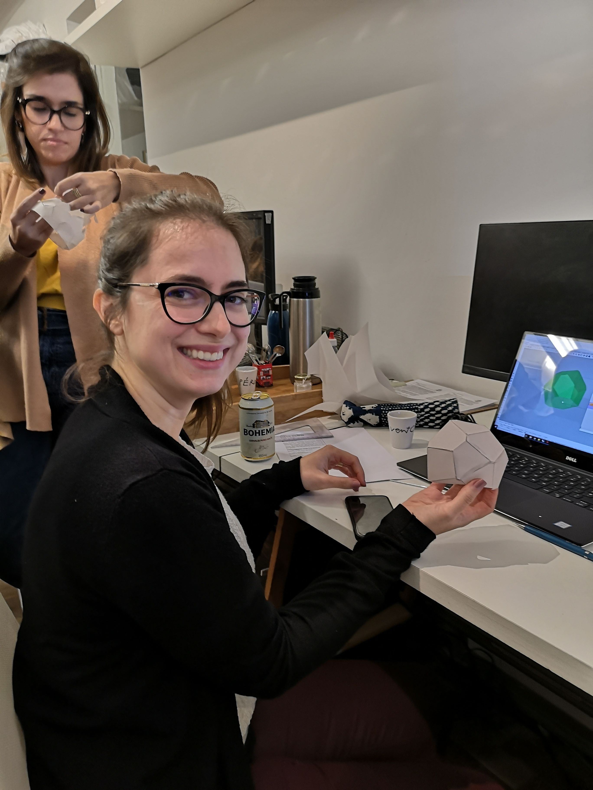

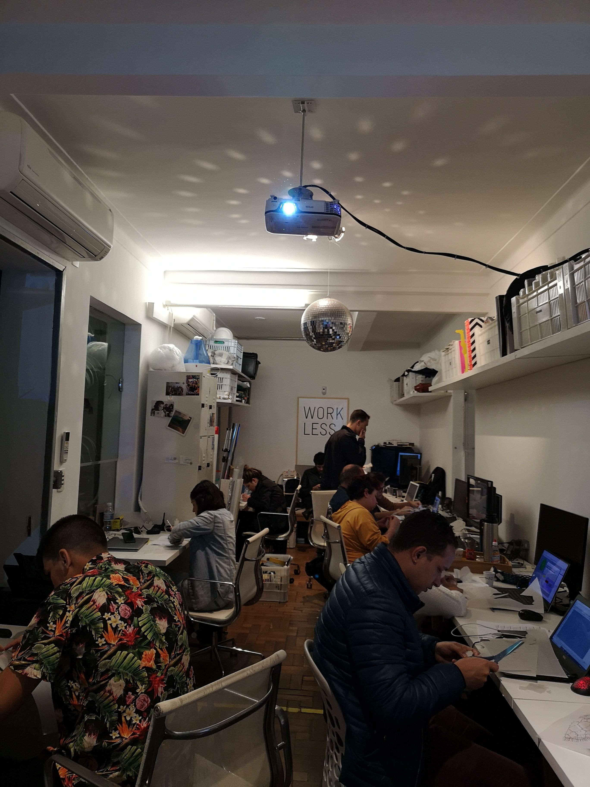

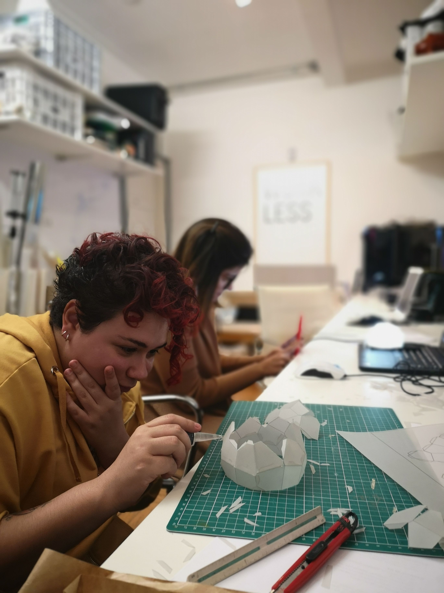

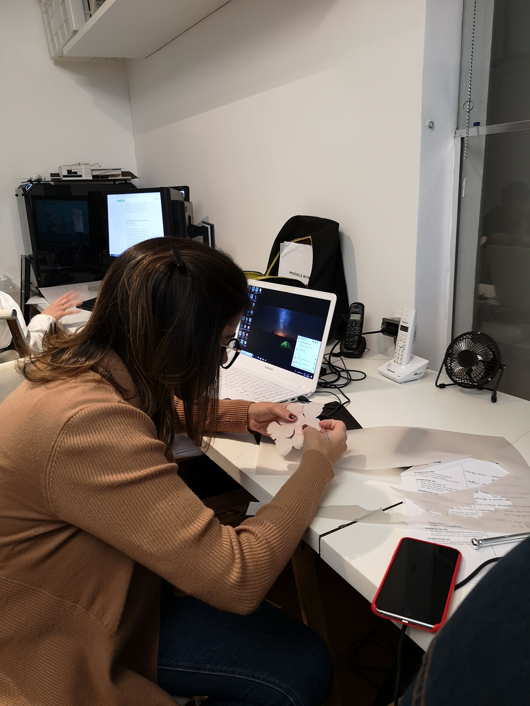

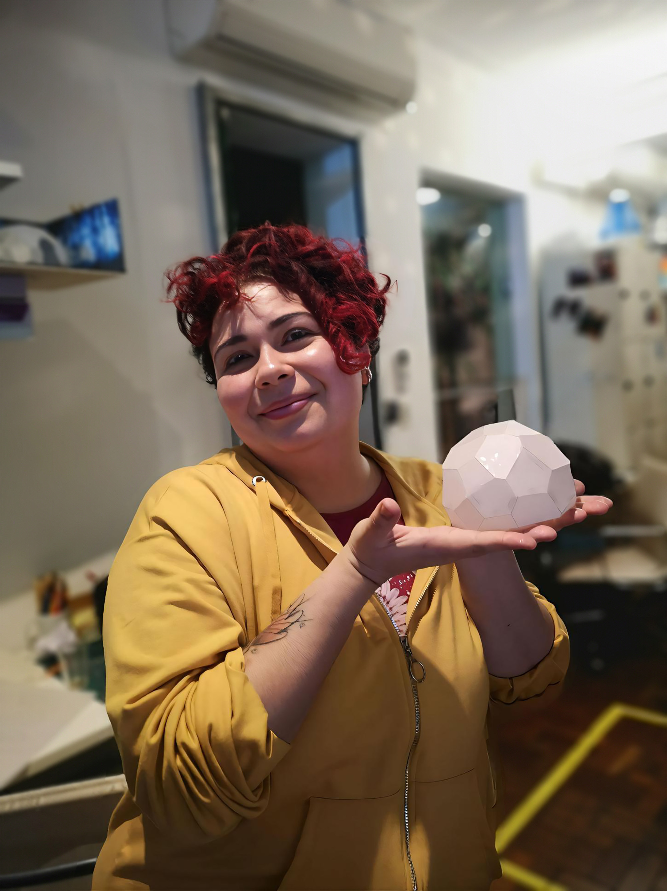

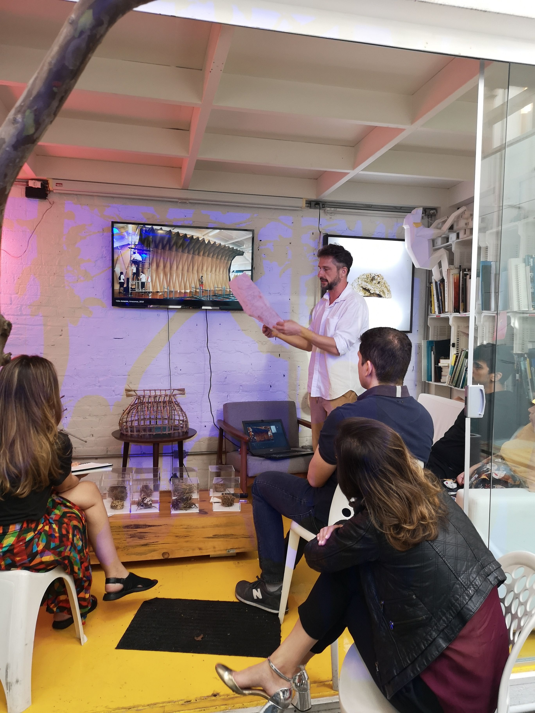
