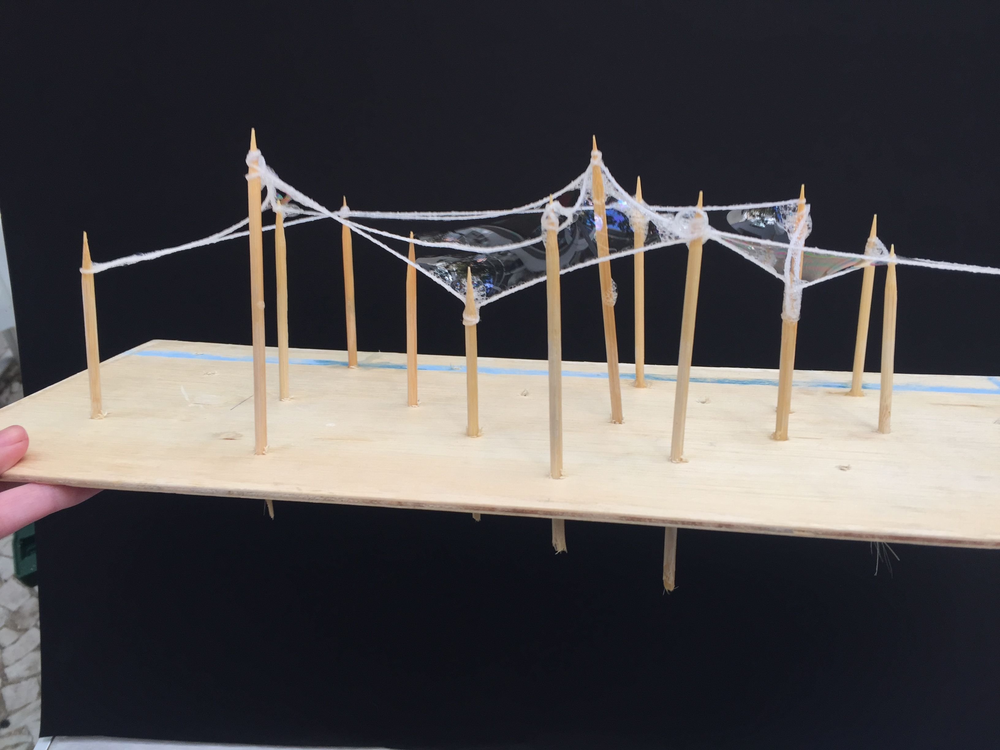
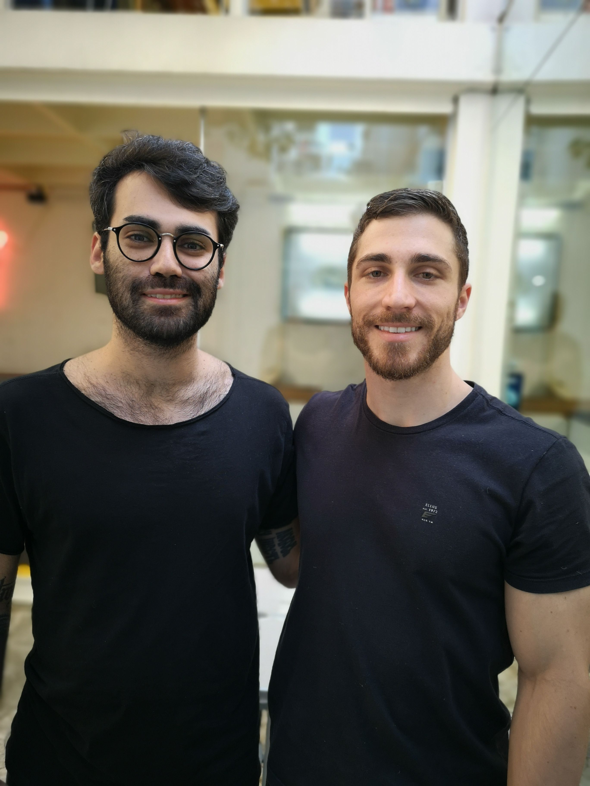
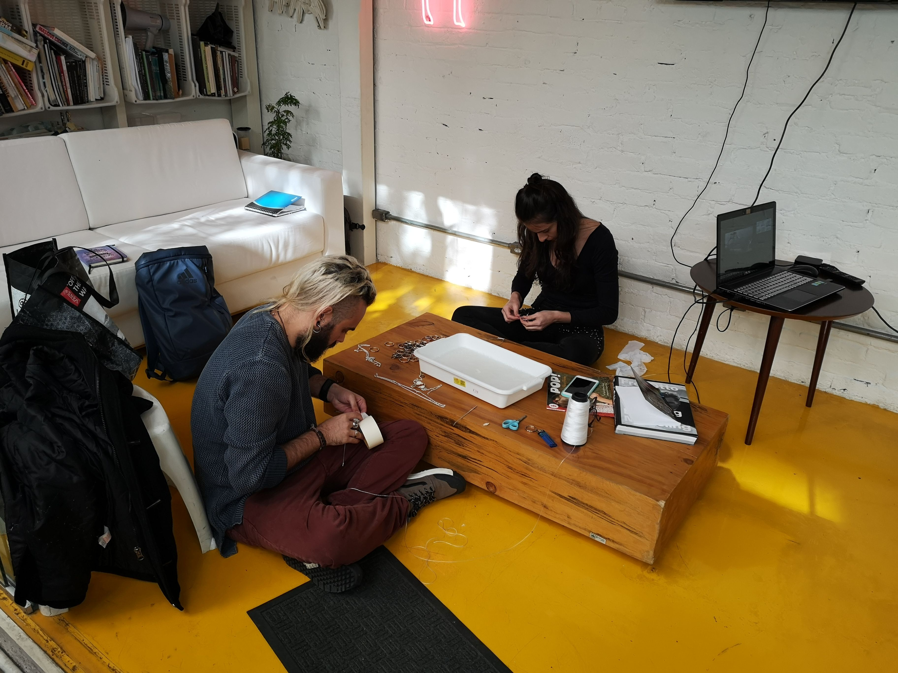
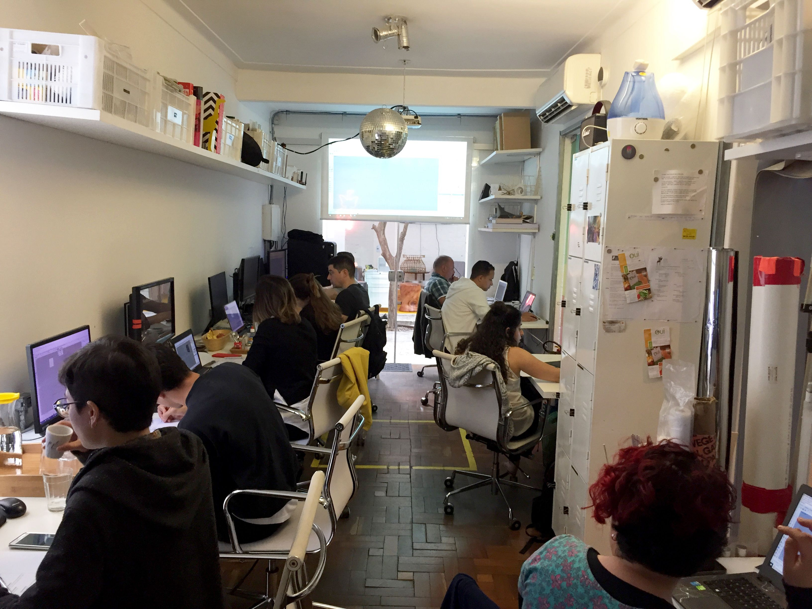

Dieser Workshop versuchte, computergestützte Designpraktiken mit natürlichen Phänomenen zu verbinden und Themen wie assoziative Modellierung, Biomimetik und visuelle Programmiersprache zu behandeln.

