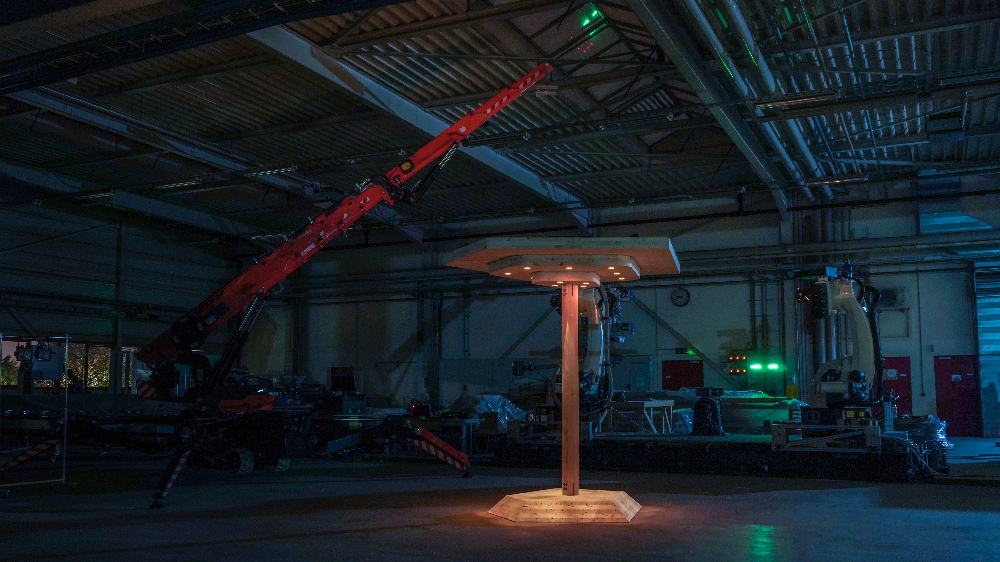
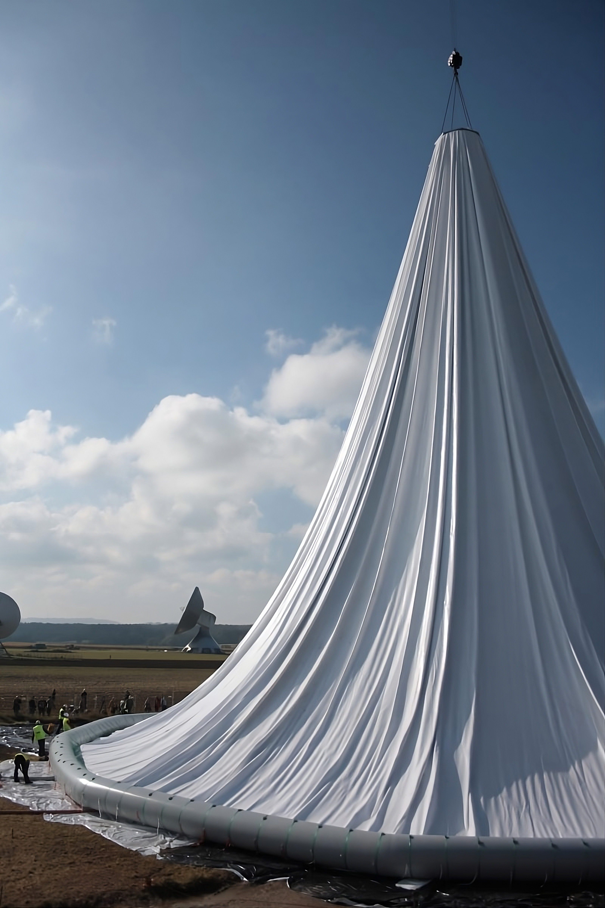
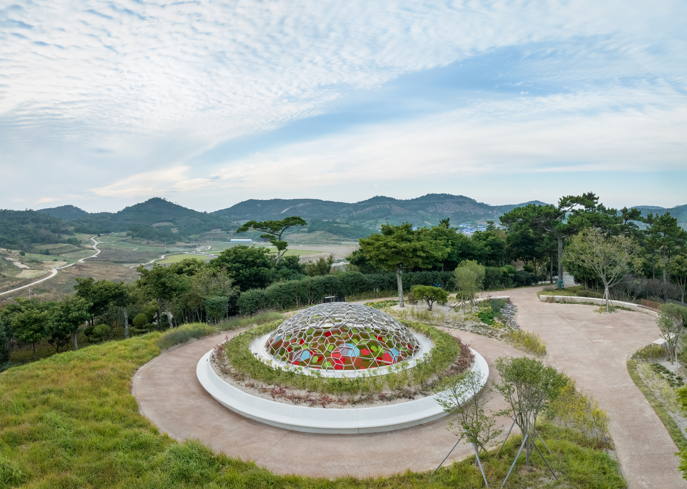
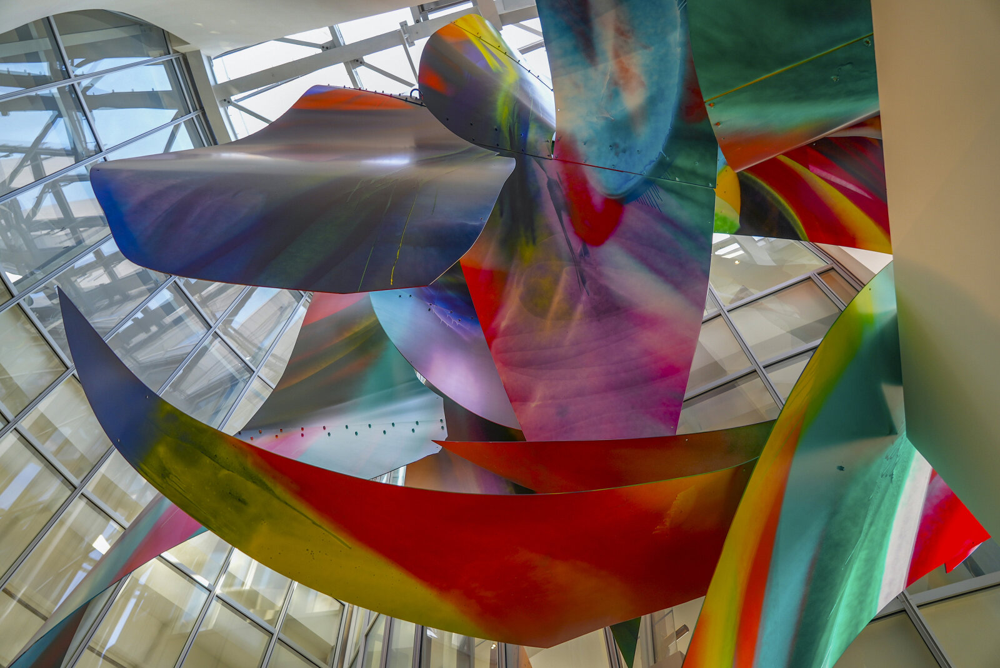

## About the invitation

Invitation received on 2026-04-07 from Digital Futures Portuguese (portuguese.digitalfutures@gmail.com) for a roughly 20-minute talk about the academic and professional Lusophone diaspora: professional profile, education and work abroad, opportunities, challenges, and current work.

Second appearance in the Portuguese-language DigitalFutures series, after Digital Futures 2023: Novos Hibridismos.

## Speaker bio

The bio prepared for this talk is in Portuguese, since the event is delivered in Portuguese to a Lusophone audience. See the pt/ version of this file for the text and composition notes.

## Submitted images

Five portfolio images in narrative order, one for each stage mentioned in the bio. Form limit: up to 5 files, 10 MB each, PDF/image/video.

### 1. O3 Pavilion, Atelier Marko Brajovic (Brazilian phase)

Designed at the Atelier shortly after graduating from FAU-USP. First steps in computational design with Rhino, Grasshopper and Kangaroo. Anchors the pre-diaspora Brazilian identity that opens the bio.

### 2. Building Across Scales, ITECH master's thesis (German formation)

Master's thesis at ITECH (University of Stuttgart), co-authored with Nils Opgenorth. Multi-scalar robotic system for on-site press-gluing of cross-laminated timber. Illustrates "robotic fabrication and engineered timber".

### 3. Radom Raisting, Alfred Rein Ingenieure (first engineering office)

Deployment simulation of a 48.8m inflatable radome protecting a parabolic antenna at the Raisting earth station. Illustrates "form finding of tensile structures".

### 4. Breathing Earth Sphere, ArtEngineering for Olafur Eliasson

Computational engineering, finite element analysis with SOFiSTiK, and logistical segmentation of the 10m stainless steel sphere installed on Docho Island, South Korea. Headline image that grounds the Eliasson name in the bio.

### 5. Canyon, ArtEngineering for Katharina Grosse

Second collaboration with a renowned artist during the ArtEngineering period, installed at Louis Vuitton in Paris. Grounds the plural "artists" in the bio and keeps the narrative from resting on a single name.

## Form submission

### Title (provisional, to be refined)

**De Janine Benyus a Goethe: Uma Travessia de Lentes**

Working title in Portuguese — submitted verbatim because the event is Portuguese-language. Daniel is not sold on "Uma Travessia de Lentes" (feels forced). Further brainstorming pending in a future session. See the pt/ version of this file for the alternative candidates already considered and the principles for the next brainstorm.

### Talk description (100 words, Portuguese)

Submitted verbatim in Portuguese to match the event language. See the pt/ version of this file for the full text.
