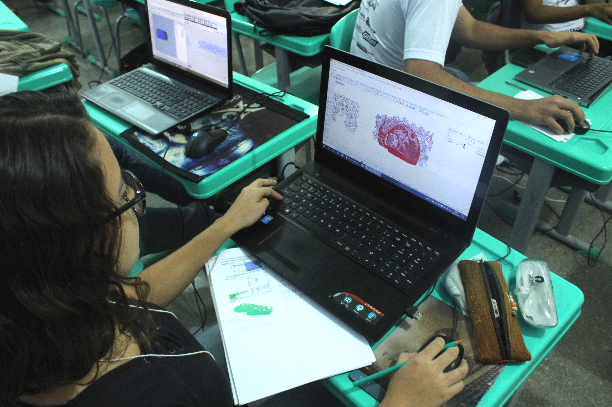
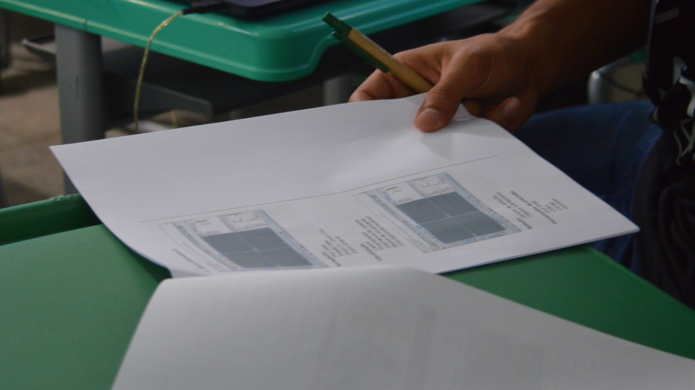
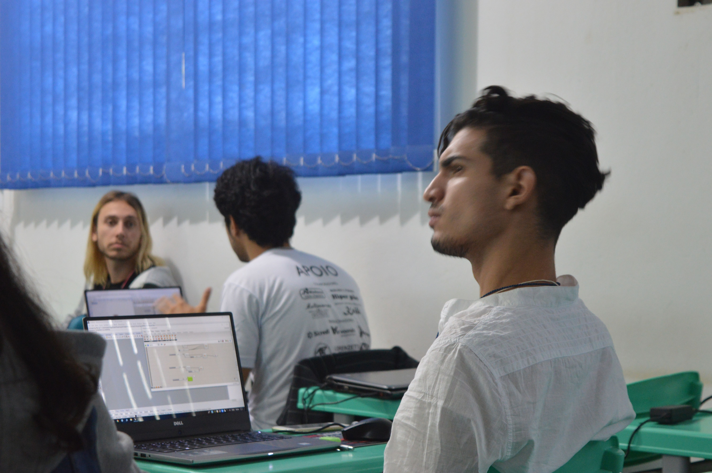
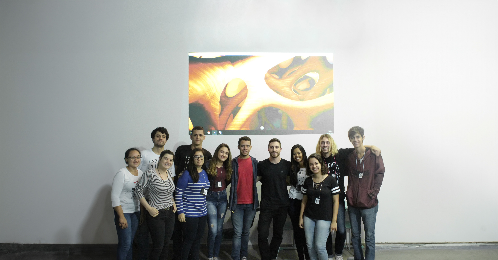
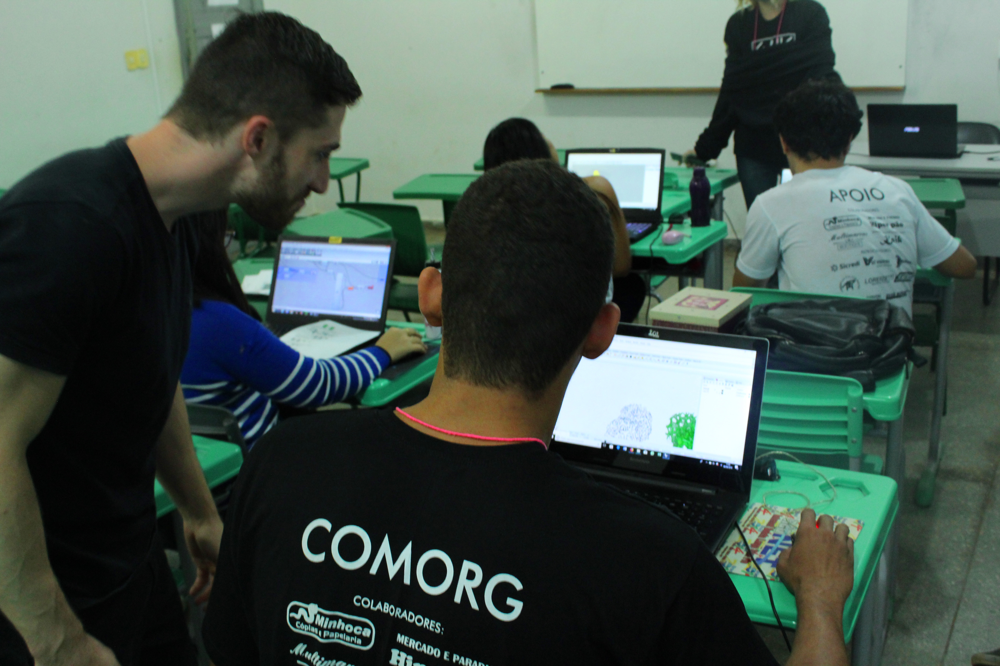

This workshop was part of the XIV Semana da Arquitetura e Urbanismo (XIV Architecture and Urbanism Week) at UNEMAT in Barra do Bugres, Brazil. What made it unique was its adaptive format: instead of following a rigid syllabus, the participants collectively chose which computational design strategy they wanted to explore.

## The concept

I prepared several well-known computational design strategies (Voronoi, mesh relaxation, reaction-diffusion, and others) and on the first day, after covering the fundamentals of Grasshopper, the group voted on which approach to dive deeper into. They chose **Exoskeleton**, a Grasshopper plugin that converts wireframe meshes into solid tubular structures.

## Day 1: Fundamentals

The first day covered the basics: the Grasshopper interface, data types, parameters, and how visual programming differs from traditional CAD modeling. Each participant received a printed handout to follow along.

## Day 2: Exoskeleton

On the second day, we focused entirely on the chosen strategy. The students built their own Grasshopper definitions from scratch, experimenting with different mesh topologies and tube thicknesses. The Exoskeleton plugin takes any wireframe input and generates a smooth, 3D-printable mesh, making it a perfect bridge between computational design and digital fabrication.

## Results

By the end of the workshop, every participant had produced their own unique parametric structure. The variety of outcomes, from organic coral-like forms to architectural tunnel geometries, demonstrated how a single computational strategy can produce vastly different results depending on the input geometry and parameters.

