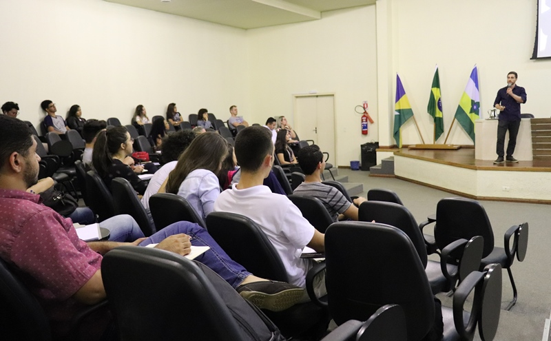

---
{
  "Cover": "/assets/content/teaching/architecture-biomimicry-algorithm-at-ifro/cover-cover.jpeg",
  "CoverAlt": "Group photo with all the students.",
  "Description": "During my visit to my hometown, I proposed a lecture to the architecture and urbanism course of the Federal Institute of Rondônia - IFRO. I presented some works and research that I had done so far and discussed the future of the profession amid so many technological changes.",
  "Name": "Architecture + Biomimicry + Algorithm at IFRO",
  "Slug": "teaching/architecture-biomimicry-algorithm-at-ifro",
  "Tags": [],
  "Authors": [],
  "Category": "Talk",
  "City": [
    "Vilhena"
  ],
  "DateStart": "2019-08-07",
  "Language": "Portuguese",
  "Link": {
    "Text": "https://portal.ifro.edu.br/vilhena/noticias/8153-palestra-arquitetura-biomimetica-e-algoritmo-e-realizada-em-vilhena",
    "Href": "https://portal.ifro.edu.br/vilhena/noticias/8153-palestra-arquitetura-biomimetica-e-algoritmo-e-realizada-em-vilhena"
  },
  "Place": "IFRO Vilhena"
}
---

During my visit to my hometown, I proposed a lecture to the architecture and urbanism course of the Federal Institute of Rondônia - IFRO. I presented my work, research, and discussed the future of the profession amid so many technological changes.

