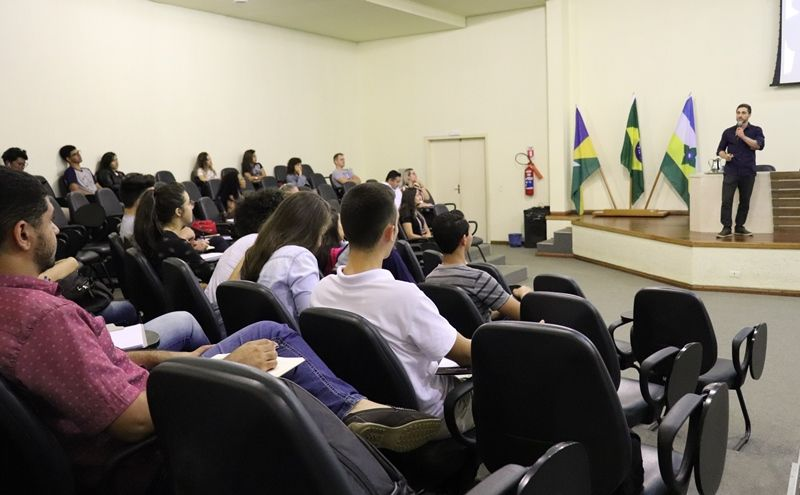
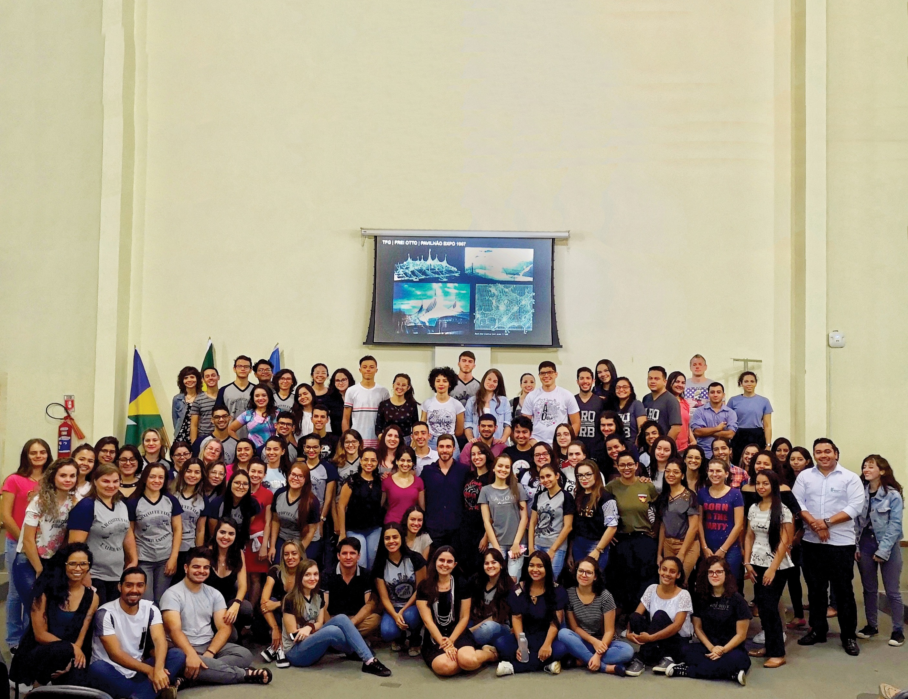

import Figure from '@/components/Figure.astro'

During my visit to my hometown, I proposed a lecture to the architecture and urbanism course of the Federal Institute of Rondônia (IFRO). I presented my work, research, and discussed the future of the profession amid so many technological changes.

<Figure credit="IFRO Vilhena">
  
</Figure>

The talk traced my academic and professional trajectory, starting from my early studies at UNEMAT (2007-2008), through FAU-USP (2010-2016), and my exchange period at Auburn University and CSU Long Beach (2013-2014).

I then presented my professional work at Atelier Marko Brajovic, showcasing projects such as the [Parada Coca-Cola](/projects/parada-coca-cola-by-atelier-marko-brajovic), the [Docol Pavilion at Exporevestir 2017](/projects/o3-pavilion-by-atelier-marko-brajovic-for-docol) with its Voronoi diagram-based design, and the [Heineken Bar at Festival MECA](/projects/bar-stage-heineken-by-atelier-marko-brajovic-for-sherpa42).

A central part of the talk focused on biomimicry, exploring how biological principles informed my [final graduation project (TFG)](/research/architecture-biomimicry-algorithm), with references to Frei Otto's Expo 1967 Pavilion and minimal surface structures. I also presented the [Models byNature](/teaching/models-bynature-20) workshop and the ICD/ITKE Research Pavilion 2016-17 as examples of computational design inspired by nature.

The lecture concluded with a discussion on the technological evolution in the AEC industry, from Ivan Sutherland's Sketchpad in 1963 to contemporary applications of artificial intelligence in architecture, including generative design research by Stanislas Chaillou at Harvard.

<Figure credit="IFRO Vilhena">
  
</Figure>
