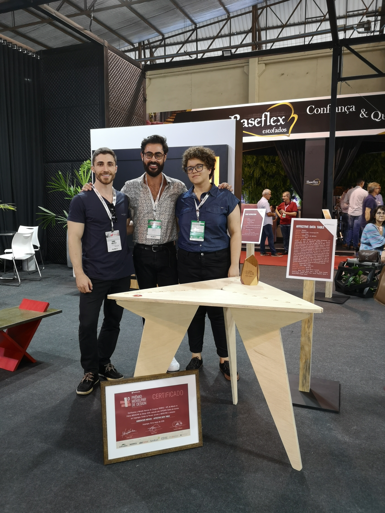
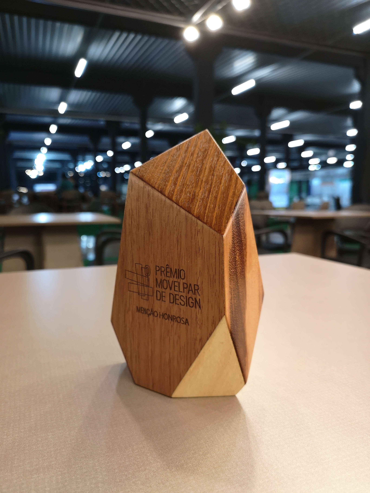
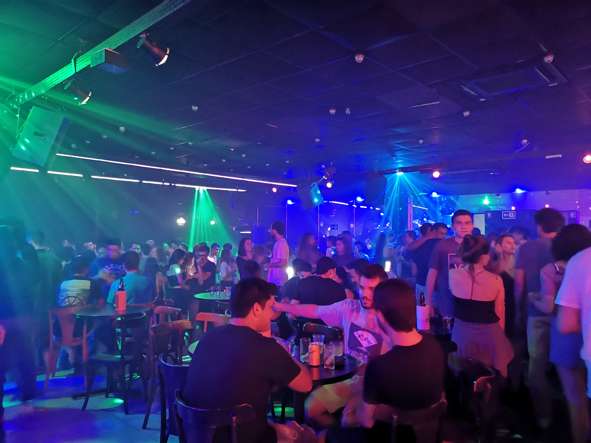

A talk at MOVELPAR 2019, one of the largest furniture fairs in Latin America, organized by SEBRAE Talks. The presentation explored how emotional design and technology intersect in contemporary furniture and product design, demonstrating how computational tools can enhance the emotional connection between users and designed objects.

