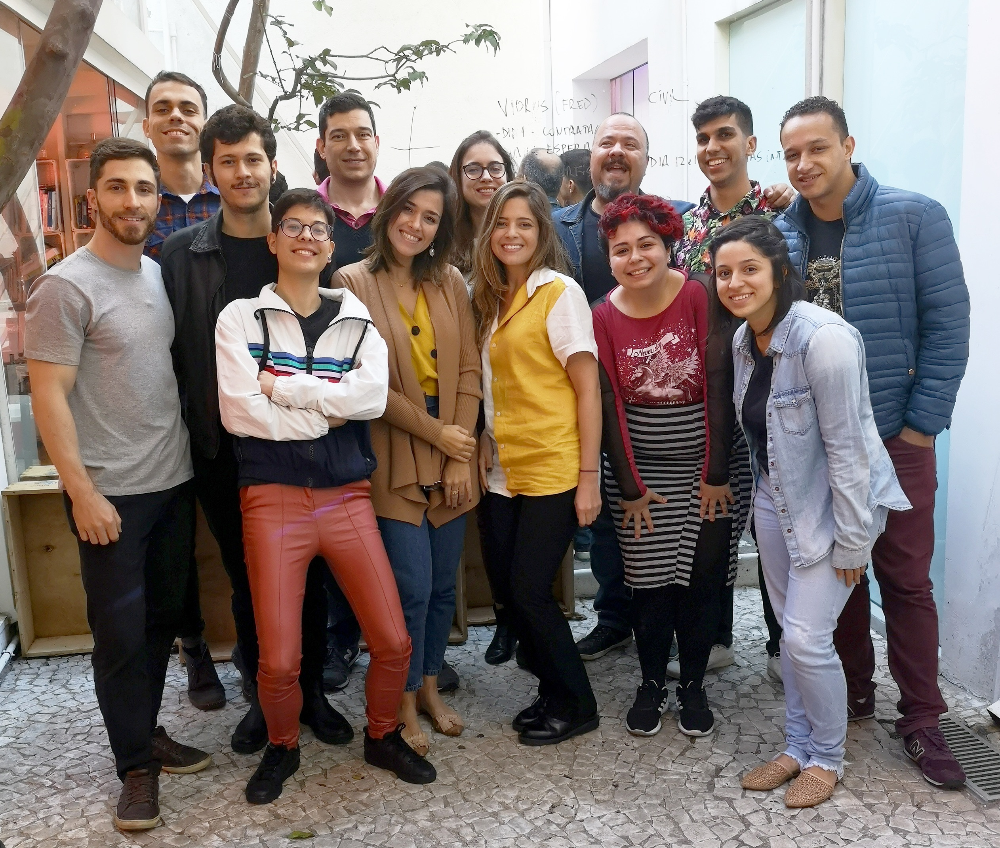
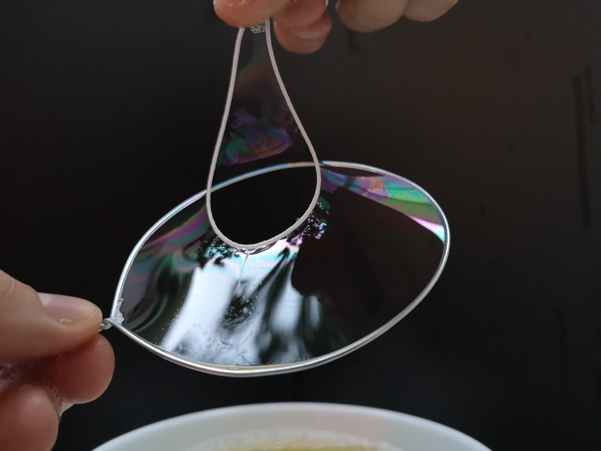
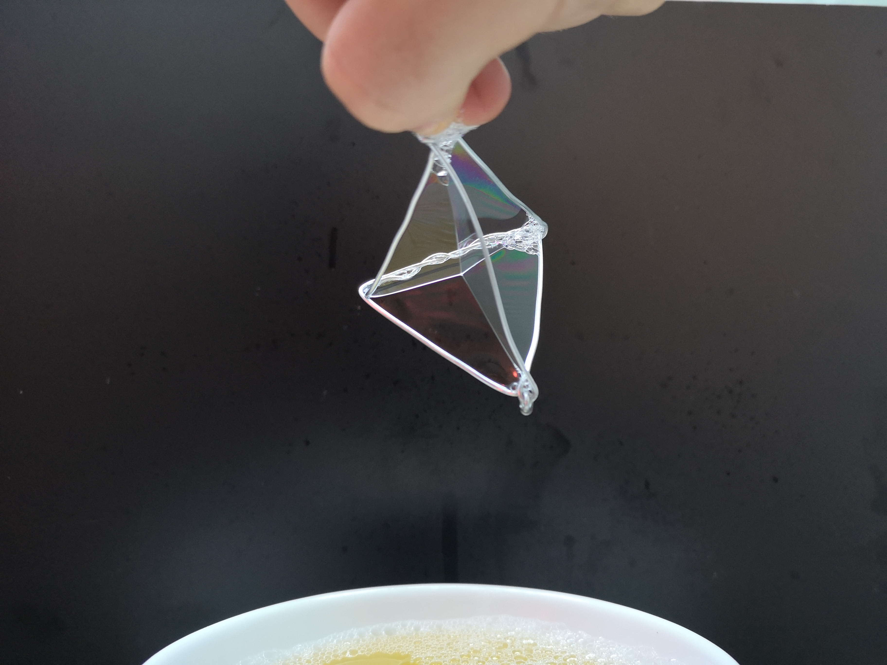
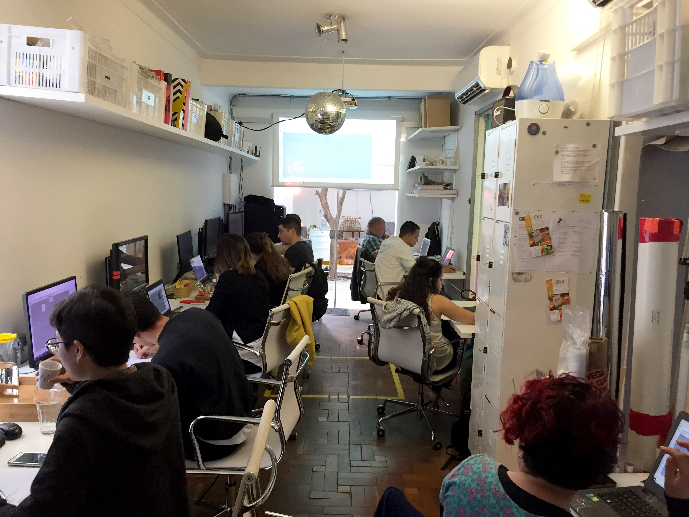
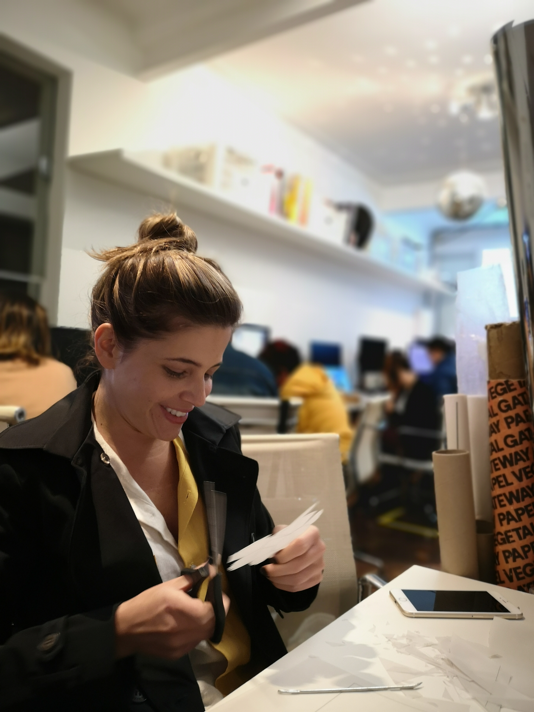
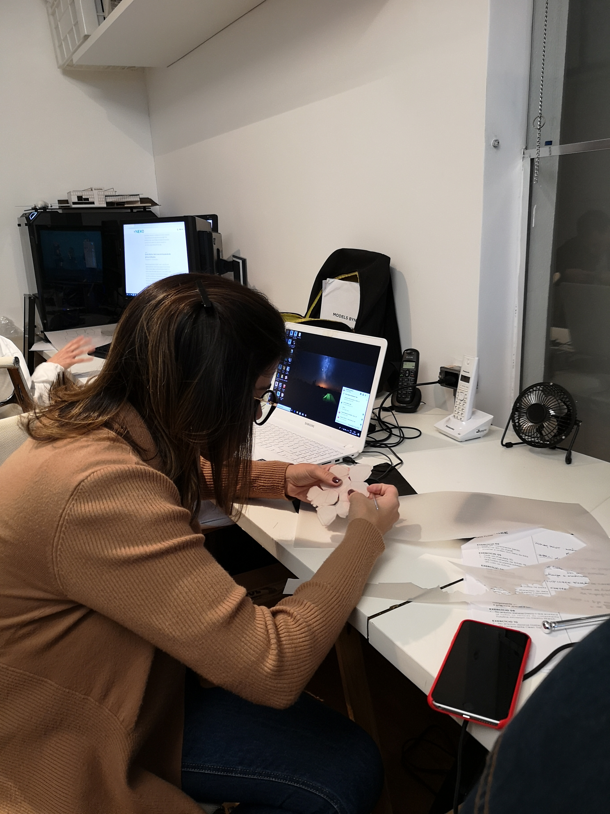
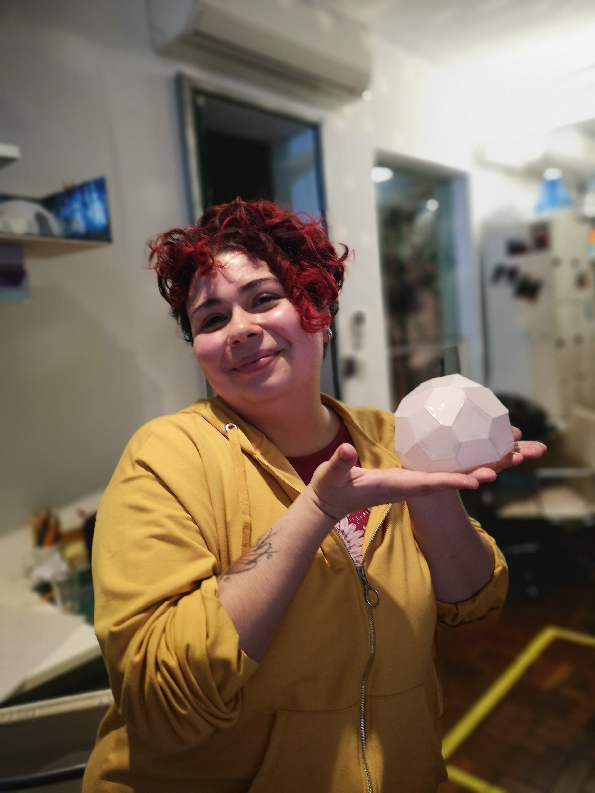

---
{
  "Cover": "/assets/content/teaching/models-bynature-10/cover-cover.jpg",
  "CoverAlt": "A student presents her Voronoi pavilion, which resulted from the workshop.",
  "Description": "This workshop sought to connect computational design practices with natural phenomena, addressing topics such as associative modeling, biomimetics and visual programming language.",
  "Name": "Models byNature 1.0",
  "Slug": "teaching/models-bynature-10",
  "Tags": [],
  "Authors": [],
  "Category": "Workshop",
  "City": [
    "São Paulo"
  ],
  "DateStart": "2019-05-18",
  "DateEnd": "2019-06-08",
  "Language": "Portuguese",
  "Link": [],
  "Place": "Atelier Marko Brajovic"
}
---

This workshop aimed to connect computational design practices with natural phenomena, addressing biomimetics, modeling with nature, and visual programming language using Rhino and Grasshopper.

