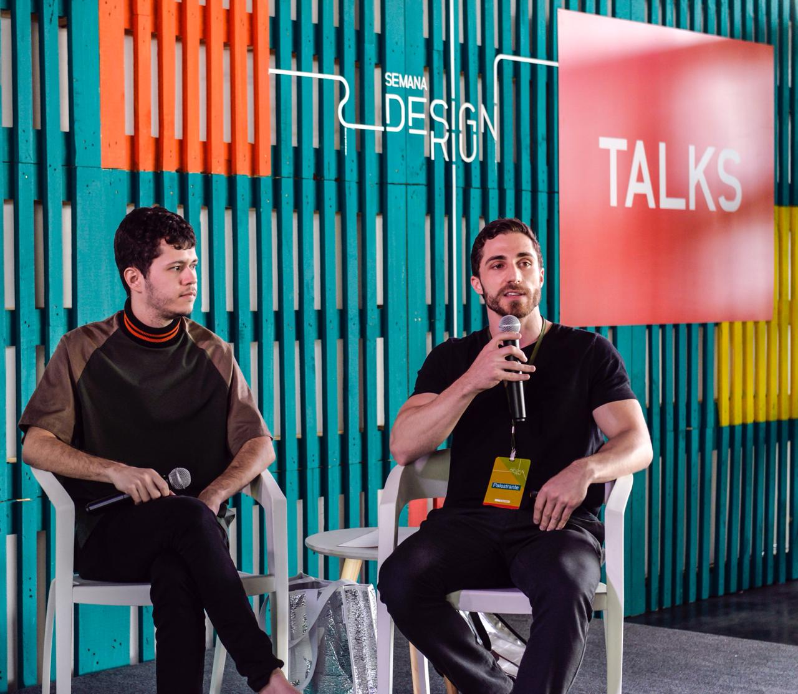
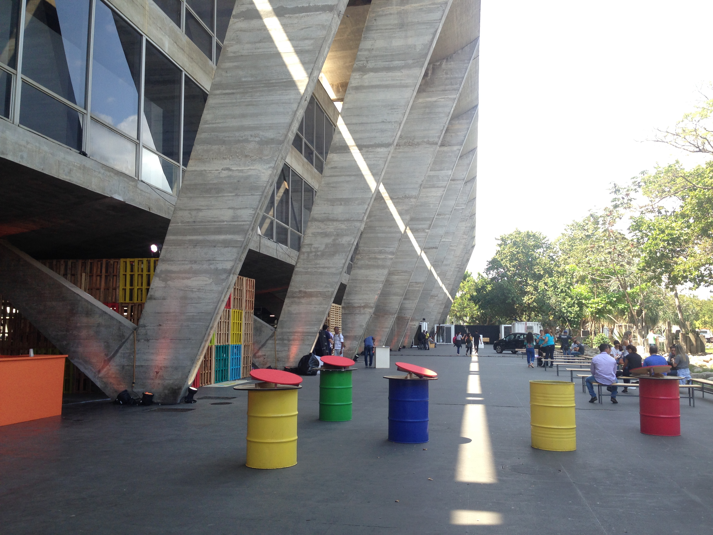
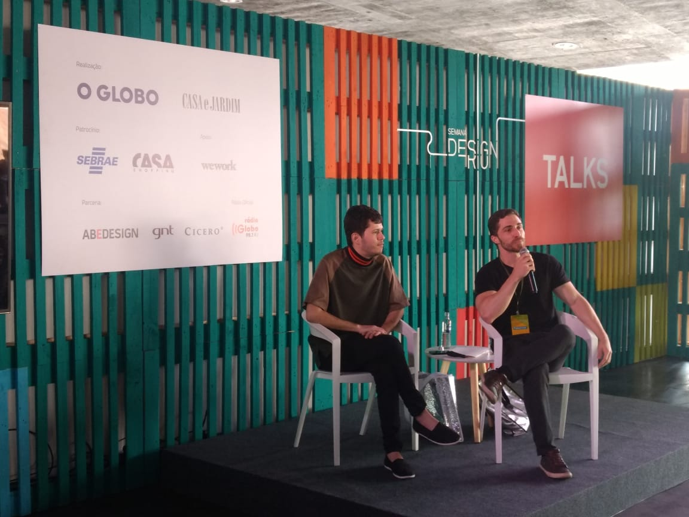

---
{
  "Cover": "/assets/content/teaching/parametric-design-inspired-by-nature-at-semana-design-rio/cover-cover.jpg",
  "CoverAlt": "Daniel Locatelli presenting at Semana Design Rio 2018",
  "Description": "A talk at Semana Design Rio 2018 exploring how computational design can draw inspiration from natural patterns and processes.",
  "Name": "Parametric Design Inspired by Nature at Semana Design Rio",
  "Slug": "teaching/parametric-design-inspired-by-nature-at-semana-design-rio",
  "Tags": [
    "Parametric Design",
    "Biomimetics",
    "Nature",
    "Computational Design"
  ],
  "Authors": [],
  "Category": "Talk",
  "City": [
    "Rio de Janeiro"
  ],
  "DateStart": "2018-09-01",
  "Event": "Semana Design Rio 2018",
  "Language": "Portuguese",
  "Link": {
    "Text": "Semana Design Rio 2018",
    "Href": "https://revistacasaejardim.globo.com/Casa-e-Jardim/Eventos/Semana-Design-Rio/noticia/2018/09/semana-design-rio-chega-6-edicao-no-mam-entre-os-dias-13-e-1609.html"
  },
  "Place": "MAM Rio de Janeiro"
}
---

A talk at the 6th edition of Semana Design Rio, held at the Museum of Modern Art (MAM) in Rio de Janeiro. The presentation explored how parametric modeling techniques and computational design can draw inspiration from natural patterns and processes, bridging the gap between biomimetics and digital fabrication.

