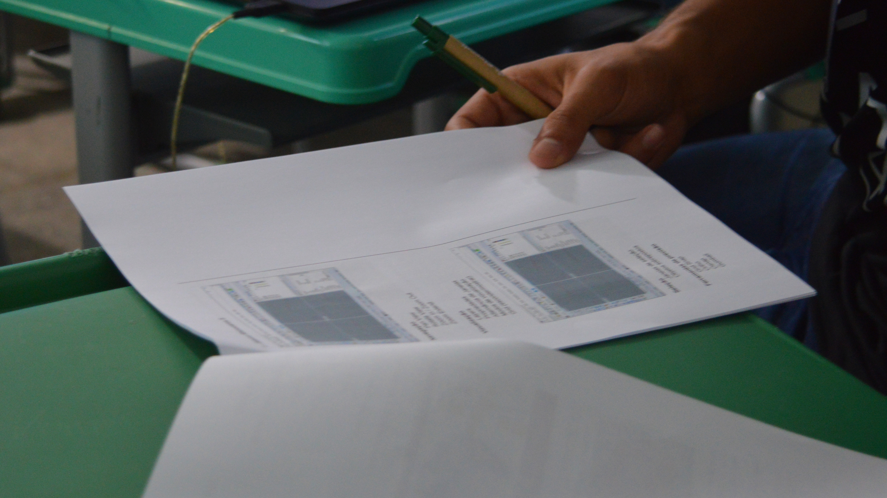
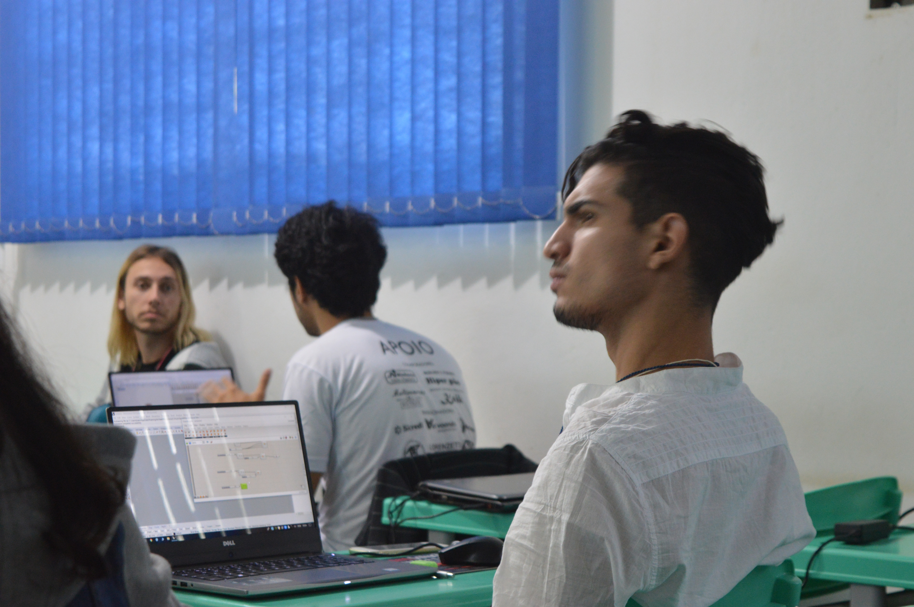

Este workshop fez parte da XIV Semana da Arquitetura e Urbanismo na UNEMAT em Barra do Bugres, Brasil. O que o tornou único foi seu formato adaptável: em vez de seguir um programa rígido, os participantes escolheram coletivamente qual estratégia de design computacional queriam explorar.

## O conceito

Preparei diversas estratégias de design computacional bastante conhecidas — Voronoi, relaxamento de malha, reação-difusão, entre outras — e no primeiro dia, após cobrir os fundamentos do Grasshopper, o grupo votou em qual abordagem gostariam de se aprofundar. Escolheram o **Exoskeleton**, um plugin do Grasshopper que converte malhas em wireframe em estruturas tubulares sólidas.

## Dia 1: Fundamentos

O primeiro dia cobriu o básico: a interface do Grasshopper, tipos de dados, parâmetros e como a programação visual difere da modelagem CAD tradicional. Cada participante recebeu uma apostila impressa para acompanhar.

## Dia 2: Exoskeleton

No segundo dia, focamos inteiramente na estratégia escolhida. Os alunos construíram suas próprias definições no Grasshopper do zero, experimentando diferentes topologias de malha e espessuras de tubos. O plugin Exoskeleton recebe qualquer entrada em wireframe e gera uma malha suave, pronta para impressão 3D — tornando-o uma ponte perfeita entre design computacional e fabricação digital.

## Resultados

Ao final do workshop, cada participante havia produzido sua própria estrutura paramétrica única. A variedade de resultados — de formas orgânicas semelhantes a corais até geometrias arquitetônicas de túneis — demonstrou como uma única estratégia computacional pode produzir resultados vastamente diferentes dependendo da geometria de entrada e dos parâmetros.

