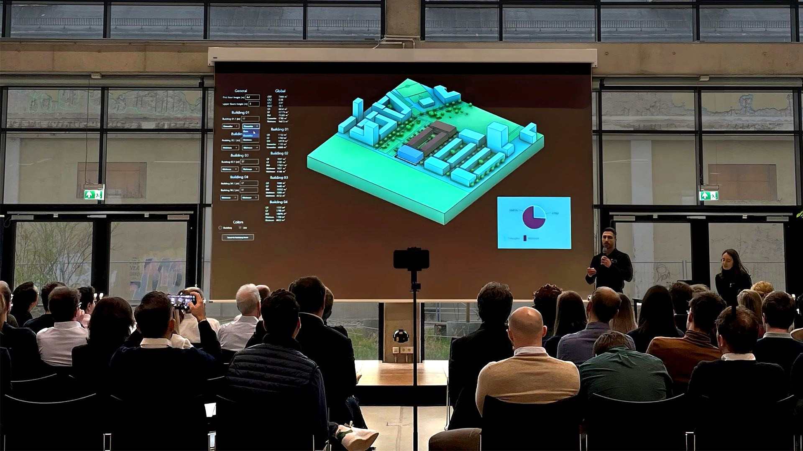

Na Conferência Siemens Research, Innovation & Ecosystem (RIE) de Munique sobre "Digitalization & Low Code Engineering in Industry", apresentamos a abordagem da BuildSystems para enfrentar um dos maiores desafios da indústria da construção: tornar os dados de sustentabilidade acionáveis.

## O pitch

A ideia central foi demonstrar um fluxo de trabalho computacional multinível que conecta a análise em escala urbana até os componentes individuais de um edifício. As ferramentas que desenvolvemos funcionam em um ciclo de retroalimentação fechado:

1. **Ferramenta de Nível Urbano** — avalia a viabilidade de um novo edifício com base nas regulamentações municipais e normas de segurança contra incêndio, determinando a área máxima de construção permitida para cada terreno.
2. **Ferramenta de Nível do Edifício** — gera um edifício paramétrico baseado em sistemas construtivos comuns, capaz de se adaptar a diferentes dimensões de terreno.
3. **Biblioteca de Componentes** — alimenta o modelo paramétrico com dados da nossa biblioteca de componentes construtivos, contendo informações sobre quantidades de materiais, pegada de carbono e custo por metro quadrado de construção.
4. **Nível Econômico** — compara diferentes sistemas construtivos não apenas pelo custo estimado, mas também pelo seu potencial de receber financiamento.

Essas ferramentas funcionam em um ciclo fechado, informando umas às outras constantemente até alcançarem um equilíbrio — tudo orientado por bancos de dados e frameworks de código aberto.

