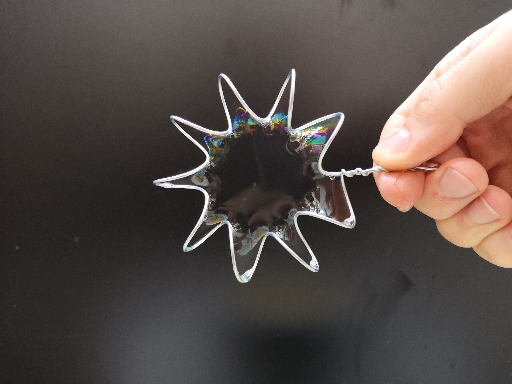
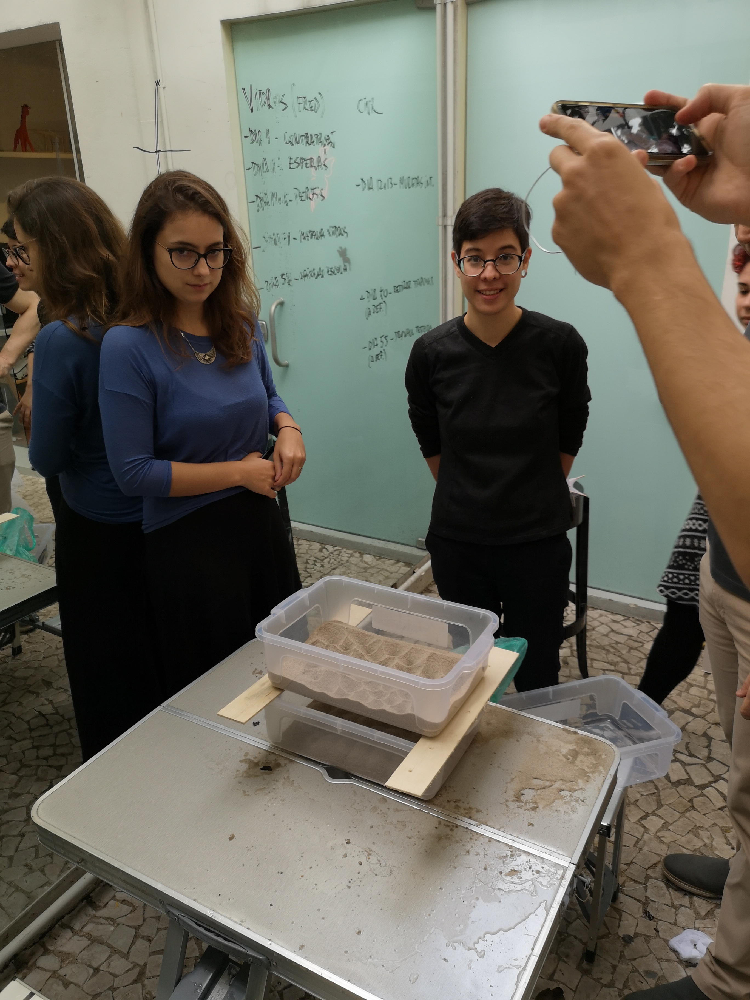
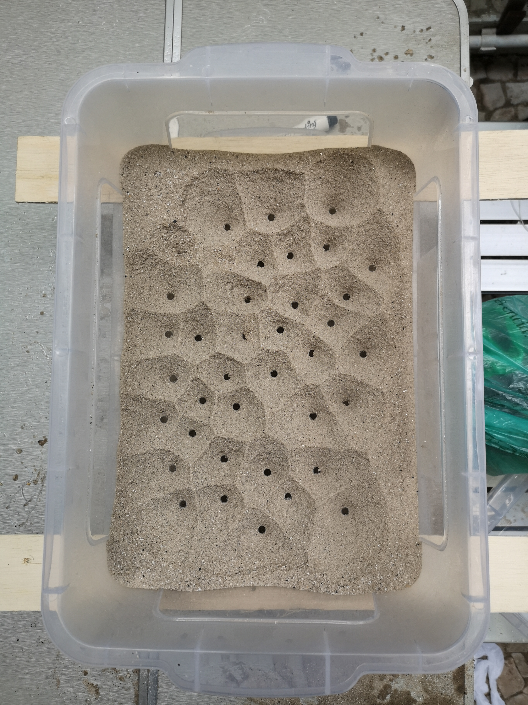
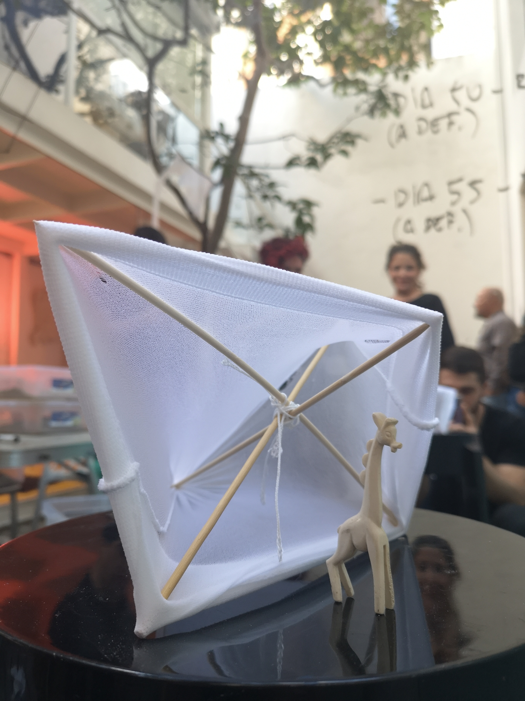
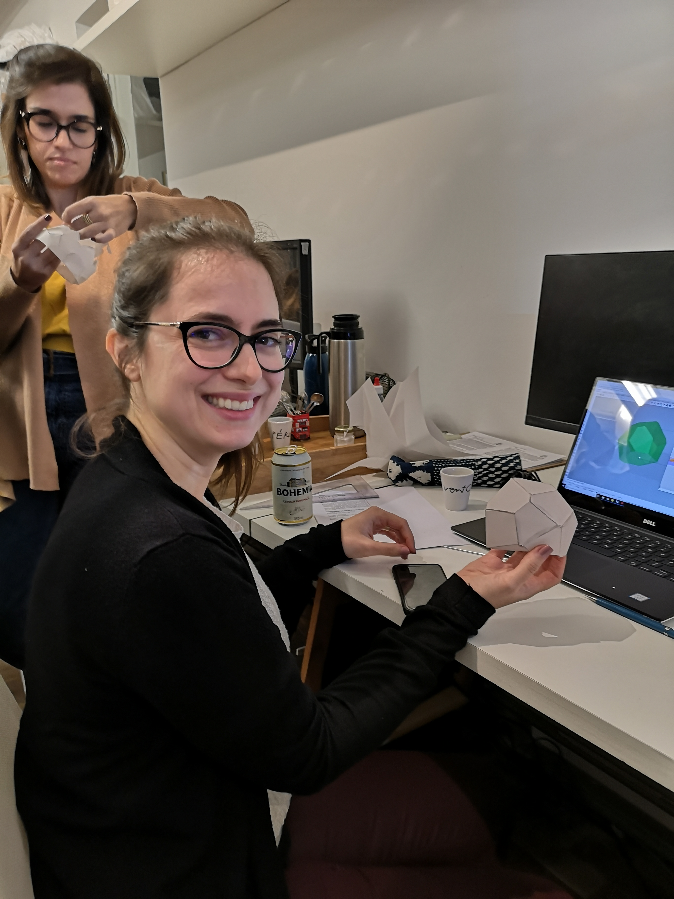
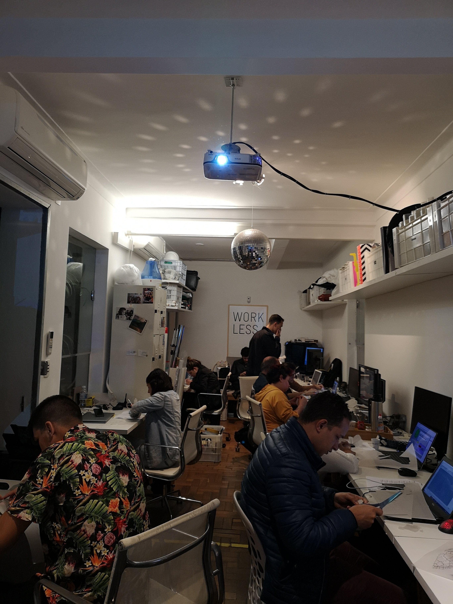
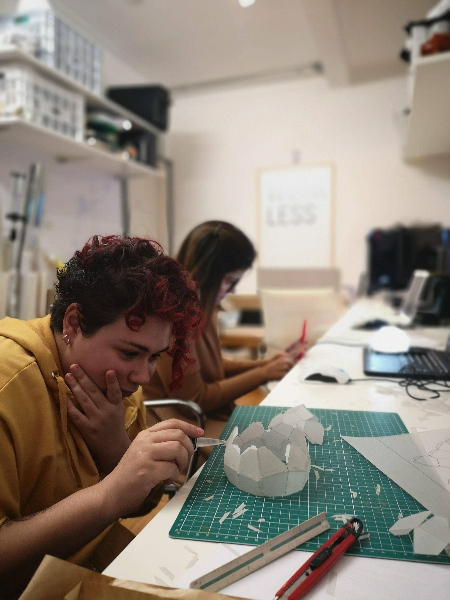
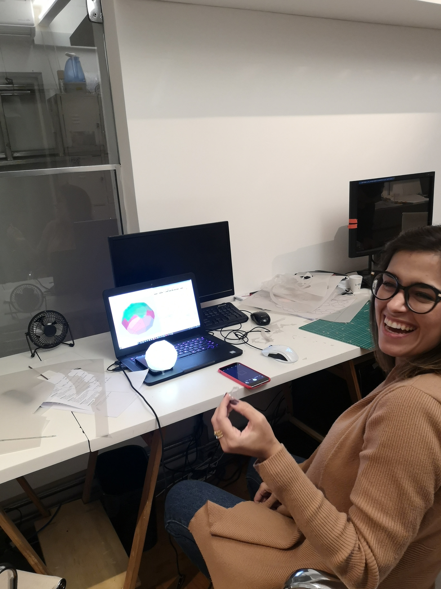
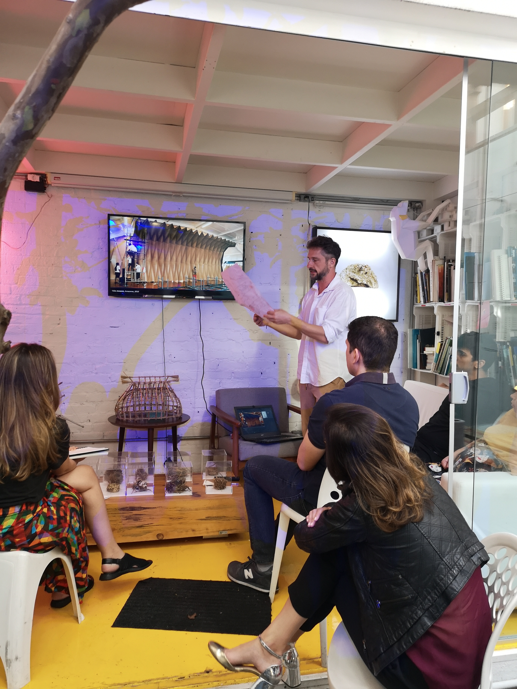

---
{
  "Cover": "/assets/content/teaching/models-bynature-10/cover-cover.jpg",
  "CoverAlt": "Uma aluna apresenta seu pavilhão de Voronoi, resultado do workshop.",
  "Description": "Este workshop buscou conectar práticas de design computacional com fenômenos naturais, abordando tópicos como modelagem associativa, biomimética e linguagem de programação visual.",
  "Name": "Models byNature 1.0",
  "Slug": "teaching/models-bynature-10",
  "Tags": [],
  "Authors": ["Daniel Locatelli", "Adalberto de Paula"],
  "Category": "Workshop",
  "City": [
    "São Paulo"
  ],
  "DateStart": "2019-05-18",
  "DateEnd": "2019-06-08",
  "Language": "Portuguese",
  "Link": [],
  "Place": "Atelier Marko Brajovic"
}
---

Este workshop teve como objetivo conectar práticas de design computacional com fenômenos naturais, abordando biomimética, modelagem com natureza e linguagem de programação visual usando Rhino e Grasshopper.

