import ImageRow from '@/components/ImageRow.astro'

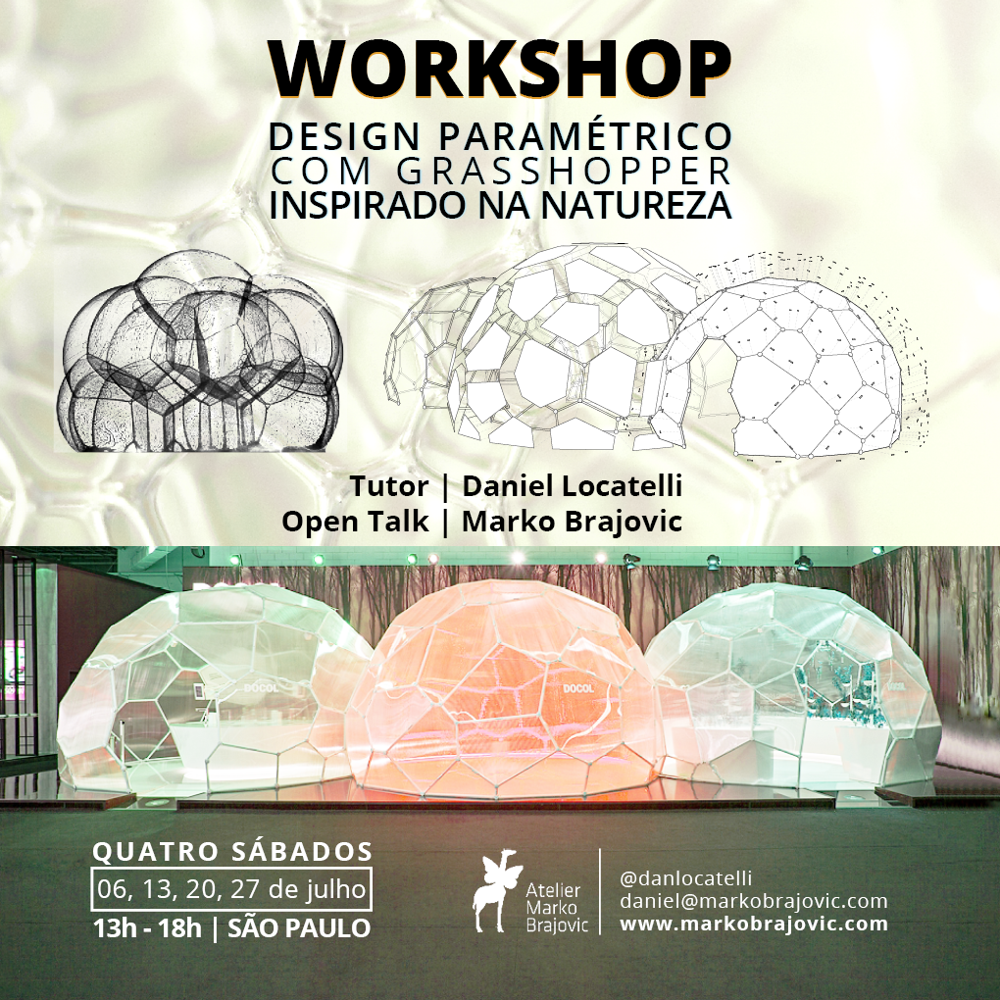

Após o sucesso do [Models byNature 1.0](/teaching/models-bynature-10), esta segunda edição deu continuidade ao formato do workshop ao longo de quatro sábados, aprofundando ainda mais a conexão entre design computacional e fenômenos naturais. Realizado no Atelier Marko Brajovic em São Paulo, o curso guiou os participantes por experimentos físicos de busca pela forma, modelagem paramétrica com Rhino e Grasshopper e princípios de design biomimético. A literatura de referência, incluindo "Thinking by Modeling" de Frei Otto e "Soap Bubbles" de C.V. Boys, forneceu a base teórica para a abordagem prática do workshop.

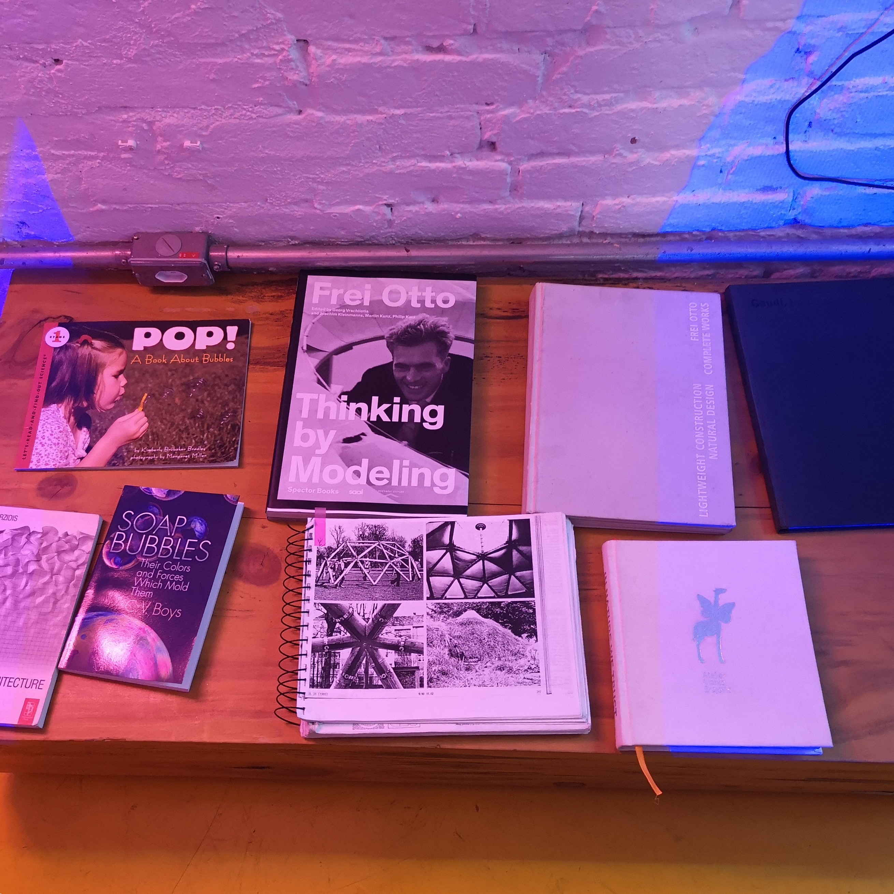

## Experimentos de busca pela forma

O primeiro sábado foi dedicado à busca pela forma física. Os participantes construíram armações de arame e as mergulharam em solução de sabão para revelar superfícies mínimas, o mesmo princípio que Frei Otto utilizou ao projetar estruturas tensionadas. Curvas catenárias surgiram de fios suspensos entre palitos, tecidos esticados sobre armações demonstraram o comportamento de membranas sob tensão, e areia despejada sobre placas perfuradas se auto-organizou em padrões de Voronoi. Esses experimentos proporcionaram aos participantes uma compreensão intuitiva e material da lógica estrutural que as ferramentas computacionais posteriormente formalizam.

<ImageRow>
  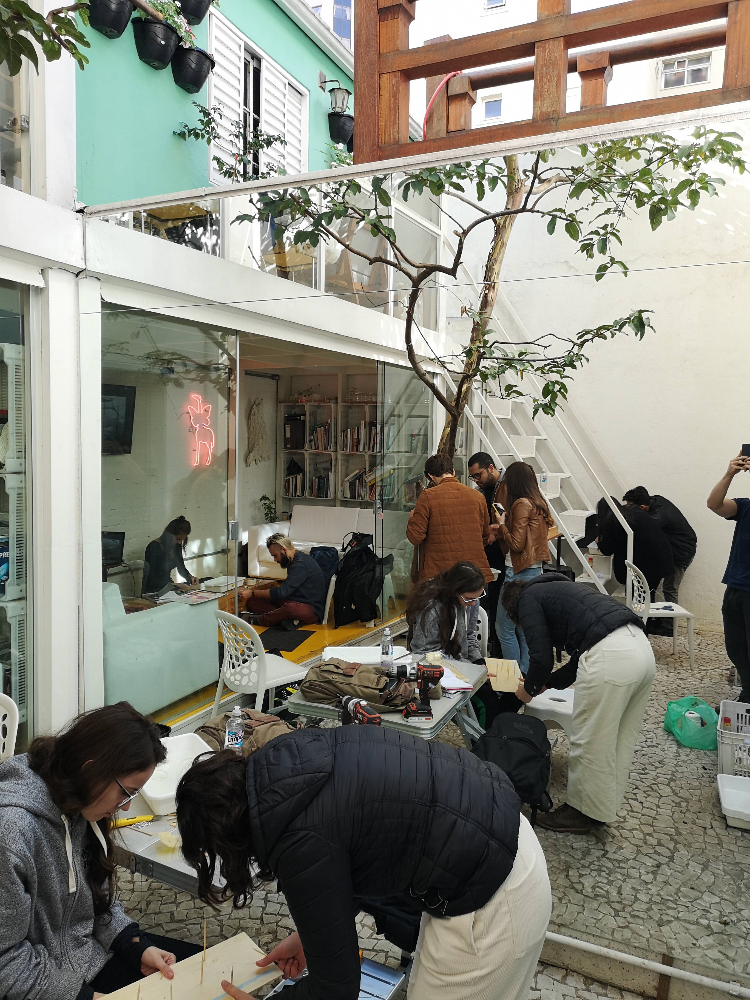

  
</ImageRow>

<ImageRow>
  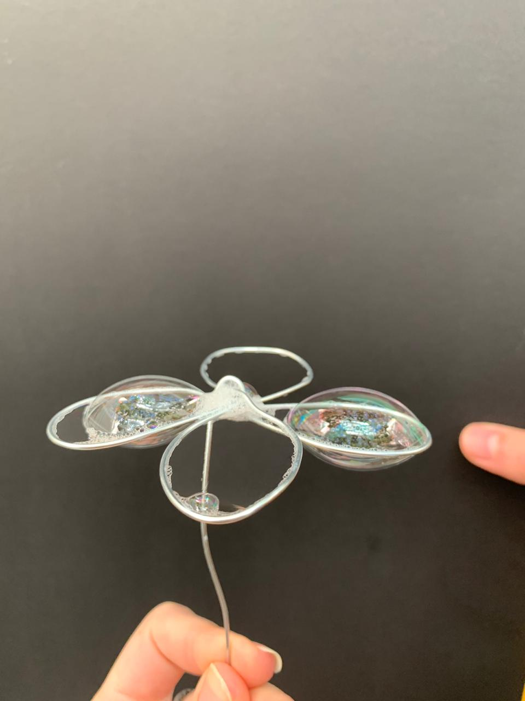

  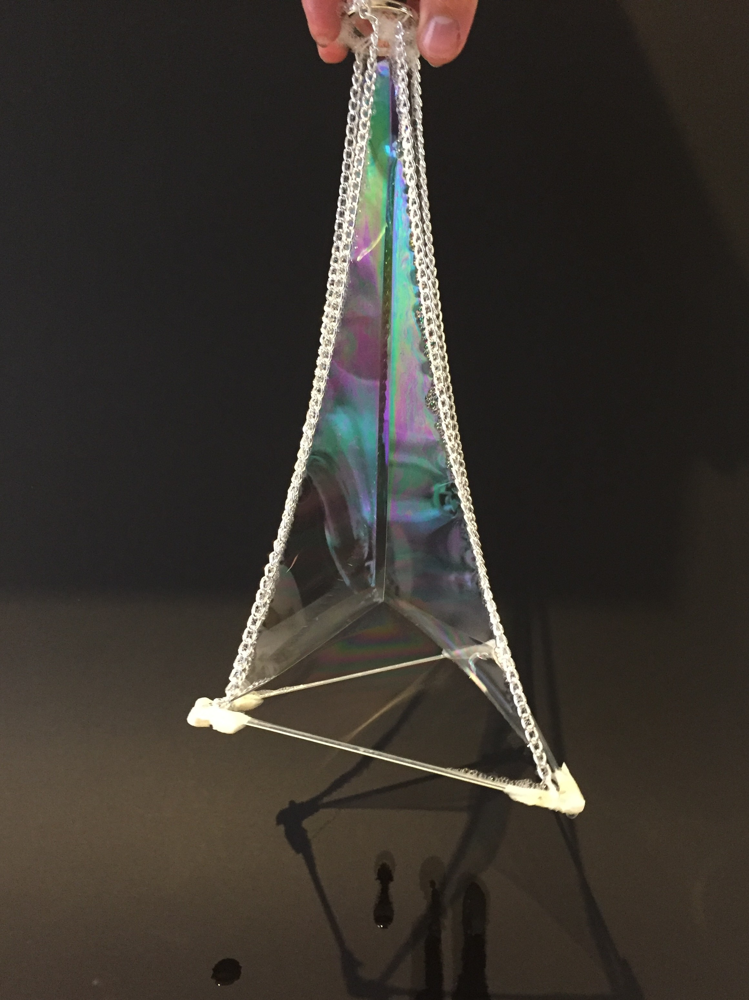
</ImageRow>

<ImageRow>
  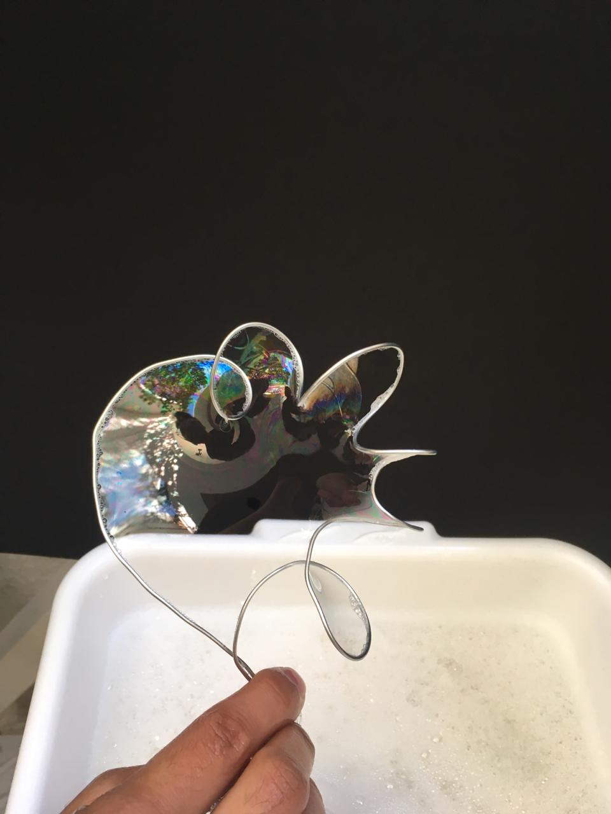

  
</ImageRow>

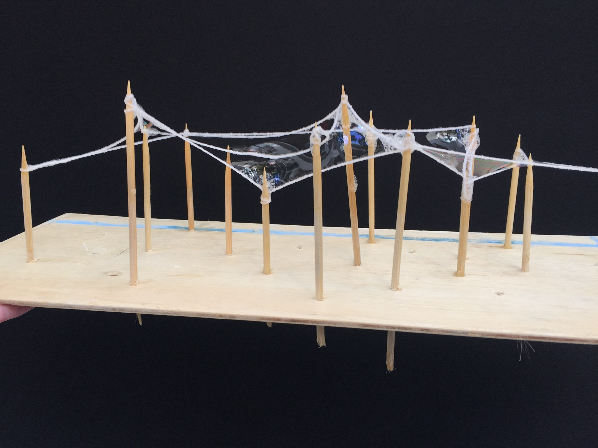

<ImageRow>
  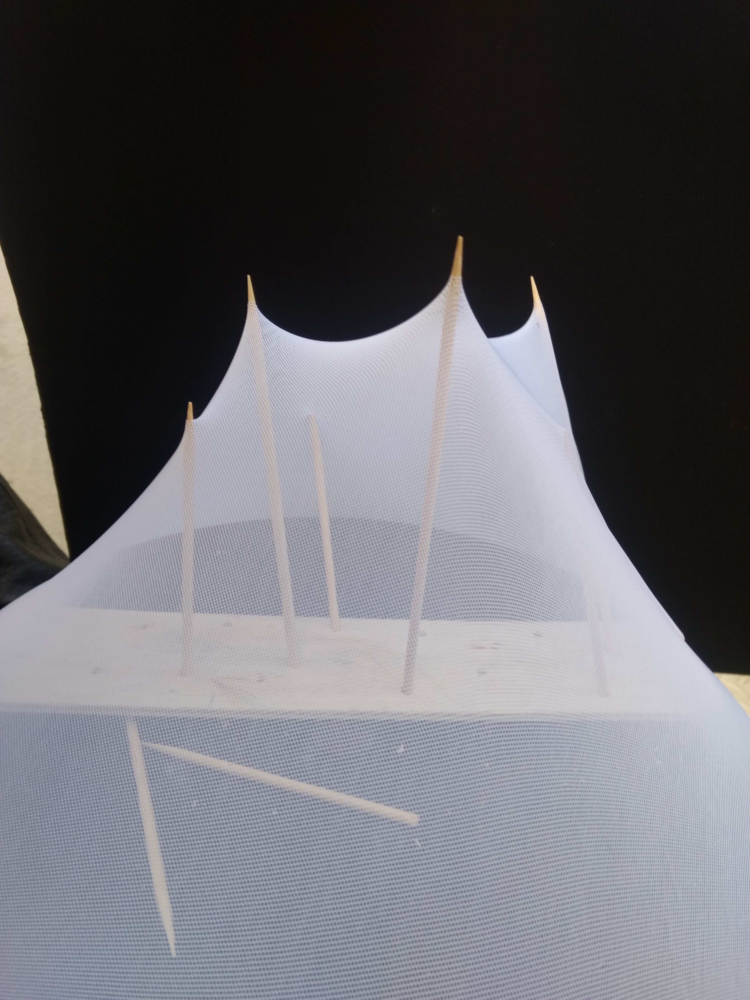

  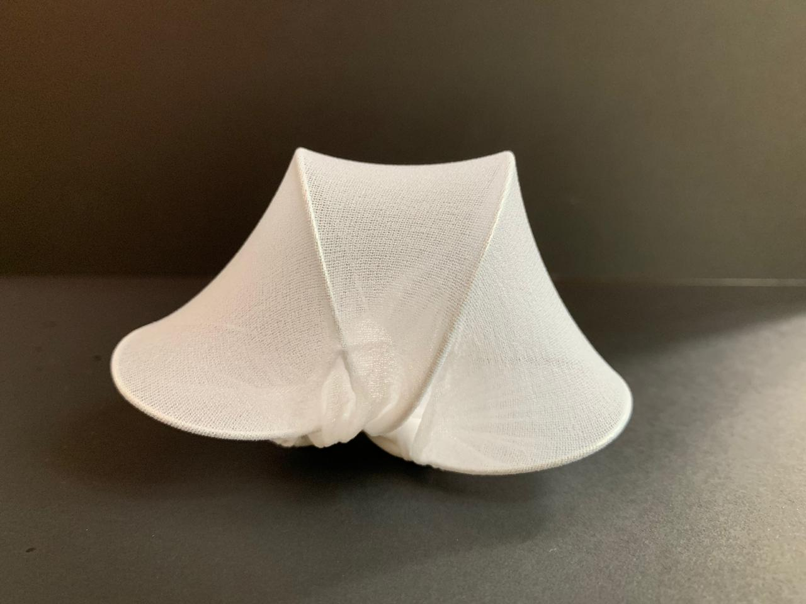
</ImageRow>

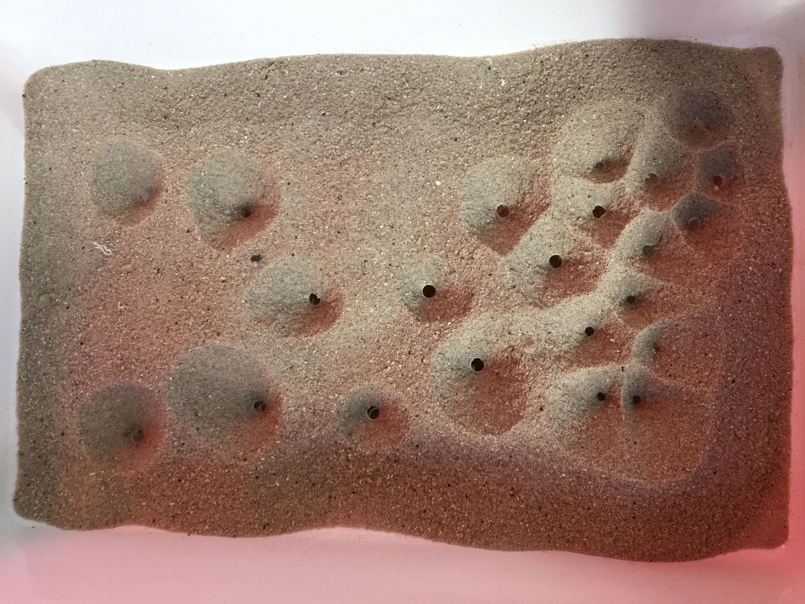

## Fase de design computacional

Nos sábados seguintes, os participantes traduziram seus experimentos físicos em modelos paramétricos usando Rhino e Grasshopper. Os tópicos incluíram tesselação de Voronoi, relaxamento de malha com Kangaroo, subdivisão de superfícies com Weaverbird e técnicas de modelagem associativa. Cada participante desenvolveu um projeto individual inspirado nos processos naturais observados durante o dia de busca pela forma. A progressão do físico para o digital reforçou um princípio central: o design computacional é mais eficaz quando fundamentado na compreensão dos fenômenos que simula.

<ImageRow>
  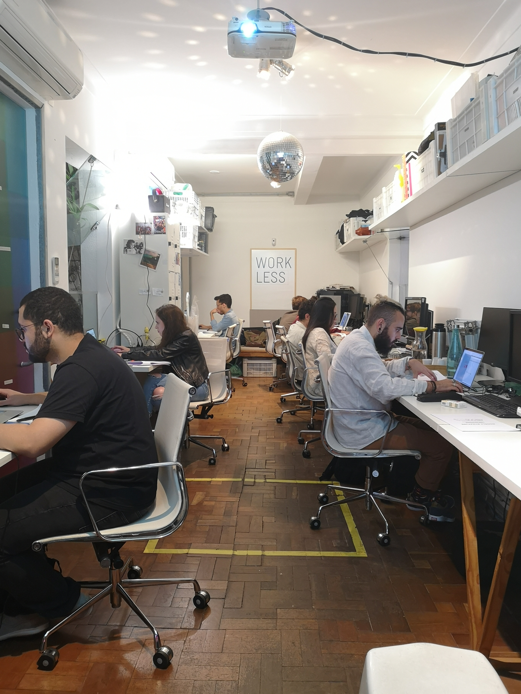

  
</ImageRow>

## Apresentações finais

No último sábado, os participantes apresentaram seus projetos individuais. O arquiteto Marko Brajovic participou da sessão de encerramento com uma palestra aberta sobre biomimética e seu papel na arquitetura e no design contemporâneos, conectando os exercícios do workshop a temas mais amplos da área.