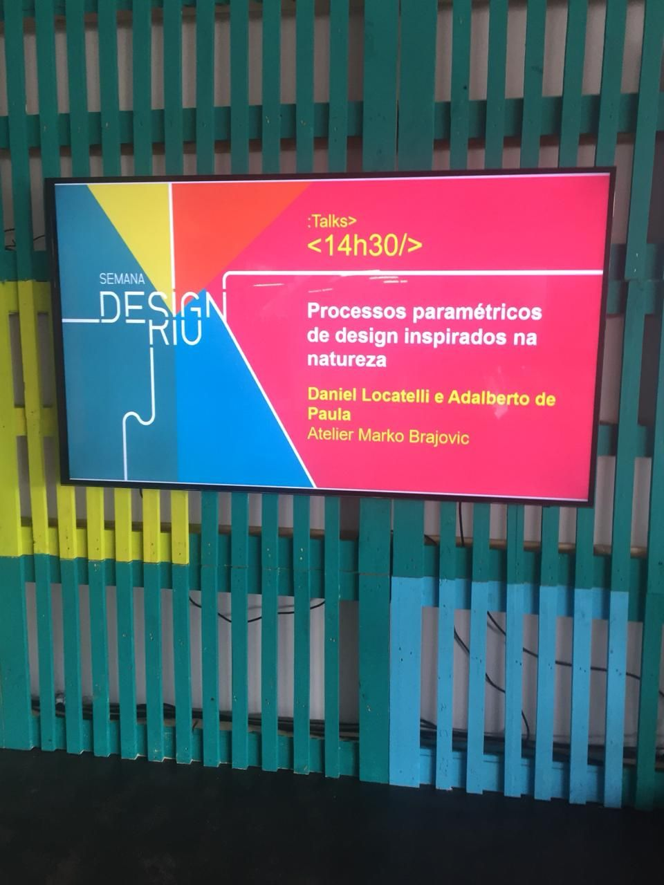
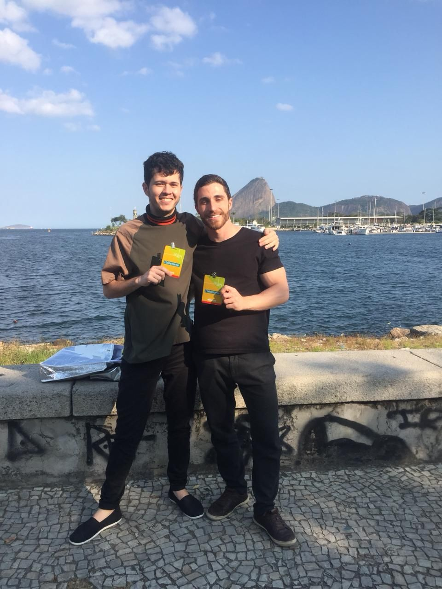

Palestra na 6ª edição da Semana Design Rio, realizada no Museu de Arte Moderna (MAM) do Rio de Janeiro. A apresentação explorou como processos paramétricos de design podem se inspirar em padrões e organismos naturais, conectando biomimética, programação visual e fabricação digital por meio de projetos desenvolvidos no Atelier Marko Brajovic.

## Sete Princípios da Natureza

A palestra apresentou sete princípios observados na natureza e os aplicou como diretrizes conceituais para o design paramétrico:

1. **Coletividade**, inspirada na floresta: a interdependência e o inter-relacionamento entre indivíduos em um grupo.
2. **Reciprocidade**, inspirada no líquen: conexão pela troca benéfica entre as partes.
3. **Metamorfose**, inspirada na borboleta: completa transformação de forma e do comportamento.
4. **Resiliência**, inspirada na água-viva imortal: sistemas e organismos capazes de resistir a crises e mudanças.
5. **Mimetismo**, inspirado na borboleta coruja: a habilidade evolutiva de um organismo em copiar traços e padrões de outro organismo.
6. **Evolução**: mudança nas características das populações de animais e plantas ao longo de gerações sucessivas.
7. **Auto-organização**: habilidade de um sistema de organizar seus componentes ou elementos de forma espontânea e intencional.

## Da Natureza à Computação

A apresentação enquadrou três abordagens complementares ao design: behaviourologia (como as pessoas fazem), fenomenologia (como a física faz) e biomimética (como a natureza faz). Em seguida, explorou o papel da programação visual como ponte entre esses princípios naturais e as ferramentas computacionais, argumentando que a natureza é uma designer de 3,8 bilhões de anos de experiência.

## Estudos de Caso

Diversos projetos do Atelier Marko Brajovic foram apresentados como estudos de caso demonstrando esses princípios na prática, incluindo o Pavilhão do Brasil na Expo Milão 2015 (com Studio Arthur Casas), a Parada Coca-Cola nos Jogos Olímpicos Rio 2016, as lojas Camper Together em São Paulo, Hong Kong, Melbourne e Milão, o Pavilhão O3 na Expo Revestir 2017, a Casa Ninho Docol na Expo Revestir 2018, a instalação Nike Air Guitar no Red Bull Station em São Paulo e a instalação Heineken Live Your Music no MECA Inhotim.

